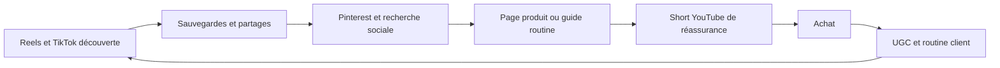

# Rapport stratégique pour Femiglow

> **Note d'archivage.** Ce fichier reproduit *verbatim* le rapport stratégique fourni
> par l'équipe. Il sert de **source unique de vérité** pour l'ingestion dans la
> pipeline de génération de contenu (LangGraph + RAG). Le plan d'exploitation —
> comment découper, nettoyer, router et tester ce contenu pour obtenir une
> génération de très haute qualité — se trouve dans le fichier voisin
> [`plan-ingestion-pipeline.md`](./plan-ingestion-pipeline.md).
>
> ⚠️ Le contenu ci-dessous contient des marqueurs de citation bruts (`cite…turn…`)
> issus de l'outil de recherche d'origine. Ils sont conservés ici par fidélité,
> mais **doivent être strippés** avant ingestion (voir le plan, étape « Nettoyage »).

---

## Résumé exécutif

Le fichier joint demande un rapport de recherche approfondi, en français, structuré comme une analyse comparée reliant psychologie du consommateur, mécaniques de viralité, règles algorithmiques des grandes plateformes, cas d’usage beauté/e-commerce, production de contenu par IA et tendances beauté/skincare récentes, avec recommandations directement actionnables pour la marque Femiglow. Le document impose aussi un résumé exécutif, une table des matières cliquable, des exemples concrets, des “règles système”, un tableau final par plateforme, une check-list annexe et une liste de sources.

La conclusion principale est la suivante : **Femiglow ne doit pas chercher à “faire du viral” au sens spectaculaire, mais à construire une machine de désir mémorisable et crédible**. Dans la beauté, les contenus qui performent durablement combinent cinq ingrédients : un hook émotionnel ou sensoriel très rapide, une preuve immédiatement visible, une utilité pratique claire, une grammaire visuelle cohérente, et un niveau de confiance suffisant pour transformer l’attention en intention d’achat. Les travaux de Berger et Milkman sur la viralité montrent que les émotions à forte activation favorisent le partage, tandis que la littérature sur l’authenticité, les avis et les influenceurs montre qu’en cosmétique, la crédibilité et la preuve restent centrales pour la conversion.

Pour Femiglow, le mix organique le plus rationnel est le suivant : **TikTok et Instagram Reels** pour la découverte et la désirabilité, **Pinterest** pour la captation d’intention et l’evergreen, **YouTube Shorts** pour l’éducation courte et le passage vers la confiance, **Facebook** pour la communauté et les couches de réassurance, **Threads/X** pour la conversation et le contexte culturel, et **LinkedIn** non pas pour vendre directement des soins DTC, mais pour porter une narration fondatrice, retail, B2B, recrutement et crédibilité de marque. Cette hiérarchie est cohérente avec la nature des systèmes de recommandation et avec l’usage déclaré de chaque plateforme.

Sur Instagram, la recommandation dépend de la valeur prédite du contenu, et Adam Mosseri a explicitement insisté sur le fait que les **“sends per reach”** deviennent un signal majeur pour les Reels. Sur TikTok, la logique du For You repose fortement sur les interactions, le contenu vidéo lui-même, les sons, les hashtags et les signaux de satisfaction. Sur Pinterest, la découverte est thématique et non chronologique, avec un poids très fort des **saves** et des métadonnées. Sur YouTube, les Shorts et les vidéos longues sont désormais explicitement traités par des systèmes de recommandation distincts. Ces différences doivent dicter non seulement vos formats, mais aussi vos objectifs créatifs.

L’angle J-Beauty est un avantage réel pour Femiglow à condition d’être **traduit**, pas folklorisé. La J-Beauty est décrite par les sources sectorielles comme une esthétique à la fois minimaliste, technologique et nourrie par des traditions anciennes ; les routines japonaises mettent l’accent sur la douceur, la prévention, l’hydratation, le rituel et l’élégance discrète. Pour un public occidental, cela doit devenir un langage clair : **moins de bruit, plus de précision ; moins de promesses agressives, plus de gestes, textures, preuves et discipline de routine**.

Enfin, l’IA doit être envisagée comme un **accélérateur de production**, pas comme une identité créative de substitution. Les études sur l’authenticité et la confiance, ainsi que les obligations croissantes de transparence de Meta et de l’AI Act européen, convergent : quand un contenu beauté semble trop synthétique, trop “parfait” ou insuffisamment contextualisé, il fragilise la confiance. La meilleure stratégie 2026 pour Femiglow est donc une logique **“IA assistée, preuve humaine”** : scripts, déclinaisons, storyboards, localisation, voire fonds créatifs via IA ; mais démonstrations produit, textures, peau, rituel, voix et validation restent ancrés dans le réel.

**Table des matières**

- [Instructions extraites du fichier](#instructions-extraites-du-fichier)
- [Méthodologie et hypothèses](#méthodologie-et-hypothèses)
- [Psychologie du consommateur et mécaniques cognitives](#psychologie-du-consommateur-et-mécaniques-cognitives)
- [Viralité, storytelling et conversion](#viralité-storytelling-et-conversion)
- [Règles éditoriales par plateforme](#règles-éditoriales-par-plateforme)
- [Stratégie J-Beauty pour Femiglow](#stratégie-j-beauty-pour-femiglow)
- [IA, tendances, feuille de route, limites et références](#ia-tendances-feuille-de-route-limites-et-références)

## Instructions extraites du fichier

Le fichier joint demande explicitement un rapport qui fasse trois choses à la fois : **comprendre la psychologie qui pousse à l’achat**, **cartographier les mécaniques de performance organique par plateforme**, et **en déduire une stratégie de contenu beauté/e-commerce adaptée à Femiglow**, avec un accent particulier sur les réseaux sociaux, la viralité, l’esthétique japonaise, les signaux de mémorisation et les tendances récentes de la beauté et du skincare. Il impose une structure détaillée, des exemples concrets, des comparaisons, ainsi qu’un rendu de niveau expert, pédagogique et actionnable.

| Dimension demandée | Exigence explicite du fichier | Conséquence pour ce rapport |
|---|---|---|
| Langue | Français | Le rapport est intégralement rédigé en français. |
| Format | Rapport structuré, analytique, comparatif | Les parties relient théorie, plateformes, contenus et recommandations. |
| Niveau | Très détaillé, “important/skippable interdit” | Les recommandations sont justifiées par des sources et des inférences explicites. |
| Contenu | Psychologie, virality, plateformes, beauté, IA, tendances | Les sections couvrent l’ensemble de la chaîne attention → mémorisation → conversion. |
| Exemples | Exemples beauté/e-commerce demandés | Chaque partie contient des exemples applicables à Femiglow. |
| Production finale | Tableau synthétique par plateforme, check-list, sources | Les éléments demandés sont intégrés en fin de rapport. |

Ce que le fichier demande de façon particulièrement utile, c’est de **ne pas dissocier l’algorithme, la créativité et l’achat**. Autrement dit, Femiglow ne doit pas se contenter d’une réflexion “branding”, ni d’une réflexion “performance”, ni d’une réflexion “trend”. La valeur est dans l’architecture : un contenu doit être **vu**, **retenu**, **partagé**, **cru**, puis **cliqué**. C’est cette logique unifiée que j’applique dans toute la suite.

## Méthodologie et hypothèses

La méthode suivie ici est simple : partir des questions du fichier, puis les traduire en un cadre de décision utilisable par une marque. J’ai donc privilégié, pour les points instables ou techniques, les **sources officielles de plateformes** (Meta, TikTok, Pinterest, YouTube, LinkedIn, X), les **sources institutionnelles** (UE, JNTO) et les **travaux académiques originaux ou revues** sur la viralité, l’attention, la charge cognitive, les biais de décision, l’authenticité et l’effet des avis en ligne. Lorsque les plateformes ne publient pas elles-mêmes une “règle optimale” claire — par exemple une fréquence universelle de publication — je le signale et je formule une **recommandation opérationnelle**, présentée comme telle, plutôt qu’un faux fait “algorithmique”.

Plusieurs éléments n’étaient pas précisés dans le fichier ; j’ai donc posé les hypothèses suivantes. **Première hypothèse :** Femiglow est une marque DTC de beauté/skincare ou une marque en lancement/accélération, qui vend en ligne à une audience principalement francophone et occidentale, tout en voulant exploiter un imaginaire et/ou des codes J-Beauty. **Deuxième hypothèse :** le budget de production n’est pas précisé, donc la stratégie proposée est conçue pour rester viable en organique ou en organique + amplification légère. **Troisième hypothèse :** aucun territoire de vente n’étant spécifié, les recommandations culturelles sont formulées pour un usage global/occidental avec prudence sur la traduction des codes japonais. **Quatrième hypothèse :** le bon horizon de travail est un cycle de 90 jours pour l’exécution et de 12 mois pour la plateformisation et la saisonnalité.

Pour éviter un rapport “désincarné”, j’utilise un cadre funnel très concret. Les métriques de succès ne doivent pas être seulement les vues, mais les bonnes métriques au bon étage : **partages et sauvegardes** au niveau découverte/considération, **clics sortants et vues PDP** au niveau intention, puis **ajouts au panier, conversion, répétition** au niveau business. Cette logique est cohérente avec les systèmes de recommandation des plateformes et avec la notion de “consumer decision journey”, où les consommateurs ne suivent plus un entonnoir linéaire simple mais un parcours d’allers-retours entre découverte, recherche, validation sociale et achat.

## Psychologie du consommateur et mécaniques cognitives

L’attention ne se gagne pas uniquement avec “de belles images” ; elle se gagne en épousant la manière dont le cerveau scanne, filtre et juge. Les travaux de Nielsen Norman Group montrent que la lecture digitale conserve souvent une logique en **F** sur les interfaces riches en texte, y compris sur mobile, tandis que les principes de hiérarchie visuelle utilisés en UX décrivent une logique plus **en Z** sur les pages ou compositions plus simples, pilotées par un visuel fort et un CTA clair. En pratique, cela veut dire qu’un contenu beauté ne doit pas traiter l’écran comme une affiche pleine : il doit guider l’œil. Le regard doit rencontrer, dans les toutes premières fractions de seconde, un objet prioritaire : texture, visage, geste, produit, bénéfice ou contraste avant/après.

Les études d’eye-tracking sur la publicité montrent aussi que la **présence d’un visage** et la **direction du regard** influencent fortement l’attention, la mémorisation et l’évaluation de l’annonce. Quand les yeux du modèle regardent le produit ou la zone d’intérêt, l’attention s’y déplace davantage. Pour la beauté, c’est un levier majeur : un regard vers la joue, la texture, le flacon ou le geste d’application n’est pas un détail esthétique ; c’est un outil de guidage cognitif.

La charge cognitive est un autre point décisif. La théorie de la charge cognitive insiste sur les limites de la mémoire de travail, et Cowan rappelle qu’elle est beaucoup plus limitée qu’on ne l’imaginait traditionnellement. Sur un réseau social, cela signifie qu’un contenu “complet” est souvent un contenu trop dense. Les créations qui surperforment en beauté n’essaient pas de faire tenir *tout* le produit dans un post ; elles font tenir **une idée, une preuve, une action**. Un Reel qui tente de vendre en même temps la marque, trois actifs, l’histoire japonaise, une offre promo, cinq bénéfices et deux CTA crée surtout du bruit.

Plusieurs biais de décision expliquent ensuite pourquoi certains messages convertissent mieux que d’autres. L’**effet de simple exposition** de Zajonc montre que la familiarité répétée améliore l’attitude envers un stimulus ; le **framing effect** de Tversky et Kahneman rappelle que la formulation d’une information modifie la décision ; l’étude d’Iyengar et Lepper sur la surcharge de choix montre qu’un trop grand éventail d’options peut décourager l’action ; l’**effet halo** explique enfin qu’une impression globale positive se propage aux autres attributs du produit ou de la marque. En beauté, cela donne une règle claire : la répétition cohérente d’actifs, de gestes, de textures, de codes visuels et de bénéfices crée de la fluence, tandis qu’un univers instable ou trop bavard détruit cette impression de maîtrise.

La preuve sociale reste essentielle. Une méta-analyse récente montre que les avis en ligne influencent significativement l’intention d’achat, la valence des avis étant particulièrement puissante. De même, les méta-analyses sur les influenceurs montrent que leur efficacité passe par la crédibilité, l’expertise perçue, l’attractivité et la congruence produit. En skincare, cela veut dire qu’un contenu “premium” n’est pas seulement plus beau : c’est un contenu qui semble **vrai**, **maîtrisé**, **spécifique** et **socialement validé**. Les signaux utiles sont les démonstrations réalistes, les routines filmées en contexte, les commentaires qualifiés, les témoignages d’usage, les comparatifs honnêtes et les créateurs pertinents, pas seulement la brillance de l’image.

Pour Femiglow, cela conduit à une distinction pratique entre **contenu premium** et **contenu “cheap”**. Le premium repose sur la sobriété, les gros plans matière, la lisibilité, la régularité visuelle, la cohérence de palette, les gestes lents, les micro-preuves, et la retenue textuelle. Le “cheap”, à l’inverse, vient souvent de la surcharge : trop d’overlays, trop d’effets, trop d’all-caps, trop de promesses, trop de codes empruntés sans unité. Cette conclusion est en partie une **inférence**, mais elle s’appuie solidement sur la charge cognitive, l’effet halo et les études d’attention.

**Exemple Femiglow.**
Au lieu d’un visuel “5 bienfaits du sérum + -20% + ingrédients + routine + avis”, préférer un Reel de 12 à 18 secondes : ouverture sur une goutte qui s’étire, texte “Pourquoi votre peau tire après le nettoyage ?”, cut sur l’application, micro-texte “double hydratation inspirée du rituel japonais”, plan peau lumineuse, CTA “Sauvegardez pour votre routine du soir”. Cette structure respecte mieux l’attention, le framing et la charge cognitive, tout en laissant de la place à la mémorisation.

> **Règle système**
> **Un écran = une idée. Une création = une preuve. Un post = un seul vrai comportement attendu.** Si un contenu a besoin de trop d’explications pour être compris, il est déjà trop chargé.

Les erreurs à éviter sont donc constantes : empiler trop d’arguments dans un seul asset ; utiliser des visages sans point focal ; saturer en texte “pour être clair” ; faire croire qu’une image très polish suffit à créer de la désirabilité ; et confondre familiarité avec redondance creuse. La familiarité utile répète des **actifs distinctifs** ; elle ne répète pas la même création en boucle.

## Viralité, storytelling et conversion

La viralité n’est pas aléatoire. Berger et Milkman ont montré que les contenus les plus partagés sont davantage associés à des émotions à forte activation — admiration, surprise, colère, anxiété — qu’à des émotions faibles, et que l’utilité pratique compte également. Jonah Berger a ensuite popularisé la grille **STEPPS** : social currency, triggers, emotion, public, practical value, stories. Pour une marque beauté, cela signifie qu’un contenu sera d’autant plus partageable qu’il fait paraître la personne informée, qu’il la relie à un rituel ou à une tendance, qu’il suscite une émotion claire, qu’il donne une utilité concrète et qu’il raconte quelque chose de transmissible.

Mais la beauté ajoute une exigence : un contenu très viral ne convertit pas mécaniquement. Beaucoup de contenus beauté font des vues parce qu’ils sont étonnants, polarisants ou satisfaisants, sans pour autant élever la confiance produit. Il faut donc distinguer **viralité de diffusion** et **viralité de considération**. La première cherche le partage large ; la seconde cherche le partage par les personnes susceptibles d’acheter. Sur Instagram, le fait que Mosseri insiste sur les envois à des amis proches comme signal fort pousse précisément vers cette seconde logique : le contenu doit être suffisamment mémorable pour être envoyé, mais suffisamment pertinent pour être envoyé **à la bonne personne**.

Dans le court format, les hooks qui marchent le mieux en beauté sont rarement les hooks “publicitaires” purs. Ce sont plutôt des hooks de **tension légère** :
“Vous hydratez peut-être votre peau dans le mauvais ordre.”
“Pourquoi votre nettoyant vous donne une peau plus sèche.”
“Le geste japonais qui change la sensation d’une routine.”
“Trois signes que votre peau veut moins d’actifs, pas plus.”
Ce type d’ouverture active la curiosité, la menace légère ou l’utilité immédiate, sans tomber dans l’agressivité ou la promesse impossible. Cela colle aux résultats de Berger et Milkman sur l’activation émotionnelle, et aux recommandations de YouTube pour capter l’attention dans les premières secondes des Shorts.

Sur TikTok et Reels, les formats beauté qui reviennent le plus dans les sources officielles et semi-officielles sont les **tutorials**, **GRWM**, **transformations**, **reviews**, **routines** et contenus “besties/creator-led”. TikTok indique dans son guide beauté 2025 que les créateurs y comptent en raison de la confiance et de l’authenticité, et ses playbooks mettent explicitement en avant les swatches satisfaisants et les routines GRWM. Meta, de son côté, observe que les Reels alimentent des tendances comme les beauty transitions et les GRWM. Femiglow doit donc s’inscrire dans les formats existants de la culture plateforme, non pas pour copier des gimmicks, mais pour parler la langue native du scroll.

Le son et la tendance sont utiles, mais pas souverains. TikTok recommande de surveiller en temps réel les hashtags, chansons, créateurs et vidéos via Creative Center, et ses rapports “What’s Next” distinguent bien les **moments** à cycle court, qui vivent de quelques jours à quelques semaines, des signaux plus durables. YouTube précise en parallèle qu’un Short n’a pas besoin d’un son tendance pour performer : une idée originale et résonante peut suffire. La bonne lecture stratégique est donc double : **utiliser les signaux de tendance pour amplifier**, mais ne jamais fonder la stratégie de marque uniquement sur eux.

Le contenu court doit-il surtout éduquer ou divertir ? La réponse utile pour Femiglow est : **divertir par l’éducation sensible**. Dans la beauté, la meilleure zone n’est pas le “cours”, ni le “show” pur, mais le format où l’apprentissage est emballé dans une expérience visuelle agréable à regarder, à écouter ou à sauvegarder. Une texture satisfaisante, un geste précis, une révélation de routine ou une erreur corrigée tiennent mieux en mémoire qu’une slide théorique. Ce n’est pas une contradiction avec l’éducation ; c’est sa forme la plus social-native.

Pour les formats plus longs, la logique change. Le long format n’est pas d’abord un outil de trend-chasing ; c’est un outil de **densification de confiance**. Sur YouTube, l’algorithme de recommandation raisonne largement à partir de l’historique de visionnage, de recherche et de satisfaction, et le long format permet d’installer expertise, routine, démonstration et nuance. Femiglow n’a pas besoin de produire beaucoup de long. Elle a besoin d’un petit nombre de vidéos longues **utiles**, reliées à ses Shorts : par exemple “Routine barrière inspirée du rituel japonais pour peau sensible”, “Comment utiliser une double hydratation sans alourdir la peau”, ou “Les erreurs de layering qui donnent une peau terne”.

**Exemple Femiglow.**
Un TikTok/Reel haut de funnel : “Le geste japonais qui évite de surcharger sa peau en été”, 15 secondes, sous-titres, texture légère, main, carrelage clair, CTA “sauvegarder”.
Un second asset mid funnel : carrousel Instagram “3 signes qu’une routine trop active fatigue votre barrière cutanée”.
Un Pin evergreen : “Routine peau sensible en 3 étapes inspirée du Japon”.
Un Short YouTube : “Double hydratation : la différence entre lotion, essence et émulsion”.
Cette séquence mélange partage, sauvegarde, recherche et preuve sans reposer sur une seule plateforme.

> **Règle système**
> **Le court format attrape et fait circuler. Le moyen format explique. Le long format crédibilise. La page produit convertit.** Toute stratégie qui attend d’un seul post qu’il fasse tout à la fois dilue sa force.

Les grandes erreurs à éviter sont classiques : sacrifier la clarté au trend, utiliser une tendance audio sans rapport avec le produit, faire un hook anxiogène sans payoff, copier des codes de créateurs sans cohérence de marque, ou chercher la viralité aux dépens de la crédibilité. Un contenu beauté envoyé à une amie doit donner envie de tester, pas seulement de rire.

## Règles éditoriales par plateforme

Les plateformes ne récompensent pas la même chose, parce qu’elles n’essaient pas d’obtenir le même comportement. Il faut donc piloter Femiglow par **rôle de plateforme**, pas par recyclage uniforme du même contenu.

Sur **Instagram**, la logique utile est mixte : recommandation, relation, identité, shopping léger. Meta explique que le Feed Instagram ordonne les posts selon ce qu’il prédit comme le plus pertinent et précieux, tandis que la recherche Instagram s’appuie notamment sur le texte du handle, du nom de profil, de la bio, des légendes et des hashtags. Mosseri a en plus signalé que les envois à des amis proches deviennent un signal-clé pour les Reels. Cela implique trois règles : créer du contenu **partageable**, **sauvegardable** et **sémantiquement clair**. Les Reels sont la tête d’affiche ; les carrousels servent la pédagogie et les sauvegardes ; les Stories et Broadcast Channels renforcent la proximité.

Sur **TikTok**, le rôle est la découverte accélérée et le commerce culturel. Le système de recommandation officiel met en avant les interactions utilisateur, les informations vidéo, les sons et d’autres signaux contextuels. TikTok for Business insiste sur le rôle des créateurs, des tutorials, des reviews, des transformations et des routines de type GRWM ; son Creative Center sert de radar temps réel sur les hashtags, sons, créateurs et vidéos montants. TikTok est donc l’espace le plus fort pour rendre Femiglow **désirable et native**, surtout si la marque traite la vidéo comme une micro-preuve vivante, pas comme un spot.

Sur **Facebook**, le potentiel organique n’est plus celui d’il y a dix ans, mais la plateforme garde un intérêt structurel pour la communauté, la répétition et certaines audiences plus âgées ou familiales. Meta explique que le Feed Facebook est piloté par des systèmes de ranking prédictifs ; la recommandation vidéo et les Reels existent bien ; et les groupes restent un terrain utile quand la marque peut animer une conversation réelle autour des routines, de la sensibilité cutanée, des retours utilisateurs ou des lancements. Facebook ne doit plus être le cœur d’acquisition froide, mais peut devenir un bon espace de **réassurance** et de **relation**.

Sur **Pinterest**, la logique est radicalement différente. Pinterest rappelle que les gens y viennent pour découvrir, planifier et acheter ; que la plateforme classe le contenu par signaux d’engagement et par sujets plutôt que chronologiquement ; que les saves sont des signaux actifs importants ; et que les titres, descriptions, mots-clés et métadonnées aident le moteur de recommandation à contextualiser le contenu. Pinterest est donc la plateforme de choix pour capter l’**intention douce mais réelle** : routine peau sensible, inspiration salle de bain, soins japonais, guide hydratation, idées cadeaux, textures, morning routine, etc. C’est l’endroit où l’esthétique Femiglow peut rester visible longtemps après publication.

Sur **YouTube Shorts**, YouTube précise clairement que la Home, Up Next et le Shorts player sont personnalisés, et que les signaux principaux incluent l’historique de visionnage, de recherche, les abonnements, likes, dislikes et signaux de satisfaction. YouTube a aussi indiqué que les systèmes de recommandation pour Shorts et long format sont distincts. Les titres et thumbnails restent importants pour la découverte générale sur YouTube, tandis que les tags jouent un rôle limité par rapport au titre, à la miniature et à la description. Pour Femiglow, YouTube ne doit pas être pensé comme un clone de TikTok, mais comme une **colonne vertébrale de crédibilité** reliant short éducatif, mini-séries et quelques vidéos plus longues de référence.

Sur **Threads**, Meta décrit le réseau comme une plateforme text-first de conversations en temps réel, reliée aux communautés d’intérêt. Cela en fait un espace utile pour la narration fondatrice, les micro-convictions, les questions/réponses, les prises de position légères, le “behind the routine”, ou les journaux de lancement. En revanche, c’est moins naturellement une surface de conversion directe que TikTok, Instagram ou Pinterest. Threads est donc pertinent pour la **proximité discursive**, pas pour porter seul la vente. Cela est une **inférence stratégique** fondée sur la nature conversationnelle officielle de la plateforme.

Sur **X**, le “For You” combine contenu des comptes suivis et recommandations ; la plateforme reste très orientée temps réel, commentaires et découverte de sujets. Pour une marque beauté, X n’est pas un grand moteur de vente directe, mais peut ponctuellement rendre service sur les annonces, les réactions à tendances, les contextes presse ou les conversations niche. Là aussi, c’est une **plateforme de contexte**, pas un socle e-commerce.

Sur **LinkedIn**, les algorithmes visent à ordonner un feed professionnel pertinent et à réduire la diffusion des contenus de faible qualité ou non sûrs. Les travaux d’ingénierie LinkedIn décrivent un feed de ranking personnalisé à grande échelle. En parallèle, LinkedIn Marketing Solutions insiste sur la valeur du brand building de long terme pour le ROI. Pour Femiglow, LinkedIn a donc un rôle précis : crédibilité du fondateur, expertise ingredient-led, recrutement, partenariats, retail/wholesale, narrative de fabrication et éventuellement signal premium auprès d’un écosystème B2B. La faible priorité de LinkedIn en vente directe DTC est ici une **inférence** cohérente avec la finalité du réseau.

### Tableau synthétique Femiglow par plateforme

| Plateforme | Rôle principal | Formats à privilégier | Fenêtres horaires de départ | KPI prioritaires | Recommandation Femiglow |
|---|---|---|---|---|---|
| Instagram | Désirabilité, partage, relation, shopping léger | Reels, carrousels, Stories | Lun 14–16h ; mar 13–19h ; mer 12–21h ; jeu 12–14h, heure locale | Sends/reach, saves/reach, vues profil, clics lien | 4–6 Reels/semaine, 2 carrousels/semaine, Stories quasi quotidiennes |
| TikTok | Découverte, culturalité, impulsion | UGC natif, GRWM, reviews, transitions utiles | Mar-jeu 14–18h, heure locale | Taux de visionnage, rétention, partages, clic bio | 5–7 vidéos/semaine, ton natif, sous-titres systématiques |
| Facebook | Réassurance, communauté, répétition | Reels, posts feed, groupes, Lives ponctuels | Mar-mer 12–20h ; lun/jeu autour de midi | Commentaires, clics, vues engagées, activité groupe | 3–5 posts/semaine, plus animation communautaire |
| Pinterest | Intention, evergreen, trafic qualifié | Pins verticaux, vidéos courtes, product pins | Mar-jeu 10–13h, heure locale | Saves, outbound CTR, clics produit | 5–10 Pins/semaine, SEO visuel et sémantique |
| YouTube Shorts | Éducation courte, confiance, passerelle vers long format | Shorts + vidéos longues de référence | Shorts : surtout fin de semaine/soirée ; long format : dimanche matin et matinées fortes | Vus vs swipes, watch time, abonnés, clics description | 3–5 Shorts/semaine + 2 vidéos longues/mois |
| Threads | Conversation, fondateur, proximité | Textes courts, images, réponses, séries | Pas de benchmark robuste ; test via analytics | Réponses, reposts, vues profil | 3–5 posts/semaine, intensifier en période de lancement |
| X | Réactivité, actualité, annonces, presse | Posts courts, threads, images, citations | Mar-ven 12–18h, heure locale | Reposts, replies, clics profil | Usage opportuniste, pas cœur de système |
| LinkedIn | Autorité, B2B, retail, recrutement | Founder posts, carrousels/documents, coulisses | Mar 11–17h ; mer 11–16h ; jeu 13–17h | Dwell, saves, clics profil/page, leads | 2–3 posts/semaine, très éditorialisés |

**Important :** les plateformes ne publient pas d’“idéal de fréquence” universel. Les cadences ci-dessus sont des recommandations de travail pour Femiglow, dérivées des usages plateforme, des contraintes de qualité et du principe de cohérence. Elles doivent ensuite être arbitrées par les analytics maison.

> **Règle système**
> **Ne publiez jamais “le même contenu partout”. Publiez la même idée, traduite dans la logique comportementale de chaque surface.**

## Stratégie J-Beauty pour Femiglow

Le positionnement le plus fort pour Femiglow n’est pas “la beauté japonaise” au sens décoratif ; c’est **la discipline du soin japonais rendue intuitive pour une audience occidentale**. Les sources sectorielles décrivent la J-Beauty comme minimaliste, technologiquement avancée et nourrie par les traditions. Les routines japonaises sont également associées à la douceur, au double nettoyage, à la double hydratation et à la protection quotidienne. Le territoire le plus crédible pour Femiglow est donc : **rituels précis, textures élégantes, respect de la barrière cutanée, prévention, saisonnalité, sophistication discrète**.

Cela appelle un cadrage sémiotique précis. Visuellement, Femiglow devrait préférer les **blancs cassés, ivoire, argiles claires, bleu indigo, vert thé, beiges pierre**, avec des accents plus rares de **rouge camélia** ou de **doré** pour les temps forts. Les sources officielles japonaises insistent sur la profondeur historique des palettes et sur la sensibilité japonaise au raffinement des nuances ; la couleur rouge, dans plusieurs objets et symboles japonais, est associée à la vitalité et à la protection ; le blanc renvoie à la pureté ; l’indigo et les bleus artisanaux sont très fortement ancrés dans l’imaginaire textile et artisanal. Pour Femiglow, cela ne doit pas devenir un symbolisme rigide, mais une grammaire de ton.

Le pont avec les attentes occidentales doit, lui, être explicite. En Occident, les contenus skincare convertissent mieux lorsqu’ils articulent clairement un problème, une preuve et un bénéfice. Il faut donc traduire la J-Beauty en phrases compréhensibles :
- “routine douce, peau moins réactive”
- “double hydratation, fini plus confortable”
- “texture légère, barrière respectée”
- “rituel court mais constant”
- “preuve sensorielle + cohérence de routine”
Autrement dit : garder l’esthétique japonaise, mais toujours la relier à une promesse d’usage quotidienne. Cette conclusion est une **inférence stratégique** à partir des sources sur la J-Beauty et des recherches sur l’attention, l’authenticité et la décision.

Les ingrédients “héros” doivent suivre la même règle. Les ingrédients liés à l’imaginaire japonais sont puissants à condition de rester crédibles et de ne pas être sur-vendus. Les travaux récents sur les produits de fermentation du riz montrent des bénéfices potentiels de type hydratation, activité antioxydante, anti-inflammatoire et éclaircissante ; les travaux sur l’huile de camélia suggèrent des bénéfices cutanés et barrières ; les revues sur le thé vert/matcha soutiennent surtout un intérêt antioxydant et photoprotecteur, avec un niveau de preuve clinique plus nuancé ; le yuzu apporte une narration sensorielle forte et certains travaux pointent des activités antioxydantes ou éclaircissantes de composés isolés. La meilleure stratégie est donc de présenter ces ingrédients comme **vecteurs de routine et de sensorialité**, assortis de preuves mesurées — jamais comme miracles “orientaux”.

Le cœur éditorial Femiglow devrait reposer sur cinq piliers :

**Pilier rituel.** Montrer le geste, l’ordre, la sensation, le temps juste.
**Pilier texture.** Macro visuels, bruit de matière, glisse, absorption, rinse-off, glow discret.
**Pilier pédagogie.** Expliquer simplement la barrière cutanée, le layering, les combinaisons, les erreurs de surexposition aux actifs.
**Pilier preuve sociale.** Témoignages, créateurs pertinents, commentaires, routine avant/après avec prudence et sans surpromesse.
**Pilier culture traduite.** Storytelling saisonnier, ingrédients, artisanat, matières, esthétique sobre, sans exotisation.

### Calendrier éditorial saisonnier recommandé

| Saison | Angle J-Beauty | Contenus Femiglow recommandés | Pourquoi cela peut marcher |
|---|---|---|---|
| Été | Matsuri, chaleur, légèreté, indigo, routines non grasses | “Routine d’été légère inspirée du Japon”, “texture qui ne colle pas”, “GRWM peau calme malgré la chaleur” | Les festivals d’été structurent l’imaginaire saisonnier japonais ; l’été est propice aux routines allégées et visuelles. |
| Fin d’été | Obon, retour à soi, maison, soin doux | contenus plus intimes, routine du soir, self-care, peau fatiguée par soleil/chaleur | Obon est un temps de retour et de rituel ; bon cadre pour des contenus de réassurance. |
| Automne | Momiji/koyo, réparation, réconfort, tonalités chaudes | routines barrière, hydratation progressive, “reset peau sensible”, Pins evergreen d’automne | Les couleurs d’automne sont très ancrées culturellement ; Pinterest performe particulièrement bien quand les gens planifient tôt. |
| Hiver | Richesse légère, camélia, cadeaux, harmonie, rouge/doré maîtrisés | coffrets, textures cocon, contenus cadeau, rituel du soir plus enveloppant | Temps fort e-commerce naturel ; possibilité de premiumiser sans crier. |
| Printemps | Sakura, renouvellement, éclat doux, purification | contenu “routine de renouveau”, “peau lumineuse sans surcharge”, visuels clairs et aérés | Les sakura structurent fortement l’imaginaire saisonnier japonais et international. |

Cette saisonnalité doit être commencée en amont sur Pinterest et dans les contenus SEO sociaux, car Pinterest rappelle explicitement que les gens y planifient très tôt et qu’il faut souvent lancer les campagnes plusieurs mois avant les moments calendaires.

Ce schéma résume la meilleure logique Femiglow : ne pas attendre qu’un seul canal fasse tout, mais articuler **découverte → recherche → preuve → achat → réutilisation communautaire**. Il correspond à la nature différente des plateformes et à la réalité du parcours décisionnel.

**Exemples concrets Femiglow.**
Sur Instagram : “Le geste japonais qui rend la lotion plus confortable sur peau sensible”, avec main + visage + lumière douce.
Sur TikTok : “Vous n’avez peut-être pas besoin d’un actif de plus, mais d’une meilleure hydratation”, en ton natif et conversationnel.
Sur Pinterest : “Routine japonaise minimaliste pour peau qui tiraille”, avec étape 1/2/3, mots-clés lisibles, flacon net, verticale propre.
Sur YouTube Shorts : “Lotion, essence, émulsion : enfin la différence en 40 secondes”.
Sur Threads : “Le vrai luxe skincare : quand la peau n’a plus besoin d’être ‘rattrapée’ tous les trois jours.”

> **Règle système**
> **Femiglow doit vendre moins un “pays” qu’une manière de prendre soin de sa peau : douce, rigoureuse, élégante, reproductible.** La culture japonaise doit enrichir la preuve, jamais la remplacer.

Les erreurs majeures seraient de sur-décorer les contenus avec des clichés japonais, de promettre des effets “magiques” liés aux ingrédients, de faire du J-Beauty uniquement par le packaging, ou d’oublier la traduction fonctionnelle pour le public occidental. Un code culturel n’a de valeur commerciale que s’il améliore la compréhension, la mémoire et le désir.

## IA, tendances, feuille de route, limites et références

L’IA modifie déjà la production de contenu beauté, mais son intérêt réel se situe surtout dans les tâches de **vitesse, variation et system design** : génération d’angles, storyboards, scripts, sous-titres, déclinaisons multi-plateformes, tests de hooks, moodboards, doublages, localisation, organisation de calendrier éditorial et prévisualisation de concepts. En revanche, dès qu’il s’agit de peau, de texture, de crédibilité produit et d’authenticité perçue, les limites deviennent évidentes. Les recherches récentes sur l’authenticité suggèrent que la confiance et la perception de vérité restent des médiateurs clés d’intention d’achat ; les travaux émergents sur les influenceurs ou contenus générés par IA insistent déjà sur le risque d’une authenticité perçue plus faible.

Cette prudence n’est pas seulement marketing ; elle devient réglementaire. Meta indique avoir déployé un système de labellisation du contenu généré par IA et rapporte des centaines de milliards de vues de labels “AI info” sur ses plateformes ; Meta ajoute aussi une information AI à certaines créations publicitaires générées ou significativement modifiées via ses outils. En parallèle, le règlement européen sur l’IA et les documents de la Commission et du Parlement européen imposent une trajectoire de transparence de plus en plus claire pour le contenu synthétique ou manipulé, notamment pour les images, audios et vidéos artificiels. Pour une marque opérant en Europe ou vers l’Europe, cacher une part substantielle de génération IA dans des contenus de démonstration ou de type “human-like” devient stratégiquement risqué.

La doctrine conseillée pour Femiglow est donc nette :

- **oui** à l’IA pour accélérer le système éditorial ;
- **oui** à l’IA pour variations de scripts, plans, hooks, voix off auxiliaires, fonds ou maquettes ;
- **prudence forte** sur les peaux entièrement synthétiques, les démonstrations produit photoréalistes non réelles, les avatars “experts” et les avant/après artificiels ;
- **transparence** dès qu’un contenu est substantiellement généré ou modifié ;
- **priorité au réel** sur les textures, mains, gestes, application, résultats, UGC, témoignages.

Cette recommandation est une **inférence à haute confiance** fondée sur la convergence entre la recherche sur l’authenticité et la transparence croissante des plateformes et du droit européen.

### Tendances beauté et skincare structurantes pour 2025-2026

Plusieurs tendances fortes se dégagent des sources récentes. D’abord, la beauté continue de se déplacer vers des routines plus **simples, plus douces et plus fonctionnelles** : Pinterest Forecast 2026 évoque des esthétiques plus naturelles et des rapports plus personnels au style ; les analyses mode/beauté mettent aussi en avant bien-être, personnalisation, sécurité des ingrédients et routines plus intelligentes. Ensuite, TikTok confirme le poids central des créateurs, des routines, des swatches, du GRWM et du BeautyTok comme moteur de découverte, avec une articulation toujours plus forte entre culture, recommandation et commerce. Enfin, l’environnement social 2026 montre une tension croissante entre sophistication technologique et désir de réel : les marques qui gagnent sont souvent celles qui gardent de la **chaleur humaine** dans un contexte où beaucoup de contenu devient mécaniquement produit.

Pour Femiglow, les tendances les plus exploitables sont donc :

**La simplification premium.**
Le skincare “plus simple mais plus précis” colle parfaitement à la J-Beauty et à la fatigue actuelle face à la surenchère d’actifs.

**La barrière cutanée et la douceur.**
C’est un territoire crédible, éducatif, répétable et moins soumis à l’obsolescence ultra-rapide que les micro-trends maquillage.

**Le social commerce par la routine.**
TikTok reste un pôle majeur de découverte beauté, tandis que Pinterest convertit les moments d’inspiration en recherche et en clics.

**Le “realness premium”.**
Les contenus trop synthétiques ou trop “ads-looking” fatiguent ; les formats qui ressemblent à une vraie routine bien filmée gagnent en confiance. Cette conclusion est partiellement inférée, mais elle est cohérente avec la littérature sur l’authenticité et les créateurs.

### Feuille de route Femiglow sur 90 jours

| Horizon | Objectif | Actions prioritaires |
|---|---|---|
| Mois initial | Installer la grammaire de marque | Définir palette, décors, gestes, plans textures, ton de voix, 5 piliers éditoriaux, bibliothèque de hooks |
| Mois suivant | Créer la boucle découverte → intention | Publier en rythme sur TikTok/Instagram ; ouvrir le socle Pinterest evergreen ; lancer 1 série Shorts éducative |
| Mois de consolidation | Optimiser par signaux de qualité | Garder les formats avec meilleurs saves/sends/CTR ; transformer les meilleurs posts en Pins, emails, PDP et UGC |

Cette feuille de route suppose une discipline analytique simple : **ce qui est vu n’est pas encore utile ; ce qui est sauvegardé, envoyé, recherché et re-cliqué commence à devenir une brique business**.

### Check-list finale opérationnelle

- La promesse Femiglow est-elle formulée comme un **rituel de soin précis** plutôt qu’un imaginaire flou ?
- Chaque création a-t-elle **une seule idée maîtresse** ?
- Le hook est-il visible/entendable dans les **deux premières secondes** ?
- Le contenu montre-t-il une **preuve concrète** : texture, geste, peau, ordre, sensation, retour client ?
- La légende et le profil utilisent-ils des **mots-clés compréhensibles** pour la recherche sociale ?
- Le contenu est-il conçu pour être **envoyé** ou **sauvegardé**, pas seulement liké ?
- Le même concept existe-t-il en version TikTok/Reel, Pin et Short YouTube ?
- Le storytelling J-Beauty est-il **traduit en bénéfice d’usage** et non réduit à un décor ?
- L’IA est-elle utilisée pour accélérer la production sans fragiliser la confiance sur la peau et la texture ?
- Les contenus générés ou fortement modifiés par IA sont-ils **évalués sous l’angle transparence** ?
- Les analytics différencient-ils bien découverte, considération, intention et conversion ?
- La marque documente-t-elle ses **actifs distinctifs** : flacon, matière, geste, lumière, phrase-signature, couleur d’accent ?

**Questions ouvertes et limites.**
Ce rapport ne disposait pas de données propriétaires Femiglow : pas d’audience actuelle, pas d’analytics de compte, pas de gamme produit détaillée, pas de budget, pas de marché de vente principal, pas de marges par SKU. En conséquence, les recommandations de fréquence, de priorisation éditoriale et de calendrier sont **stratégiques** mais doivent être recalées sur les signaux réels de la marque après 4 à 6 semaines d’exécution. Les plateformes publient peu de “recettes universelles” ; là où l’officiel est incomplet, j’ai privilégié des recommandations prudentes et explicitement inférées plutôt que des pseudo-règles absolues.

**Références principales**

1. Fichier joint d’instructions utilisateur.
2. Berger, J., Milkman, K. — *What Makes Online Content Viral?*
3. Zajonc, R. — *Attitudinal Effects of Mere Exposure.*
4. Tversky, A., Kahneman, D. — *The Framing of Decisions and the Psychology of Choice.*
5. Iyengar, S., Lepper, M. — *When Choice Is Demotivating.*
6. Nielsen Norman Group — *F-Shaped Pattern of Reading on the Web.*
7. Sweller, J. — *Cognitive Architecture and Instructional Design.*
8. Cowan, N. — *The Magical Mystery Four / The magical number 4.*
9. Qiu et al. — méta-analyse sur l’effet des avis en ligne sur l’intention d’achat.
10. Barari et al. — méta-analyse sur l’efficacité des influenceurs.
11. Andonopoulos et al. — authenticité perçue et intention d’achat.
12. Mosseri / Instagram — importance des “sends per reach”.
13. Instagram — *Breaking Down How Instagram Search Works.*
14. Meta Transparency — systèmes de ranking Instagram, Facebook, Threads.
15. TikTok — *How TikTok recommends videos* et Creative Center Trends.
16. TikTok for Business — guide beauté 2025 et playbooks tendances.
17. Pinterest Business — découverte, planification, ranking par sujets et signaux actifs.
18. YouTube Help — *How YouTube recommendations work.*
19. YouTube Blog — Shorts et recommandations séparées.
20. YouTube Help — importance relative du titre, de la miniature et rôle limité des tags.
21. LinkedIn Help / Engineering / Marketing Solutions.
22. X — documentation sur le For You timeline et l’algorithme ouvert.
23. Premium Beauty News — J-Beauty minimaliste, technologique et de retour en force.
24. JNTO / Travel Japan / Web-Japan — couleurs, festivals, saisons et codes culturels japonais.
25. Revue 2025 sur les produits fermentés du riz et bénéfices skincare.
26. Travaux sur l’huile de camélia et la barrière cutanée.
27. Revues sur le thé vert/matcha en dermatologie cosmétique.
28. Étude sur composés du yuzu et activité antioxydante / éclaircissante.
29. Meta — étiquetage du contenu généré par IA.
30. Union européenne — AI Act et obligations de transparence sur les contenus artificiels/manipulés.
31. Benchmarks 2026 de publication et d’engagement : Sprout Social, Buffer, Socialinsider.
