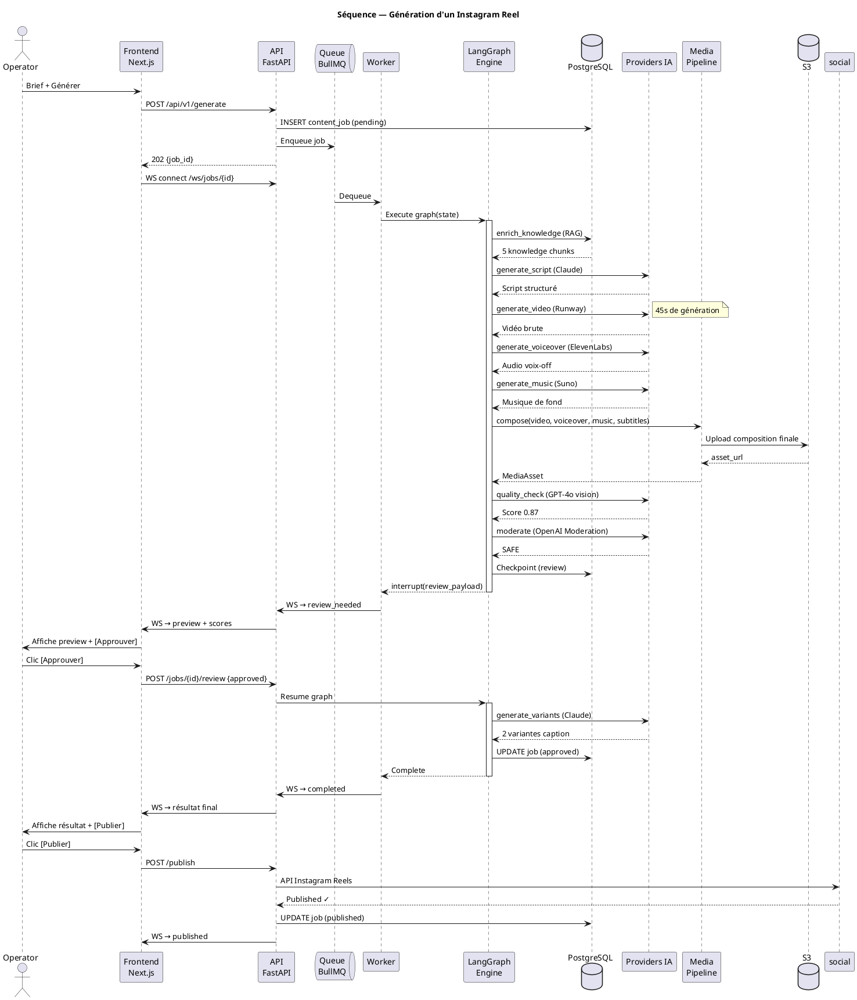
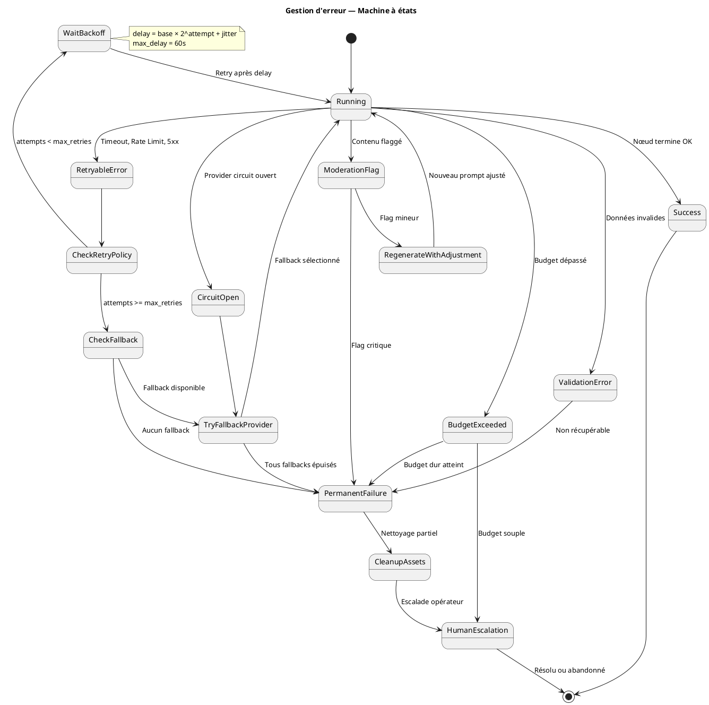
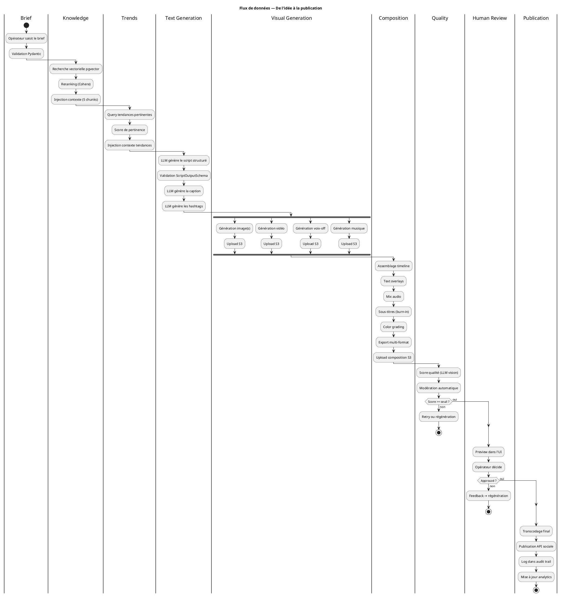
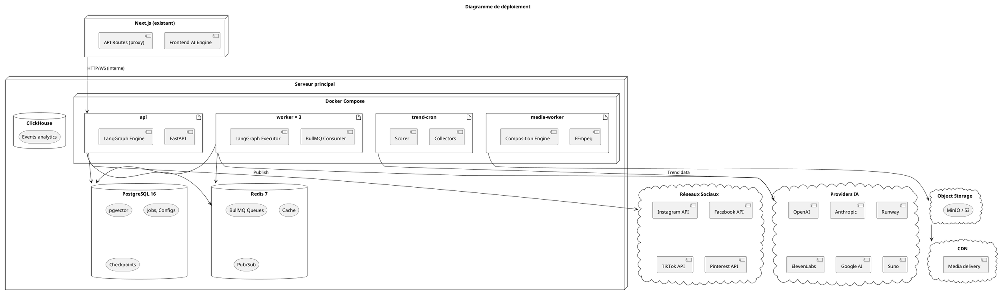

# Dossier d'Architecture — Système de Génération de Contenu Multimédia IA

**Client** : Femiglow — Marque J-Beauty e-commerce  
**Version** : 1.0.0  
**Date** : 2026-05-25  
**Classification** : Confidentiel — Usage interne  
**Auteur** : Architecture & Engineering — Conseil Senior  

---

## Table des matières

1. [Vision produit et objectifs stratégiques](#1-vision-produit-et-objectifs-stratégiques)
2. [Architecture globale du système](#2-architecture-globale-du-système)
3. [Architecture LangChain/LangGraph détaillée](#3-architecture-langchainlanggraph-détaillée)
4. [Découpage en sous-systèmes](#4-découpage-en-sous-systèmes)
5. [Couches techniques transversales](#5-couches-techniques-transversales)
6. [Architecture de génération multimédia intégrée](#6-architecture-de-génération-multimédia-intégrée)
7. [Interface de configuration globale](#7-interface-de-configuration-globale)
8. [Système de connaissances configurable](#8-système-de-connaissances-configurable)
9. [Système de veille tendances et actualités](#9-système-de-veille-tendances-et-actualités)
10. [Visualisation de l'architecture LangGraph](#10-visualisation-de-larchitecture-langgraph)
11. [Dashboards de métriques et observabilité](#11-dashboards-de-métriques-et-observabilité)
12. [Gestion avancée des erreurs](#12-gestion-avancée-des-erreurs)
13. [Intégration des providers IA](#13-intégration-des-providers-ia)
14. [Sécurité, gouvernance et conformité](#14-sécurité-gouvernance-et-conformité)
15. [UX/UI détaillée](#15-uxui-détaillée)
16. [Structure de dossiers du projet](#16-structure-de-dossiers-du-projet)
17. [Fichiers attendus et livrables](#17-fichiers-attendus-et-livrables)
18. [Diagrammes PlantUML](#18-diagrammes-plantuml)
19. [Recommandations de stack technique](#19-recommandations-de-stack-technique)
20. [Roadmap MVP → V1 → V2 → Plateforme avancée](#20-roadmap)
21. [Annexes — Risques, hypothèses, décisions](#21-annexes)

---

## 1. Vision produit et objectifs stratégiques

### 1.1 Énoncé de vision

> Permettre à une équipe marketing non-technique de produire, en quelques minutes, du contenu multimédia de qualité professionnelle — textes, images, vidéos, voix-off, carrousels, Stories et Reels — prêt à publier sur l'ensemble des réseaux sociaux, en s'appuyant sur une chaîne de génération IA orchestrée, configurable, observable et robuste.

### 1.2 Objectifs stratégiques

| # | Objectif | Indicateur clé | Cible MVP | Cible V2 |
|---|---------|----------------|-----------|----------|
| O1 | Réduire le temps de production de contenu | Temps moyen idée→publication | < 15 min | < 5 min |
| O2 | Maximiser la qualité perçue | Score qualité humain (1-5) | ≥ 3.5 | ≥ 4.2 |
| O3 | Couvrir tous les formats sociaux | Formats supportés | 6 | 12+ |
| O4 | Contrôle des coûts IA | Coût moyen par contenu | < $0.50 | < $0.30 |
| O5 | Fiabilité de la chaîne | Taux de succès end-to-end | ≥ 92% | ≥ 98% |
| O6 | Autonomie opérateur | % workflows sans dev | 60% | 95% |
| O7 | Viralité du contenu | Engagement rate moyen | > baseline x1.5 | > baseline x3 |
| O8 | Conformité marque | Taux de rejet brand-safety | < 5% | < 1% |

### 1.3 Principes directeurs d'architecture

| Principe | Description |
|----------|-------------|
| **Provider-Agnostic** | Chaque nœud de la chaîne peut choisir son modèle, provider, paramètres. Aucun couplage fort à un fournisseur. |
| **Configuration-over-Code** | Les workflows, prompts, seuils qualité, fallbacks et règles métier sont configurables depuis l'UI sans déploiement. |
| **Observable-by-Default** | Chaque exécution produit des traces, métriques, logs et coûts exploitables. Aucune boîte noire. |
| **Fail-Safe** | Retries, fallbacks, circuit breakers, compensation, idempotence. Un échec partiel ne corrompt jamais l'état. |
| **Human-in-the-Loop** | L'opérateur valide, ajuste, rejette à chaque étape critique. Le système propose, l'humain dispose. |
| **Knowledge-Driven** | La génération s'appuie sur des bases de connaissances configurables (neuromarketing, tendances, brand guidelines). |
| **Cost-Aware** | Budget par requête, par jour, par tenant. Alertes de dépassement. Choix automatique du provider optimal coût/qualité. |
| **Composable** | Chaque sous-système est un module indépendant avec contrat d'interface. Remplacement, extension, test unitaire possibles. |

### 1.4 Périmètre fonctionnel

```
┌─────────────────────────────────────────────────────────────────┐
│                    PÉRIMÈTRE DU SYSTÈME                         │
├─────────────────────────────────────────────────────────────────┤
│                                                                 │
│  Entrées                    Traitements              Sorties    │
│  ─────────                  ────────────             ────────   │
│  • Brief opérateur          • Orchestration          • Images   │
│  • Template prédéfini         LangGraph              • Vidéos   │
│  • Veille tendances         • Génération texte       • Stories  │
│  • Calendrier éditorial     • Génération image       • Reels    │
│  • Assets marque            • Génération vidéo       • Carousel │
│  • Base de connaissances    • Voix-off / TTS         • Posts    │
│  • Historique performance   • Composition/montage    • Threads  │
│  • Signal actualité         • Sous-titrage           • Pins     │
│                             • Transcodage            • Shorts   │
│                             • Contrôle qualité       • Exports  │
│                             • Modération                        │
│                             • Optimisation format               │
│                                                                 │
└─────────────────────────────────────────────────────────────────┘
```

### 1.5 Parties prenantes

| Rôle | Besoin principal | Interaction système |
|------|-----------------|-------------------|
| **Opérateur marketing** | Produire du contenu rapidement | UI de création, preview, publication |
| **Responsable marque** | Cohérence et qualité | Validation HITL, brand guidelines |
| **Administrateur** | Configuration et contrôle | Settings, workflows, providers, budgets |
| **Data analyst** | Performance et optimisation | Dashboards, métriques, A/B results |
| **Développeur** | Extension et maintenance | API, plugins, monitoring, déploiement |

---

## 2. Architecture globale du système

### 2.1 Vue C4 — Niveau contexte

```
┌──────────────────────────────────────────────────────────────────┐
│                        UTILISATEURS                              │
│   Opérateur Marketing    Admin    Responsable Marque    Analyst  │
└──────────────┬───────────────────────────────────────────────────┘
               │ HTTPS / WebSocket
               ▼
┌──────────────────────────────────────────────────────────────────┐
│              FEMIGLOW AI CONTENT PLATFORM                        │
│                                                                  │
│  ┌──────────┐  ┌──────────────┐  ┌───────────┐  ┌───────────┐  │
│  │ Frontend  │  │ API Gateway  │  │ LangGraph │  │ Knowledge │  │
│  │ Next.js   │  │ + Auth       │  │ Engine    │  │ Base      │  │
│  └──────────┘  └──────────────┘  └───────────┘  └───────────┘  │
│  ┌──────────┐  ┌──────────────┐  ┌───────────┐  ┌───────────┐  │
│  │ Media     │  │ Queue /      │  │ Monitoring│  │ Config    │  │
│  │ Pipeline  │  │ Workers      │  │ & Traces  │  │ Store     │  │
│  └──────────┘  └──────────────┘  └───────────┘  └───────────┘  │
└──────────────────────────────────────────────────────────────────┘
               │                              │
               ▼                              ▼
┌─────────────────────────┐    ┌──────────────────────────────────┐
│    PROVIDERS IA          │    │    PLATEFORMES SOCIALES          │
│  OpenAI  Anthropic       │    │  Instagram  Facebook  TikTok    │
│  Google  ElevenLabs      │    │  Pinterest  YouTube   LinkedIn  │
│  Runway  Stability       │    │  X/Twitter  Threads   Shorts    │
│  Ollama  Suno            │    │                                 │
└─────────────────────────┘    └──────────────────────────────────┘
```

### 2.2 Vue C4 — Niveau conteneurs

```
┌─────────────────────────────────────────────────────────────────────────┐
│                           FRONTEND LAYER                                │
│                                                                         │
│  ┌─────────────┐  ┌──────────────┐  ┌─────────────┐  ┌──────────────┐ │
│  │ Studio UI   │  │ Config Panel │  │ Dashboard   │  │ Graph Viewer │ │
│  │ (Création)  │  │ (Admin)      │  │ (Metrics)   │  │ (Archi Viz)  │ │
│  └─────────────┘  └──────────────┘  └─────────────┘  └──────────────┘ │
└───────────────────────────────┬─────────────────────────────────────────┘
                                │ REST + WebSocket + SSE
                                ▼
┌─────────────────────────────────────────────────────────────────────────┐
│                           API LAYER                                     │
│                                                                         │
│  ┌──────────────────┐  ┌─────────────────┐  ┌───────────────────────┐  │
│  │ Content API      │  │ Config API      │  │ Analytics API         │  │
│  │ POST /generate   │  │ CRUD workflows  │  │ GET /metrics          │  │
│  │ GET /jobs/:id    │  │ CRUD providers  │  │ GET /traces           │  │
│  │ POST /publish    │  │ CRUD knowledge  │  │ GET /costs            │  │
│  └──────────────────┘  └─────────────────┘  └───────────────────────┘  │
│  ┌──────────────────┐  ┌─────────────────┐  ┌───────────────────────┐  │
│  │ Auth API         │  │ Media API       │  │ Trend API             │  │
│  │ JWT + RBAC       │  │ Upload/Download │  │ GET /trends           │  │
│  └──────────────────┘  └─────────────────┘  └───────────────────────┘  │
└───────────────────────────────┬─────────────────────────────────────────┘
                                │
                                ▼
┌─────────────────────────────────────────────────────────────────────────┐
│                       ORCHESTRATION LAYER                               │
│                                                                         │
│  ┌────────────────────────────────────────────────────────────────────┐ │
│  │                    LANGGRAPH ENGINE                                │ │
│  │                                                                    │ │
│  │  ┌──────┐  ┌──────┐  ┌──────┐  ┌──────┐  ┌──────┐  ┌──────────┐│ │
│  │  │Brief │→ │Text  │→ │Image │→ │Video │→ │Compose│→ │QA/Export ││ │
│  │  │Parse │  │Gen   │  │Gen   │  │Gen   │  │Mount  │  │Publish   ││ │
│  │  └──────┘  └──────┘  └──────┘  └──────┘  └──────┘  └──────────┘│ │
│  │                                                                    │ │
│  │  Checkpointing │ Human-in-the-Loop │ Branching │ Retry/Fallback  │ │
│  └────────────────────────────────────────────────────────────────────┘ │
│                                                                         │
│  ┌──────────────────┐  ┌─────────────────┐  ┌───────────────────────┐  │
│  │ Job Queue        │  │ Worker Pool     │  │ Scheduler             │  │
│  │ (BullMQ/Redis)   │  │ (Consumers)     │  │ (Cron / Calendar)     │  │
│  └──────────────────┘  └─────────────────┘  └───────────────────────┘  │
└───────────────────────────────┬─────────────────────────────────────────┘
                                │
                                ▼
┌─────────────────────────────────────────────────────────────────────────┐
│                         DATA LAYER                                      │
│                                                                         │
│  ┌──────────────┐  ┌──────────────┐  ┌──────────┐  ┌───────────────┐  │
│  │ PostgreSQL   │  │ Redis        │  │ S3/MinIO │  │ Vector Store  │  │
│  │ (Principal)  │  │ (Cache+Queue)│  │ (Médias) │  │ (pgvector)    │  │
│  └──────────────┘  └──────────────┘  └──────────┘  └───────────────┘  │
│  ┌──────────────┐  ┌──────────────┐  ┌──────────────────────────────┐  │
│  │ ClickHouse   │  │ Prompt Store │  │ Config Store (JSONB)         │  │
│  │ (Analytics)  │  │ (Versioned)  │  │ Workflows, Providers, Rules  │  │
│  └──────────────┘  └──────────────┘  └──────────────────────────────┘  │
└─────────────────────────────────────────────────────────────────────────┘
```

### 2.3 Décisions d'architecture clés

| ID | Décision | Alternatives considérées | Justification |
|----|---------|-------------------------|---------------|
| ADR-001 | LangGraph comme orchestrateur principal | Temporal, Prefect, custom state machine | Natif LLM, checkpointing intégré, HITL natif, écosystème LangChain, visualisation native |
| ADR-002 | Python pour le moteur d'orchestration | Node.js (LangChain.js), Go | Écosystème ML/IA mature, LangGraph Python plus avancé que JS, bibliothèques média (ffmpeg, PIL) |
| ADR-003 | Next.js pour le frontend | Remix, SvelteKit, Nuxt | Déjà utilisé dans Femiglow, SSR, écosystème React riche, RSC pour le dashboard |
| ADR-004 | PostgreSQL + pgvector | Pinecone, Weaviate, Qdrant standalone | Unification data, pas de service supplémentaire, pgvector performant jusqu'à ~5M vecteurs |
| ADR-005 | BullMQ/Redis pour la queue | RabbitMQ, SQS, Kafka | Simplicité, Redis déjà présent, BullMQ mature, retry/delay natif, dashboard intégré |
| ADR-006 | S3-compatible pour le stockage média | Système de fichiers, Cloudflare R2 | Scalable, pre-signed URLs, CDN-ready, backup natif |
| ADR-007 | Multi-provider avec abstraction | Single provider (OpenAI only) | Résilience, optimisation coût/qualité, évolution rapide du marché IA |
| ADR-008 | Config en JSONB PostgreSQL | Fichiers YAML, etcd, Consul | Transactionnel, versionnable, requêtable, pas d'infra supplémentaire |

### 2.4 Contraintes et hypothèses

| Type | Énoncé |
|------|--------|
| **Contrainte** | Le système s'intègre dans l'écosystème Femiglow existant (Next.js 14, PostgreSQL, Redis, S3) |
| **Contrainte** | Budget infrastructure plafonné à ~$200/mois hors coûts API IA |
| **Contrainte** | Déploiement sur serveur dédié (pas de Kubernetes initialement) |
| **Contrainte** | Un seul tenant (Femiglow) au MVP, multi-tenant prévu V2 |
| **Hypothèse** | Les APIs des providers IA restent stables sur 12 mois |
| **Hypothèse** | Volume de génération < 500 contenus/jour au MVP |
| **Hypothèse** | L'opérateur a une culture marketing mais pas technique |
| **Hypothèse** | La latence acceptable pour une génération complète est < 5 minutes |

---

## 3. Architecture LangChain/LangGraph détaillée

### 3.1 Concepts fondamentaux appliqués

**LangGraph 1.0** (released October 2025, production-stable) modélise la chaîne de génération comme un **graphe orienté à états** (StateGraph) où :

- **State** : l'objet immuable qui traverse le graphe, enrichi à chaque nœud
- **Nodes** : fonctions Python qui transforment l'état (génération texte, image, vidéo, etc.)
- **Edges** : transitions conditionnelles entre nœuds (qualité suffisante ? budget ok ? HITL approuvé ?)
- **Checkpoints** : snapshots d'état persistés pour reprise, rollback, debugging — nécessite un `AsyncPostgresSaver` pour la production
- **Interrupts** : points d'arrêt pour validation humaine (human-in-the-loop) — natif, le runtime pause et sauvegarde l'état, reprend sans bloquer le thread
- **Functional API** : complémentaire au graph API, même runtime (nouveau dans 1.0)
- **Streaming** : token et event streaming intégrés

> **Observabilité** : LangGraph Platform a été renommé **LangSmith Deployment** (octobre 2025). Inclut LangGraph Studio (debugger visuel), REST API authentifiée via `X-Api-Key`, et traces complètes. L'OSS framework est gratuit ; la plateforme de déploiement est payante.

### 3.2 Le State — Modèle de données central

```python
from typing import TypedDict, Literal, Optional
from datetime import datetime
from langgraph.graph import MessagesState

class ContentState(TypedDict):
    # === Identité ===
    job_id: str
    tenant_id: str
    created_at: datetime
    
    # === Brief d'entrée ===
    brief: BriefInput            # Objectif, ton, cible, contraintes
    platform: Platform           # instagram, facebook, tiktok, etc.
    format: ContentFormat        # feed, story, reel, carousel, short
    content_type: ContentType    # product, lifestyle, educational, promo, ugc
    
    # === Connaissances injectées ===
    knowledge_context: str       # RAG depuis la base de connaissances
    trend_context: str           # Tendances actuelles pertinentes
    brand_guidelines: str        # Directives marque
    performance_context: str     # Insights des contenus passés
    
    # === Génération texte ===
    script: Optional[ScriptOutput]        # Script/scénario structuré
    caption: Optional[CaptionOutput]      # Caption optimisée par plateforme
    hashtags: list[str]                    # Hashtags stratégiques
    cta: Optional[str]                    # Call-to-action
    
    # === Génération visuelle ===
    image_prompts: list[ImagePrompt]      # Prompts image générés
    images: list[MediaAsset]              # Images générées
    video_prompts: list[VideoPrompt]      # Prompts vidéo
    videos: list[MediaAsset]             # Vidéos générées
    
    # === Audio ===
    voiceover_script: Optional[str]       # Script voix-off
    voiceover: Optional[MediaAsset]       # Audio voix-off
    music: Optional[MediaAsset]           # Musique de fond
    
    # === Composition ===
    subtitles: Optional[SubtitleTrack]    # Sous-titres SRT/VTT
    composition: Optional[MediaAsset]     # Montage final
    thumbnails: list[MediaAsset]          # Miniatures
    
    # === Export ===
    exports: dict[str, MediaAsset]        # {platform_format: asset}
    
    # === Contrôle ===
    quality_scores: dict[str, float]      # Scores qualité par dimension
    moderation_result: Optional[ModerationResult]
    human_review: Optional[HumanReview]   # Décision HITL
    
    # === Méta ===
    current_step: str
    errors: list[StepError]
    retries: dict[str, int]
    cost_tracking: CostTracking
    provider_selections: dict[str, ProviderChoice]
    
    # === Variantes ===
    variants: list['ContentState']        # Variantes A/B générées
    selected_variant: Optional[int]


class BriefInput(TypedDict):
    objective: Literal['awareness', 'engagement', 'conversion', 'education', 'entertainment']
    tone: Literal['professional', 'casual', 'playful', 'luxurious', 'educational', 'inspiring']
    target_audience: str
    product_focus: Optional[str]           # Produit spécifique ou gamme
    key_message: str
    constraints: list[str]                 # "pas de comparaison concurrents", etc.
    seasonal_context: Optional[str]        # "Sakura season", "Black Friday", etc.
    trend_reference: Optional[str]         # Tendance à exploiter
    language: str                          # fr, en, ja
    max_budget_cents: Optional[int]


class MediaAsset(TypedDict):
    asset_id: str
    url: str                               # S3 pre-signed URL
    mime_type: str
    width: Optional[int]
    height: Optional[int]
    duration_ms: Optional[int]
    file_size_bytes: int
    provider: str                          # "openai-dalle3", "runway-gen3", etc.
    generation_params: dict                # Paramètres de génération pour reproductibilité
    cost_cents: float


class CostTracking(TypedDict):
    total_cents: float
    breakdown: dict[str, float]            # {step_name: cost}
    tokens_used: dict[str, int]            # {model: token_count}
    budget_remaining_cents: Optional[float]
```

### 3.3 Le Graphe principal — Pipeline de génération

```python
from langgraph.graph import StateGraph, START, END
from langgraph.checkpoint.postgres import PostgresSaver

def build_content_graph(config: WorkflowConfig) -> StateGraph:
    graph = StateGraph(ContentState)
    
    # ── Nœuds ──
    graph.add_node("parse_brief",        parse_brief_node)
    graph.add_node("enrich_knowledge",   enrich_knowledge_node)
    graph.add_node("enrich_trends",      enrich_trends_node)
    graph.add_node("generate_script",    generate_script_node)
    graph.add_node("generate_caption",   generate_caption_node)
    graph.add_node("generate_images",    generate_images_node)
    graph.add_node("generate_video",     generate_video_node)
    graph.add_node("generate_voiceover", generate_voiceover_node)
    graph.add_node("generate_music",     generate_music_node)
    graph.add_node("generate_subtitles", generate_subtitles_node)
    graph.add_node("compose",            compose_node)
    graph.add_node("transcode_export",   transcode_export_node)
    graph.add_node("quality_check",      quality_check_node)
    graph.add_node("moderate",           moderate_node)
    graph.add_node("human_review",       human_review_node)
    graph.add_node("generate_variants",  generate_variants_node)
    graph.add_node("publish",            publish_node)
    
    # ── Flux principal ──
    graph.add_edge(START,                "parse_brief")
    graph.add_edge("parse_brief",        "enrich_knowledge")
    graph.add_edge("enrich_knowledge",   "enrich_trends")
    graph.add_edge("enrich_trends",      "generate_script")
    
    # ── Branchement conditionnel post-script ──
    graph.add_conditional_edges(
        "generate_script",
        route_after_script,
        {
            "caption_only":  "generate_caption",      # Post texte simple
            "image_flow":    "generate_images",        # Image + caption
            "video_flow":    "generate_video",         # Vidéo complète
            "carousel_flow": "generate_images",        # Carrousel multi-images
        }
    )
    
    # ── Flux image ──
    graph.add_edge("generate_images",    "generate_caption")
    
    # ── Flux vidéo ──
    graph.add_conditional_edges(
        "generate_video",
        route_after_video,
        {
            "with_voiceover": "generate_voiceover",
            "music_only":     "generate_music",
            "silent":         "generate_subtitles",
        }
    )
    graph.add_edge("generate_voiceover", "generate_music")
    graph.add_edge("generate_music",     "generate_subtitles")
    graph.add_edge("generate_subtitles", "compose")
    
    # ── Composition et export ──
    graph.add_edge("generate_caption",   "compose")
    graph.add_edge("compose",            "transcode_export")
    graph.add_edge("transcode_export",   "quality_check")
    
    # ── Contrôle qualité ──
    graph.add_conditional_edges(
        "quality_check",
        route_after_quality,
        {
            "pass":       "moderate",
            "retry":      "generate_script",    # Régénération si qualité insuffisante
            "fail":       END,                  # Échec définitif après N retries
        }
    )
    
    # ── Modération ──
    graph.add_conditional_edges(
        "moderate",
        route_after_moderation,
        {
            "safe":       "human_review",
            "flagged":    "generate_script",    # Régénération si contenu flaggé
            "blocked":    END,
        }
    )
    
    # ── Validation humaine (interrupt) ──
    graph.add_conditional_edges(
        "human_review",
        route_after_human_review,
        {
            "approved":          "generate_variants",
            "approved_direct":   "publish",
            "rejected":          "generate_script",
            "edit_requested":    "generate_script",
        }
    )
    
    # ── Variantes et publication ──
    graph.add_edge("generate_variants",  "publish")
    graph.add_edge("publish",            END)
    
    return graph


# ── Fonctions de routage ──

def route_after_script(state: ContentState) -> str:
    fmt = state["format"]
    if fmt in ("reel", "short", "story_video"):
        return "video_flow"
    if fmt == "carousel":
        return "carousel_flow"
    if fmt in ("feed", "story"):
        return "image_flow"
    return "caption_only"

def route_after_video(state: ContentState) -> str:
    script = state.get("script", {})
    if script.get("voiceover_required"):
        return "with_voiceover"
    if script.get("music_required"):
        return "music_only"
    return "silent"

def route_after_quality(state: ContentState) -> str:
    scores = state.get("quality_scores", {})
    avg = sum(scores.values()) / max(len(scores), 1)
    retries = state.get("retries", {}).get("quality", 0)
    if avg >= state["brief"].get("quality_threshold", 0.7):
        return "pass"
    if retries < 3:
        return "retry"
    return "fail"

def route_after_moderation(state: ContentState) -> str:
    result = state.get("moderation_result")
    if not result or result["safe"]:
        return "safe"
    if result.get("can_retry"):
        return "flagged"
    return "blocked"

def route_after_human_review(state: ContentState) -> str:
    review = state.get("human_review")
    if not review:
        return "approved_direct"     # Auto-approve si HITL désactivé
    return review["decision"]
```

### 3.4 Nœuds détaillés — Implémentation de référence

#### 3.4.1 Parse Brief

```python
async def parse_brief_node(state: ContentState) -> ContentState:
    """
    Valide et normalise le brief d'entrée. Enrichit avec les défauts
    du workflow configuré (ton par défaut, contraintes marque, etc.).
    """
    config = await get_workflow_config(state["tenant_id"], state["format"])
    brief = state["brief"]
    
    # Merge des défauts workflow
    brief.setdefault("tone", config.default_tone)
    brief.setdefault("language", config.default_language)
    brief.setdefault("max_budget_cents", config.max_budget_per_generation)
    
    # Validation Pydantic
    validated = BriefInputSchema.model_validate(brief)
    
    return {
        **state,
        "brief": validated.model_dump(),
        "current_step": "parse_brief",
        "cost_tracking": {"total_cents": 0, "breakdown": {}, "tokens_used": {}},
    }
```

#### 3.4.2 Enrich Knowledge (RAG)

```python
async def enrich_knowledge_node(state: ContentState) -> ContentState:
    """
    Recherche vectorielle dans la base de connaissances pour injecter
    du contexte pertinent : guidelines marque, neuromarketing, best
    practices plateforme, ingrédients, storytelling J-Beauty.
    """
    brief = state["brief"]
    query = f"{brief['objective']} {brief['key_message']} {brief.get('product_focus', '')}"
    
    # Sélection des collections pertinentes
    collections = select_knowledge_collections(
        platform=state["platform"],
        content_type=state["content_type"],
        objective=brief["objective"],
    )
    
    # Recherche vectorielle multi-collection
    results = await vector_store.similarity_search(
        query=query,
        collections=collections,
        k=10,
        score_threshold=0.7,
    )
    
    # Reranking pour pertinence maximale
    reranked = await reranker.rerank(query=query, documents=results, top_k=5)
    
    # Formatage du contexte
    knowledge_context = format_knowledge_context(reranked)
    brand_guidelines = await get_brand_guidelines(state["tenant_id"])
    
    return {
        **state,
        "knowledge_context": knowledge_context,
        "brand_guidelines": brand_guidelines,
        "current_step": "enrich_knowledge",
    }
```

#### 3.4.3 Generate Script — Le nœud central de création

```python
async def generate_script_node(state: ContentState) -> ContentState:
    """
    Génère le script/scénario structuré qui pilote toute la suite.
    Utilise le provider LLM configuré pour ce nœud, avec fallback.
    """
    provider = await select_provider(
        node="generate_script",
        tenant_id=state["tenant_id"],
        budget_remaining=state["cost_tracking"].get("budget_remaining_cents"),
    )
    
    prompt = build_script_prompt(
        brief=state["brief"],
        platform=state["platform"],
        format=state["format"],
        content_type=state["content_type"],
        knowledge=state["knowledge_context"],
        trends=state["trend_context"],
        brand=state["brand_guidelines"],
        performance=state.get("performance_context", ""),
    )
    
    try:
        result = await provider.invoke(
            prompt,
            response_format=ScriptOutputSchema,
            temperature=0.8,
            max_tokens=2000,
        )
        
        script = ScriptOutputSchema.model_validate(result)
        cost = provider.last_cost_cents
        
        return {
            **state,
            "script": script.model_dump(),
            "current_step": "generate_script",
            "cost_tracking": update_cost(state["cost_tracking"], "generate_script", cost),
        }
        
    except ProviderError as e:
        return await handle_provider_error(state, "generate_script", e)


class ScriptOutputSchema(BaseModel):
    """Structure de sortie validée pour le script."""
    hook: str                              # Les 3 premières secondes / première ligne
    body: list[SceneBlock]                 # Blocs narratifs
    cta: str                               # Call-to-action final
    voiceover_required: bool
    music_required: bool
    music_mood: Optional[str]              # "calm", "energetic", "luxury"
    visual_direction: list[VisualNote]     # Notes pour la génération visuelle
    estimated_duration_seconds: Optional[int]
    

class SceneBlock(BaseModel):
    scene_number: int
    description: str                       # Description visuelle
    text_overlay: Optional[str]            # Texte à incruster
    duration_seconds: Optional[float]
    transition: Optional[str]              # "cut", "fade", "slide", "zoom"
    
    
class VisualNote(BaseModel):
    element: str                           # "product_hero", "lifestyle", "texture_closeup"
    style: str                             # "minimal_japanese", "bright_natural", "editorial"
    colors: list[str]                      # Palette suggérée
    composition: str                       # "centered", "rule_of_thirds", "flat_lay"
```

#### 3.4.4 Generate Images

```python
async def generate_images_node(state: ContentState) -> ContentState:
    """
    Génère les images à partir des visual notes du script.
    Supporte carrousel (multi-image) et single image.
    """
    script = state["script"]
    visual_notes = script["visual_direction"]
    platform_specs = PLATFORM_SPECS[state["platform"]][state["format"]]
    
    provider = await select_provider(
        node="generate_images",
        tenant_id=state["tenant_id"],
        budget_remaining=state["cost_tracking"].get("budget_remaining_cents"),
        preferred_quality="hd" if state["format"] != "story" else "standard",
    )
    
    images = []
    total_cost = 0
    
    for i, note in enumerate(visual_notes):
        image_prompt = build_image_prompt(
            note=note,
            brand_guidelines=state["brand_guidelines"],
            platform_specs=platform_specs,
            style_preset=get_style_preset(state["tenant_id"]),
        )
        
        result = await provider.generate_image(
            prompt=image_prompt,
            size=f"{platform_specs['width']}x{platform_specs['height']}",
            quality=provider.quality_setting,
            style=note.get("style", "natural"),
        )
        
        # Upload vers S3
        asset = await media_store.upload(
            data=result.image_bytes,
            content_type="image/png",
            metadata={
                "job_id": state["job_id"],
                "scene": i,
                "prompt": image_prompt,
                "provider": provider.name,
            },
        )
        
        images.append(asset)
        total_cost += result.cost_cents
    
    return {
        **state,
        "images": images,
        "current_step": "generate_images",
        "cost_tracking": update_cost(state["cost_tracking"], "generate_images", total_cost),
    }
```

#### 3.4.5 Human-in-the-Loop

```python
from langgraph.types import interrupt

async def human_review_node(state: ContentState) -> ContentState:
    """
    Pause le graphe et attend la validation humaine.
    L'opérateur voit le preview dans l'UI et peut :
    - Approuver (→ publish ou variants)
    - Rejeter avec motif (→ régénération)
    - Éditer (→ régénération avec corrections)
    """
    config = await get_workflow_config(state["tenant_id"], state["format"])
    
    if not config.human_review_required:
        return {**state, "human_review": {"decision": "approved_direct"}}
    
    # Prépare le contexte de review pour l'UI
    review_payload = {
        "job_id": state["job_id"],
        "preview_url": state.get("composition", {}).get("url"),
        "images": [img["url"] for img in state.get("images", [])],
        "caption": state.get("caption"),
        "script": state.get("script"),
        "quality_scores": state.get("quality_scores", {}),
        "cost_so_far": state["cost_tracking"]["total_cents"],
    }
    
    # Interrupt — le graphe se suspend ici
    # L'UI reçoit le review_payload via WebSocket
    # L'opérateur soumet sa décision via POST /jobs/:id/review
    human_decision = interrupt(review_payload)
    
    return {
        **state,
        "human_review": human_decision,
        "current_step": "human_review",
    }
```

### 3.5 Sous-graphes spécialisés

Le graphe principal délègue à des sous-graphes pour les opérations complexes :

```python
# Sous-graphe vidéo complète
video_subgraph = StateGraph(VideoSubState)
video_subgraph.add_node("generate_scenes",     generate_video_scenes)
video_subgraph.add_node("generate_transitions", generate_transitions)
video_subgraph.add_node("assemble_rough_cut",  assemble_rough_cut)
video_subgraph.add_node("color_grade",         color_grade)
video_subgraph.add_node("add_text_overlays",   add_text_overlays)
# ... edges ...

# Sous-graphe carrousel
carousel_subgraph = StateGraph(CarouselSubState)
carousel_subgraph.add_node("generate_cover",    generate_cover_slide)
carousel_subgraph.add_node("generate_slides",   generate_content_slides)
carousel_subgraph.add_node("generate_cta_slide", generate_cta_slide)
carousel_subgraph.add_node("ensure_coherence",  ensure_visual_coherence)
# ... edges ...

# Sous-graphe A/B variants
variants_subgraph = StateGraph(VariantsSubState)
variants_subgraph.add_node("vary_caption",      vary_caption)
variants_subgraph.add_node("vary_visual",       vary_visual)
variants_subgraph.add_node("vary_hook",         vary_hook)
variants_subgraph.add_node("score_variants",    score_variants)
# ... edges ...
```

### 3.6 Checkpointing et reprise

```python
from langgraph.checkpoint.postgres import PostgresSaver

# Le checkpointer persiste l'état après chaque nœud
checkpointer = PostgresSaver.from_conn_string(DATABASE_URL)

# Compilation avec checkpointing
app = graph.compile(
    checkpointer=checkpointer,
    interrupt_before=["human_review"],    # Pause avant review
    interrupt_after=[],
)

# Exécution avec thread_id pour traçabilité
config = {"configurable": {"thread_id": job_id}}
result = await app.ainvoke(initial_state, config)

# Reprise après interruption (review humaine soumise)
result = await app.ainvoke(
    {"human_review": human_decision},
    config,
)

# Reprise après crash (le checkpoint permet de reprendre au dernier nœud)
state = await app.aget_state(config)
if state.next:  # Il reste des nœuds à exécuter
    result = await app.ainvoke(None, config)
```

---

## 4. Découpage en sous-systèmes

### 4.1 Vue d'ensemble des sous-systèmes

```
┌─────────────────────────────────────────────────────────────────────┐
│                    SOUS-SYSTÈMES                                    │
│                                                                     │
│  ┌─────────────────┐  ┌─────────────────┐  ┌─────────────────────┐│
│  │ SS-01            │  │ SS-02            │  │ SS-03               ││
│  │ ORCHESTRATION    │  │ TEXT GENERATION  │  │ IMAGE GENERATION    ││
│  │ LangGraph Engine │  │ LLM + RAG       │  │ Multi-provider      ││
│  └─────────────────┘  └─────────────────┘  └─────────────────────┘│
│  ┌─────────────────┐  ┌─────────────────┐  ┌─────────────────────┐│
│  │ SS-04            │  │ SS-05            │  │ SS-06               ││
│  │ VIDEO GENERATION │  │ AUDIO / TTS     │  │ COMPOSITION         ││
│  │ Gen + Montage    │  │ Voix-off+Musique│  │ Montage + Export    ││
│  └─────────────────┘  └─────────────────┘  └─────────────────────┘│
│  ┌─────────────────┐  ┌─────────────────┐  ┌─────────────────────┐│
│  │ SS-07            │  │ SS-08            │  │ SS-09               ││
│  │ KNOWLEDGE BASE   │  │ TREND ENGINE    │  │ QUALITY & SAFETY    ││
│  │ RAG + Vectoriel  │  │ Veille + Signaux│  │ QA + Modération     ││
│  └─────────────────┘  └─────────────────┘  └─────────────────────┘│
│  ┌─────────────────┐  ┌─────────────────┐  ┌─────────────────────┐│
│  │ SS-10            │  │ SS-11            │  │ SS-12               ││
│  │ CONFIG ENGINE    │  │ PROVIDER HUB    │  │ OBSERVABILITY       ││
│  │ Workflows + UI   │  │ Abstraction IA  │  │ Traces + Métriques  ││
│  └─────────────────┘  └─────────────────┘  └─────────────────────┘│
│  ┌─────────────────┐  ┌─────────────────┐  ┌─────────────────────┐│
│  │ SS-13            │  │ SS-14            │  │ SS-15               ││
│  │ MEDIA STORAGE    │  │ PUBLISHING      │  │ BILLING & COST      ││
│  │ S3 + CDN + Meta  │  │ APIs sociales   │  │ Budget + Tracking   ││
│  └─────────────────┘  └─────────────────┘  └─────────────────────┘│
└─────────────────────────────────────────────────────────────────────┘
```

### 4.2 Matrice de dépendances inter-sous-systèmes

| Sous-système | Dépend de | Consommé par |
|---|---|---|
| SS-01 Orchestration | SS-10 Config, SS-11 Provider Hub, SS-12 Observability | Tous |
| SS-02 Text Gen | SS-07 Knowledge, SS-08 Trends, SS-11 Provider Hub | SS-01 |
| SS-03 Image Gen | SS-11 Provider Hub, SS-13 Media Storage | SS-01, SS-06 |
| SS-04 Video Gen | SS-11 Provider Hub, SS-13 Media Storage | SS-01, SS-06 |
| SS-05 Audio/TTS | SS-11 Provider Hub, SS-13 Media Storage | SS-01, SS-06 |
| SS-06 Composition | SS-03, SS-04, SS-05, SS-13 | SS-01 |
| SS-07 Knowledge | SS-11 Provider Hub (embeddings) | SS-02 |
| SS-08 Trends | SS-11 Provider Hub | SS-02 |
| SS-09 Quality | SS-11 Provider Hub | SS-01 |
| SS-10 Config | PostgreSQL | Tous |
| SS-11 Provider Hub | External APIs | Tous les SS de génération |
| SS-12 Observability | PostgreSQL, ClickHouse | Monitoring UI |
| SS-13 Media Storage | S3 | SS-03, SS-04, SS-05, SS-06, SS-14 |
| SS-14 Publishing | SS-13, External Social APIs | SS-01 |
| SS-15 Billing | SS-12 Observability | SS-01, SS-11 |

---

## 5. Couches techniques transversales

### 5.1 Backend — API Layer

```
apps/
  api/                          # API Python (FastAPI)
    routers/
      content.py                # POST /generate, GET /jobs/:id, POST /jobs/:id/review
      config.py                 # CRUD workflows, providers, knowledge
      analytics.py              # GET /metrics, GET /traces, GET /costs
      media.py                  # Upload/download, pre-signed URLs
      auth.py                   # JWT, sessions, RBAC
      trends.py                 # GET /trends, POST /trends/search
      publish.py                # POST /publish, GET /publish/status
    middleware/
      auth.py                   # JWT validation, tenant extraction
      rate_limit.py             # Rate limiting par tenant/endpoint
      cost_guard.py             # Vérification budget avant exécution
      request_id.py             # Correlation ID pour traçabilité
    services/
      orchestrator.py           # Interface avec LangGraph
      knowledge.py              # CRUD knowledge base + RAG
      trend_engine.py           # Moteur de veille
      publisher.py              # Publication multi-plateforme
```

**Choix technique** : FastAPI (Python) pour l'API backend, colocalisé avec le moteur LangGraph. Le frontend Next.js communique via REST + WebSocket.

| Route | Méthode | Description | Auth |
|-------|---------|-------------|------|
| `/api/v1/generate` | POST | Lance une génération | Admin |
| `/api/v1/jobs/{id}` | GET | Statut et résultat d'un job | Admin |
| `/api/v1/jobs/{id}/review` | POST | Soumet une décision HITL | Admin |
| `/api/v1/jobs/{id}/cancel` | POST | Annule un job en cours | Admin |
| `/api/v1/jobs/{id}/retry` | POST | Relance depuis le dernier checkpoint | Admin |
| `/api/v1/config/workflows` | CRUD | Gestion des workflows | SuperAdmin |
| `/api/v1/config/providers` | CRUD | Gestion des providers IA | SuperAdmin |
| `/api/v1/config/knowledge` | CRUD | Gestion base de connaissances | Admin |
| `/api/v1/config/prompts` | CRUD | Gestion des prompt templates | Admin |
| `/api/v1/analytics/metrics` | GET | Métriques agrégées | Admin |
| `/api/v1/analytics/traces/{id}` | GET | Trace détaillée d'une exécution | Admin |
| `/api/v1/analytics/costs` | GET | Suivi des coûts | Admin |
| `/api/v1/trends` | GET | Tendances actuelles | Admin |
| `/api/v1/publish` | POST | Publie vers les réseaux sociaux | Admin |
| `/api/v1/media/upload` | POST | Upload d'asset | Admin |
| `/api/v1/media/{id}` | GET | Téléchargement/preview | Admin |

### 5.2 Frontend — Next.js Integration

Le frontend s'intègre dans l'app Next.js existante de Femiglow :

```
apps/web/src/
  app/admin/content-studio-v2/
    ai-engine/                     # Nouveau module AI Engine
      page.tsx                     # Dashboard principal
      create/
        page.tsx                   # Interface de création
      config/
        page.tsx                   # Configuration globale
        workflows/page.tsx         # Éditeur de workflows
        providers/page.tsx         # Gestion providers
        knowledge/page.tsx         # Base de connaissances
        prompts/page.tsx           # Prompt templates
      analytics/
        page.tsx                   # Dashboards métriques
        traces/[id]/page.tsx       # Vue trace détaillée
        costs/page.tsx             # Suivi coûts
      graph/
        page.tsx                   # Visualisation architecture LangGraph
      trends/
        page.tsx                   # Veille tendances
```

### 5.3 Data Layer

```
┌─────────────────────────────────────────────────────────────────┐
│                      DATA ARCHITECTURE                          │
│                                                                 │
│  PostgreSQL (Principal)                                         │
│  ├── content_jobs          # Jobs de génération + state         │
│  ├── content_assets        # Référence des assets générés       │
│  ├── workflow_configs      # Configurations de workflow (JSONB)  │
│  ├── provider_configs      # Configs providers (JSONB)          │
│  ├── prompt_templates      # Templates versionnés               │
│  ├── prompt_versions       # Historique des versions            │
│  ├── knowledge_collections # Collections de connaissances       │
│  ├── knowledge_documents   # Documents avec embeddings          │
│  ├── knowledge_chunks      # Chunks vectorisés (pgvector)       │
│  ├── trend_signals         # Signaux de tendances               │
│  ├── quality_scores        # Scores qualité historiques         │
│  ├── cost_ledger           # Journal des coûts                  │
│  ├── human_reviews         # Historique des reviews HITL        │
│  ├── publish_logs          # Logs de publication                │
│  └── langgraph_checkpoints # Checkpoints LangGraph              │
│                                                                 │
│  Redis                                                          │
│  ├── job_queue (BullMQ)    # File d'attente des jobs            │
│  ├── cache:providers       # Cache des réponses provider        │
│  ├── cache:knowledge       # Cache des résultats RAG            │
│  ├── rate_limits           # Compteurs rate limiting            │
│  ├── locks                 # Distributed locks                  │
│  └── pubsub:jobs           # Notifications temps réel           │
│                                                                 │
│  S3 / MinIO                                                     │
│  ├── /generated/images/    # Images générées                    │
│  ├── /generated/videos/    # Vidéos générées                    │
│  ├── /generated/audio/     # Audio (voix-off, musique)          │
│  ├── /generated/exports/   # Exports finaux par plateforme      │
│  ├── /uploads/             # Assets uploadés par l'opérateur    │
│  ├── /knowledge/           # Documents de la base connaissance  │
│  └── /thumbnails/          # Miniatures                         │
│                                                                 │
│  ClickHouse (Analytics)                                         │
│  ├── generation_events     # Events de génération (append-only) │
│  ├── cost_events           # Events de coût détaillés           │
│  ├── provider_latency      # Latence par provider/modèle        │
│  └── quality_metrics       # Métriques qualité agrégées         │
│                                                                 │
└─────────────────────────────────────────────────────────────────┘
```

#### Schéma SQL principal

```sql
-- Jobs de génération
CREATE TABLE content_jobs (
    id              UUID PRIMARY KEY DEFAULT gen_random_uuid(),
    tenant_id       UUID NOT NULL REFERENCES tenants(id),
    status          TEXT NOT NULL DEFAULT 'pending'
                    CHECK (status IN ('pending','running','paused','review',
                                      'approved','publishing','published',
                                      'failed','cancelled')),
    brief           JSONB NOT NULL,
    platform        TEXT NOT NULL,
    format          TEXT NOT NULL,
    content_type    TEXT NOT NULL,
    workflow_id     UUID REFERENCES workflow_configs(id),
    
    -- State LangGraph (dernier snapshot pour queries rapides)
    current_step    TEXT,
    state_summary   JSONB,
    
    -- Résultats
    result_assets   JSONB,           -- [{asset_id, type, url}]
    caption         TEXT,
    hashtags        TEXT[],
    
    -- Coûts
    total_cost_cents NUMERIC(10,2) DEFAULT 0,
    cost_breakdown  JSONB,
    tokens_used     JSONB,
    
    -- Quality
    quality_scores  JSONB,
    moderation_ok   BOOLEAN,
    human_review    JSONB,
    
    -- Meta
    error_log       JSONB,
    retry_count     INT DEFAULT 0,
    created_at      TIMESTAMPTZ DEFAULT now(),
    updated_at      TIMESTAMPTZ DEFAULT now(),
    completed_at    TIMESTAMPTZ,
    
    -- Perf
    duration_ms     INT
);

CREATE INDEX idx_jobs_tenant_status ON content_jobs(tenant_id, status);
CREATE INDEX idx_jobs_created ON content_jobs(created_at DESC);

-- Configurations de workflow
CREATE TABLE workflow_configs (
    id              UUID PRIMARY KEY DEFAULT gen_random_uuid(),
    tenant_id       UUID NOT NULL,
    name            TEXT NOT NULL,
    description     TEXT,
    platform        TEXT,                    -- NULL = all platforms
    format          TEXT,                    -- NULL = all formats
    
    -- Configuration du graphe
    graph_config    JSONB NOT NULL,          -- Nœuds activés, edges, paramètres
    
    -- Defaults
    default_tone    TEXT DEFAULT 'professional',
    default_language TEXT DEFAULT 'fr',
    quality_threshold NUMERIC(3,2) DEFAULT 0.70,
    max_retries     INT DEFAULT 3,
    max_budget_cents INT DEFAULT 100,
    
    -- HITL
    human_review_required BOOLEAN DEFAULT true,
    auto_publish    BOOLEAN DEFAULT false,
    
    -- Provider preferences par nœud
    provider_overrides JSONB,               -- {node_name: {provider, model, params}}
    
    -- Versioning
    version         INT DEFAULT 1,
    is_active       BOOLEAN DEFAULT true,
    created_at      TIMESTAMPTZ DEFAULT now(),
    updated_at      TIMESTAMPTZ DEFAULT now()
);

-- Provider configurations
CREATE TABLE provider_configs (
    id              UUID PRIMARY KEY DEFAULT gen_random_uuid(),
    tenant_id       UUID NOT NULL,
    provider_type   TEXT NOT NULL,           -- "openai", "anthropic", "runway", etc.
    name            TEXT NOT NULL,           -- Display name
    
    -- Connection
    api_key_ref     TEXT NOT NULL,           -- Référence au secret (pas la clé en clair)
    base_url        TEXT,                    -- Override URL (pour Ollama, proxy, etc.)
    
    -- Capabilities
    capabilities    TEXT[] NOT NULL,         -- ["text", "image", "video", "tts", "embedding"]
    models          JSONB NOT NULL,          -- [{name, max_tokens, cost_per_1k_input, ...}]
    
    -- Limits
    rate_limit_rpm  INT,
    rate_limit_tpm  INT,
    daily_budget_cents INT,
    
    -- Reliability
    circuit_breaker JSONB,                  -- {failure_threshold, reset_timeout_s}
    priority        INT DEFAULT 50,         -- Ordre de préférence (0=highest)
    is_fallback     BOOLEAN DEFAULT false,
    
    -- Status
    is_enabled      BOOLEAN DEFAULT true,
    health_status   TEXT DEFAULT 'healthy',
    last_health_check TIMESTAMPTZ,
    
    created_at      TIMESTAMPTZ DEFAULT now(),
    updated_at      TIMESTAMPTZ DEFAULT now()
);

-- Knowledge collections
CREATE TABLE knowledge_collections (
    id              UUID PRIMARY KEY DEFAULT gen_random_uuid(),
    tenant_id       UUID NOT NULL,
    name            TEXT NOT NULL,
    slug            TEXT NOT NULL,           -- "neuromarketing", "jbeauty-ingredients", etc.
    description     TEXT,
    category        TEXT NOT NULL,           -- "brand", "psychology", "platform", "trend", "product"
    
    -- Métadonnées
    document_count  INT DEFAULT 0,
    chunk_count     INT DEFAULT 0,
    last_indexed    TIMESTAMPTZ,
    
    is_active       BOOLEAN DEFAULT true,
    created_at      TIMESTAMPTZ DEFAULT now()
);

-- Knowledge chunks avec embeddings
CREATE TABLE knowledge_chunks (
    id              UUID PRIMARY KEY DEFAULT gen_random_uuid(),
    collection_id   UUID NOT NULL REFERENCES knowledge_collections(id),
    document_id     UUID NOT NULL REFERENCES knowledge_documents(id),
    
    content         TEXT NOT NULL,
    metadata        JSONB,                  -- {source, page, section, tags}
    
    -- Embedding (pgvector)
    embedding       vector(1536),           -- OpenAI text-embedding-3-small dimension
    
    created_at      TIMESTAMPTZ DEFAULT now()
);

CREATE INDEX idx_chunks_embedding ON knowledge_chunks
    USING ivfflat (embedding vector_cosine_ops) WITH (lists = 100);

-- Prompt templates versionnés
CREATE TABLE prompt_templates (
    id              UUID PRIMARY KEY DEFAULT gen_random_uuid(),
    tenant_id       UUID NOT NULL,
    node_name       TEXT NOT NULL,           -- "generate_script", "generate_caption", etc.
    name            TEXT NOT NULL,
    
    -- Template (Jinja2 / Mustache)
    system_prompt   TEXT NOT NULL,
    user_prompt     TEXT NOT NULL,
    
    -- Variables attendues
    variables       TEXT[] NOT NULL,
    
    -- Versioning
    version         INT DEFAULT 1,
    is_active       BOOLEAN DEFAULT true,
    parent_id       UUID REFERENCES prompt_templates(id),
    
    -- Performance
    avg_quality_score NUMERIC(3,2),
    usage_count     INT DEFAULT 0,
    
    created_at      TIMESTAMPTZ DEFAULT now()
);

-- Cost ledger
CREATE TABLE cost_ledger (
    id              UUID PRIMARY KEY DEFAULT gen_random_uuid(),
    tenant_id       UUID NOT NULL,
    job_id          UUID REFERENCES content_jobs(id),
    
    provider        TEXT NOT NULL,
    model           TEXT NOT NULL,
    node_name       TEXT NOT NULL,
    
    input_tokens    INT,
    output_tokens   INT,
    cost_cents      NUMERIC(10,4) NOT NULL,
    
    created_at      TIMESTAMPTZ DEFAULT now()
);

CREATE INDEX idx_cost_tenant_date ON cost_ledger(tenant_id, created_at DESC);
```

### 5.4 Queue et Workers

```python
# BullMQ worker pour les jobs de génération
from bullmq import Worker, Queue

generation_queue = Queue("content-generation", connection=redis_conn)

async def process_generation_job(job):
    """Worker principal : lance le graphe LangGraph."""
    state = ContentState(
        job_id=job.id,
        tenant_id=job.data["tenant_id"],
        brief=job.data["brief"],
        platform=job.data["platform"],
        format=job.data["format"],
        content_type=job.data["content_type"],
    )
    
    try:
        await update_job_status(job.id, "running")
        
        # Exécution du graphe avec streaming
        config = {"configurable": {"thread_id": job.id}}
        async for event in app.astream(state, config, stream_mode="updates"):
            # Broadcast progress via WebSocket
            await broadcast_progress(job.id, event)
            # Update job status
            await update_job_step(job.id, event)
            
    except Exception as e:
        await update_job_status(job.id, "failed", error=str(e))
        raise

worker = Worker(
    "content-generation",
    process_generation_job,
    connection=redis_conn,
    concurrency=3,              # 3 jobs parallèles max
    limiter={"max": 10, "duration": 60000},  # 10 jobs/minute
)
```

### 5.5 Cache

| Couche | Technologie | TTL | Contenu |
|--------|-------------|-----|---------|
| Réponse provider | Redis | 1h | Hash(prompt+params) → résultat (évite re-génération identique) |
| Résultats RAG | Redis | 15min | Hash(query+collections) → chunks |
| Config workflow | Redis | 5min | Configs actives (invalidation on write) |
| Provider health | Redis | 30s | Statut circuit breaker par provider |
| Tendances | Redis | 1h | Résultats de veille agrégés |
| Assets média | CDN | 24h | Images/vidéos générées via pre-signed URL |

### 5.6 Authentification et permissions

```
┌─────────────────────────────────────────────────────────────┐
│                   RBAC MODEL                                │
│                                                             │
│  Rôles :                                                    │
│  ┌──────────────┐  ┌──────────────┐  ┌──────────────────┐  │
│  │ SuperAdmin   │  │ Admin        │  │ Operator         │  │
│  │ • Config     │  │ • Generate   │  │ • Generate       │  │
│  │ • Providers  │  │ • Review     │  │ • View           │  │
│  │ • Billing    │  │ • Publish    │  │                  │  │
│  │ • Users      │  │ • Knowledge  │  │                  │  │
│  │ • All        │  │ • Analytics  │  │                  │  │
│  └──────────────┘  └──────────────┘  └──────────────────┘  │
│                                                             │
│  Permissions granulaires :                                  │
│  • content:generate    • content:review                     │
│  • content:publish     • content:delete                     │
│  • config:read         • config:write                       │
│  • provider:manage     • knowledge:manage                   │
│  • analytics:read      • billing:read                       │
│  • workflow:manage     • prompt:manage                       │
│  • trend:read          • user:manage                        │
└─────────────────────────────────────────────────────────────┘
```

### 5.7 Monitoring et alerting

| Signal | Seuil | Action |
|--------|-------|--------|
| Taux d'échec job > 10% | 5 min window | Alerte Slack + circuit breaker |
| Latence P95 > 120s | 10 min window | Alerte + log investigation |
| Budget journalier > 80% | Continu | Notification UI + email |
| Provider health DOWN | 3 failures | Circuit breaker open + fallback |
| Queue depth > 50 | Continu | Scale workers + alerte |
| Disk usage S3 > 80% | Quotidien | Alerte + cleanup suggestion |

---

## 6. Architecture de génération multimédia intégrée

### 6.1 Pipeline multimédia complet

```
Brief opérateur
      │
      ▼
┌─────────────────┐
│ 1. SCRIPT GEN   │  LLM → Script structuré (scenes, visual notes, timing)
└────────┬────────┘
         │
    ┌────┴────┐
    ▼         ▼
┌────────┐ ┌────────┐
│ 2a.    │ │ 2b.    │  Parallélisable
│ TEXT   │ │ IMAGE  │
│ Caption│ │ Gen    │
│ + Tags │ │ Multi  │
└────┬───┘ └────┬───┘
     │          │
     │     ┌────┴────┐
     │     ▼         ▼
     │  ┌────────┐ ┌────────┐
     │  │ 2c.    │ │ 2d.    │  Conditionnel (vidéo uniquement)
     │  │ VIDEO  │ │ VOICE  │
     │  │ Gen    │ │ -OFF   │
     │  └────┬───┘ └────┬───┘
     │       │          │
     │       │     ┌────┴────┐
     │       │     ▼         ▼
     │       │  ┌────────┐ ┌────────┐
     │       │  │ 2e.    │ │ 2f.    │
     │       │  │ MUSIC  │ │ SUBTI  │
     │       │  │ Gen    │ │ TRES   │
     │       │  └────┬───┘ └────┬───┘
     │       │       │          │
     ▼       ▼       ▼          ▼
┌─────────────────────────────────────┐
│ 3. COMPOSITION / MONTAGE            │
│    Assemblage, text overlay, timing  │
│    Color grading, transitions        │
└────────────────┬────────────────────┘
                 │
                 ▼
┌─────────────────────────────────────┐
│ 4. TRANSCODE & EXPORT               │
│    Multi-format par plateforme       │
│    Thumbnails, miniatures            │
└────────────────┬────────────────────┘
                 │
                 ▼
┌─────────────────────────────────────┐
│ 5. QUALITY CHECK + MODERATION        │
│    Score qualité, brand safety       │
│    Content policy compliance         │
└────────────────┬────────────────────┘
                 │
                 ▼
┌─────────────────────────────────────┐
│ 6. HUMAN REVIEW (HITL)              │
│    Preview, approve, edit, reject    │
└────────────────┬────────────────────┘
                 │
                 ▼
┌─────────────────────────────────────┐
│ 7. PUBLISH                           │
│    Multi-plateforme simultanée       │
└─────────────────────────────────────┘
```

### 6.2 Spécifications par format de sortie

| Plateforme | Format | Ratio | Résolution | Durée max | Fichier |
|-----------|--------|-------|------------|-----------|---------|
| Instagram Feed | Image | 1:1 / 4:5 | 1080×1080 / 1080×1350 | — | JPEG/PNG |
| Instagram Feed | Carrousel | 1:1 / 4:5 | 1080×1080 / 1080×1350 | — | JPEG ×10 |
| Instagram Story | Image/Vidéo | 9:16 | 1080×1920 | 15s | JPEG / MP4 |
| Instagram Reel | Vidéo | 9:16 | 1080×1920 | 90s | MP4 H.264 |
| Facebook Feed | Image | 1:1 / 16:9 | 1200×1200 / 1200×630 | — | JPEG/PNG |
| Facebook Story | Image/Vidéo | 9:16 | 1080×1920 | 20s | JPEG / MP4 |
| Facebook Reel | Vidéo | 9:16 | 1080×1920 | 90s | MP4 H.264 |
| TikTok | Vidéo | 9:16 | 1080×1920 | 10min | MP4 H.264 |
| Pinterest | Pin | 2:3 / 1:1 | 1000×1500 / 1000×1000 | — | JPEG/PNG |
| YouTube Shorts | Vidéo | 9:16 | 1080×1920 | 60s | MP4 H.264 |
| LinkedIn | Image | 1:1 / 1.91:1 | 1200×1200 / 1200×627 | — | JPEG/PNG |
| X (Twitter) | Image | 16:9 / 1:1 | 1200×675 / 1200×1200 | — | JPEG/PNG |
| Threads | Image | 1:1 | 1080×1080 | — | JPEG/PNG |

### 6.3 Moteur de composition vidéo

```python
class CompositionEngine:
    """
    Assemblage final des assets en contenu publiable.
    Utilise ffmpeg pour le montage vidéo et Pillow/Sharp pour les images.
    """
    
    async def compose_video(
        self,
        scenes: list[VideoScene],
        voiceover: Optional[AudioAsset],
        music: Optional[AudioAsset],
        subtitles: Optional[SubtitleTrack],
        text_overlays: list[TextOverlay],
        output_spec: OutputSpec,
    ) -> MediaAsset:
        """
        Pipeline de composition vidéo :
        1. Concaténation des scenes avec transitions
        2. Application des text overlays (position, timing, style)
        3. Mix audio : voix-off (volume principal) + musique (volume réduit)
        4. Incrustation sous-titres (ASS/SRT)
        5. Color grading final
        6. Export au format cible (codec, bitrate, résolution)
        """
        
        # 1. Assemblage scènes
        timeline = self._build_timeline(scenes)
        
        # 2. Text overlays
        timeline = self._apply_text_overlays(timeline, text_overlays)
        
        # 3. Audio mixing
        if voiceover or music:
            audio = self._mix_audio(
                voiceover=voiceover,
                music=music,
                music_volume=0.15 if voiceover else 0.6,
                duration=timeline.duration,
            )
            timeline.set_audio(audio)
        
        # 4. Sous-titres
        if subtitles:
            timeline = self._burn_subtitles(timeline, subtitles, style=output_spec.subtitle_style)
        
        # 5. Export
        return await self._export(
            timeline,
            codec="h264",
            bitrate="8M",
            resolution=f"{output_spec.width}x{output_spec.height}",
            fps=30,
            format="mp4",
        )
    
    async def compose_carousel(
        self,
        slides: list[ImageAsset],
        text_overlays: list[list[TextOverlay]],
        brand_footer: Optional[BrandFooter],
        output_spec: OutputSpec,
    ) -> list[MediaAsset]:
        """
        Composition carrousel :
        1. Resize/crop chaque slide au ratio cible
        2. Application des text overlays par slide
        3. Ajout footer marque (logo, URL)
        4. Optimisation compression (< 8MB par image)
        """
        composed = []
        for i, (slide, overlays) in enumerate(zip(slides, text_overlays)):
            img = await self._resize_crop(slide, output_spec.width, output_spec.height)
            img = await self._apply_image_overlays(img, overlays)
            if brand_footer and i == len(slides) - 1:
                img = await self._apply_footer(img, brand_footer)
            composed.append(await self._optimize_image(img, max_size_bytes=8_000_000))
        return composed

    async def compose_static(
        self,
        image: ImageAsset,
        text_overlays: list[TextOverlay],
        brand_elements: Optional[BrandElements],
        output_spec: OutputSpec,
    ) -> MediaAsset:
        """Composition image statique avec overlays et branding."""
        img = await self._resize_crop(image, output_spec.width, output_spec.height)
        img = await self._apply_image_overlays(img, text_overlays)
        if brand_elements:
            img = await self._apply_brand_elements(img, brand_elements)
        return await self._optimize_image(img)
```

### 6.4 Transcodage multi-plateforme

```python
TRANSCODE_PRESETS = {
    "instagram_reel": {
        "codec": "h264",
        "profile": "high",
        "level": "4.2",
        "bitrate": "8M",
        "audio_codec": "aac",
        "audio_bitrate": "128k",
        "fps": 30,
        "resolution": "1080x1920",
        "pixel_format": "yuv420p",
        "max_file_size_mb": 250,
    },
    "tiktok": {
        "codec": "h264",
        "profile": "main",
        "bitrate": "6M",
        "audio_codec": "aac",
        "audio_bitrate": "128k",
        "fps": 30,
        "resolution": "1080x1920",
        "pixel_format": "yuv420p",
        "max_file_size_mb": 287,
    },
    "youtube_shorts": {
        "codec": "h264",
        "profile": "high",
        "bitrate": "10M",
        "audio_codec": "aac",
        "audio_bitrate": "192k",
        "fps": 30,
        "resolution": "1080x1920",
        "pixel_format": "yuv420p",
    },
    "facebook_reel": {
        "codec": "h264",
        "bitrate": "8M",
        "audio_codec": "aac",
        "audio_bitrate": "128k",
        "fps": 30,
        "resolution": "1080x1920",
    },
}
```

---

## 7. Interface de configuration globale

### 7.1 Architecture de configuration

Toute la logique métier est externalisée en configuration JSONB, modifiable depuis l'UI sans déploiement :

```
Configuration Hierarchy
│
├── Tenant Config (global defaults)
│   ├── Brand Guidelines
│   ├── Default tone, language, style
│   ├── Budget limits
│   └── Feature flags
│
├── Workflow Configs (par plateforme × format)
│   ├── Graph structure (nœuds activés/désactivés)
│   ├── Provider preferences par nœud
│   ├── Quality thresholds
│   ├── HITL requirements
│   ├── Retry policies
│   └── Fallback chains
│
├── Provider Configs
│   ├── API credentials (ref vers secrets)
│   ├── Models disponibles
│   ├── Rate limits
│   ├── Budget caps
│   ├── Circuit breaker settings
│   └── Priority / fallback order
│
├── Prompt Templates (versionnés)
│   ├── System prompt
│   ├── User prompt template
│   ├── Variables schema
│   └── Performance metrics
│
└── Knowledge Base Config
    ├── Collections actives
    ├── Embedding model
    ├── Chunk size / overlap
    ├── Search parameters (k, threshold)
    └── Reranker settings
```

### 7.2 Écran de configuration — Wireframe

```
┌─────────────────────────────────────────────────────────────────────┐
│ ⚙ Configuration — AI Content Engine                                 │
├──────────────┬──────────────────────────────────────────────────────┤
│              │                                                      │
│ Navigation   │  ┌─ Workflows ─────────────────────────────────┐    │
│              │  │                                               │    │
│ • Workflows  │  │  Instagram Reel ▼    [Actif ✓]              │    │
│ • Providers  │  │                                               │    │
│ • Prompts    │  │  Nœuds du pipeline :                         │    │
│ • Knowledge  │  │  ☑ parse_brief                               │    │
│ • Brand      │  │  ☑ enrich_knowledge    Provider: [Auto ▼]   │    │
│ • Budgets    │  │  ☑ enrich_trends       Provider: [Auto ▼]   │    │
│ • Quality    │  │  ☑ generate_script     Provider: [Claude ▼] │    │
│ • Moderation │  │  ☑ generate_images     Provider: [DALL-E ▼] │    │
│ • Publish    │  │  ☑ generate_video      Provider: [Runway ▼] │    │
│              │  │  ☑ generate_voiceover  Provider: [11Labs ▼] │    │
│              │  │  ☐ generate_music      [Désactivé]          │    │
│              │  │  ☑ generate_subtitles                        │    │
│              │  │  ☑ compose                                   │    │
│              │  │  ☑ quality_check       Seuil: [0.75 ▼]     │    │
│              │  │  ☑ moderate                                  │    │
│              │  │  ☑ human_review        [Requis ✓]           │    │
│              │  │                                               │    │
│              │  │  Budget max/job : [$0.50] Retries : [3]     │    │
│              │  │                                               │    │
│              │  │  [Sauvegarder]  [Tester]  [Dupliquer]       │    │
│              │  └───────────────────────────────────────────────┘    │
│              │                                                      │
└──────────────┴──────────────────────────────────────────────────────┘
```

### 7.3 Configuration Provider — Détail

```
┌─────────────────────────────────────────────────────────────────────┐
│ ⚙ Providers — Configuration                                        │
├─────────────────────────────────────────────────────────────────────┤
│                                                                     │
│  ┌─────────────────────────────────────────────────────────────┐   │
│  │ OpenAI                              Status: 🟢 Healthy      │   │
│  │ ─────────────────────────────────────────────────────────── │   │
│  │ API Key: ••••••••sk-proj-****       [Modifier]             │   │
│  │                                                             │   │
│  │ Modèles activés :                                           │   │
│  │ ☑ gpt-4o          Text   $2.50/1M in  $10/1M out          │   │
│  │ ☑ gpt-4o-mini     Text   $0.15/1M in  $0.60/1M out        │   │
│  │ ☑ dall-e-3        Image  $0.04/image (1024×1024)           │   │
│  │ ☐ gpt-4.1         Text   [Non activé]                      │   │
│  │ ☑ whisper-1       STT    $0.006/min                        │   │
│  │ ☑ tts-1-hd        TTS    $0.030/1K chars                   │   │
│  │                                                             │   │
│  │ Limites :                                                   │   │
│  │ Rate limit : [500] req/min    Budget jour : [$20.00]       │   │
│  │                                                             │   │
│  │ Circuit breaker :                                           │   │
│  │ Seuil échecs : [5]   Reset après : [60s]                   │   │
│  │ Fallback vers : [Anthropic Claude ▼]                       │   │
│  │                                                             │   │
│  │ Priorité : [1] (principal)                                  │   │
│  └─────────────────────────────────────────────────────────────┘   │
│                                                                     │
│  ┌─────────────────────────────────────────────────────────────┐   │
│  │ Anthropic Claude                    Status: 🟢 Healthy      │   │
│  │ ─────────────────────────────────────────────────────────── │   │
│  │ ☑ claude-sonnet-4-6  Text  $3/1M in  $15/1M out           │   │
│  │ ☑ claude-haiku-4-5   Text  $0.80/1M in  $4/1M out         │   │
│  │ Priorité : [2] (fallback)                                   │   │
│  └─────────────────────────────────────────────────────────────┘   │
│                                                                     │
│  ┌─────────────────────────────────────────────────────────────┐   │
│  │ ElevenLabs                          Status: 🟢 Healthy      │   │
│  │ ☑ eleven_multilingual_v2  TTS  $0.30/1K chars              │   │
│  │ Voix configurées : [Aria ▼] [Nicole ▼] [+ Ajouter]        │   │
│  └─────────────────────────────────────────────────────────────┘   │
│                                                                     │
│  [+ Ajouter un provider]                                            │
└─────────────────────────────────────────────────────────────────────┘
```

---

## 8. Système de connaissances configurable

### 8.1 Architecture du Knowledge Base

```
┌─────────────────────────────────────────────────────────────────────┐
│                    KNOWLEDGE BASE SYSTEM                             │
│                                                                     │
│  ┌─── Ingestion ──────────────────────────────────────────────┐    │
│  │                                                             │    │
│  │  Sources supportées :                                       │    │
│  │  • Texte copié/collé (rich text editor)                     │    │
│  │  • Fichiers : PDF, DOCX, TXT, CSV, JSON, YAML, MD          │    │
│  │  • URLs (web scraping intelligent)                          │    │
│  │  • Notes internes (éditeur intégré)                         │    │
│  │  • Exemples de contenu (images, vidéos, posts existants)    │    │
│  │  • Guidelines visuelles (images de référence)               │    │
│  │  • Prompt templates et exemples                             │    │
│  │                                                             │    │
│  └──────────────────────┬──────────────────────────────────────┘    │
│                         │                                           │
│                         ▼                                           │
│  ┌─── Traitement ─────────────────────────────────────────────┐    │
│  │                                                             │    │
│  │  1. Parsing (format-aware)                                  │    │
│  │  2. Chunking (semantic, overlap configurable)               │    │
│  │  3. Metadata extraction (titre, section, tags)              │    │
│  │  4. Embedding (model configurable)                          │    │
│  │  5. Indexation pgvector                                     │    │
│  │                                                             │    │
│  └──────────────────────┬──────────────────────────────────────┘    │
│                         │                                           │
│                         ▼                                           │
│  ┌─── Collections ────────────────────────────────────────────┐    │
│  │                                                             │    │
│  │  📚 Psychologie du consommateur & Neuromarketing            │    │
│  │  📚 Science du contenu viral                                │    │
│  │  📚 Algorithmes plateformes sociales 2024-2026              │    │
│  │  📚 Stratégie contenu beauté & J-Beauty                     │    │
│  │  📚 Production contenu AI : règles et contraintes           │    │
│  │  📚 Tendances émergentes et signaux faibles 2025-2026       │    │
│  │  📚 Tendances actualités et opportunités de visibilité      │    │
│  │  📚 Brand guidelines Femiglow                               │    │
│  │  📚 Fiches produits et ingrédients                          │    │
│  │  📚 Historique contenus performants                         │    │
│  │  📚 Templates et exemples de référence                      │    │
│  │  📚 Copywriting formulas et frameworks                      │    │
│  │                                                             │    │
│  └──────────────────────┬──────────────────────────────────────┘    │
│                         │                                           │
│                         ▼                                           │
│  ┌─── Retrieval (RAG) ───────────────────────────────────────┐     │
│  │                                                             │    │
│  │  Query → Embedding → Similarity Search → Reranking          │    │
│  │                                                             │    │
│  │  Paramètres configurables :                                 │    │
│  │  • k (nombre de résultats)       : 5-20                     │    │
│  │  • Score threshold               : 0.5-0.9                  │    │
│  │  • Reranker model                : cohere/cross-encoder     │    │
│  │  • Collections à interroger      : sélection par contexte   │    │
│  │  • Fusion strategy               : RRF / weighted           │    │
│  │                                                             │    │
│  └─────────────────────────────────────────────────────────────┘    │
└─────────────────────────────────────────────────────────────────────┘
```

### 8.2 Collections prédéfinies — Détail

#### 8.2.1 Psychologie du consommateur & Neuromarketing

| Document type | Contenu | Source |
|---|---|---|
| Biais cognitifs | 30+ biais exploitables : preuve sociale, rareté, ancrage, halo, familiarité, IKEA, paradoxe du choix | Recherche + Kahneman, Cialdini |
| Modèle émotionnel | Berger & Milkman — émotions qui déclenchent le partage vs. scroll passif | Publication académique |
| Psychologie des couleurs | Associations occident vs. Japon, impact par émotion cible | Recherche cross-culturelle |
| Neuroscience attention | Eye-tracking studies, hook visuel 3s, F-pattern mobile, charge cognitive | Studies Nielsen, Google |
| Décision d'achat | AIDA adapté social, framing gain/loss, parcours skincare | Framework + data beauté |
| Triggers émotionnels | Mapping émotion → type de contenu → format optimal | Matrice propriétaire |

#### 8.2.2 Science du contenu viral

| Document type | Contenu |
|---|---|
| Framework STEPPS | Social Currency, Triggers, Emotion, Public, Practical Value, Stories — appliqué beauté |
| Anatomie virale | Hook→Retain→Reward par format (image, carrousel, reel, story) |
| Scroll-stoppers | Techniques visuelles : mouvement, visage, contraste, question, chiffre inattendu |
| Copywriting formulas | PAS, AIDA, Before-After-Bridge, 4U — templates par objectif |
| Hashtag strategy | Mix niche/mid/broad, nombre optimal par plateforme, rotation |

#### 8.2.3 Algorithmes plateformes sociales 2024-2026

| Plateforme | Signaux documentés |
|---|---|
| Instagram | Send-to-friend (#1), saves, watch time, completion rate, Explore signals, SEO captions |
| TikTok | FYP recommendation, completion rate, rewatch, trending audio lifecycle |
| Facebook | Reels priority, original content boost, group engagement, retargeting |
| Pinterest | Visual search SEO, Rich Pins, saisonnalité, pin lifecycle evergreen |
| YouTube Shorts | Shorts→longform bridge, thumbnail CTR, session watch time |
| LinkedIn | Brand building signals, document posts, engagement patterns |

#### 8.2.4 Stratégie contenu beauté & J-Beauty

| Document type | Contenu |
|---|---|
| Content pillars | Éducation, inspiration, divertissement, promotion, communauté — ratio optimal |
| Calendrier beauté | Marronniers, saisons skincare, événements japonais (Sakura, Setsubun, Obon) |
| J-Beauty values | Minimalisme, ingrédients hero (rice bran, sake, camellia, matcha, yuzu), rituel |
| Content-to-Commerce | Funnel contenu→conversion, shoppable best practices par plateforme |
| UGC integration | Patterns d'intégration social proof dans contenu généré |

#### 8.2.5 Production contenu AI : règles et contraintes

| Règle | Détail |
|---|---|
| Image prompting | Guidelines pour visuels beauté réalistes, cohérence visuelle, contournement limites AI |
| Vidéo structure | Structure narrative courtes, pacing, rythme musical, sous-titrage |
| Brand consistency | Color grading, typographie, éléments visuels récurrents, watermark |
| A/B patterns | Nombre de variantes, signaux de performance, feedback loop |

### 8.3 Interface Knowledge Base — Wireframe

```
┌─────────────────────────────────────────────────────────────────────┐
│ 📚 Base de connaissances                                            │
├──────────────┬──────────────────────────────────────────────────────┤
│              │                                                      │
│ Collections  │  📚 Psychologie du consommateur & Neuromarketing     │
│              │  ──────────────────────────────────────────────────  │
│ 🔍 Recherche │                                                      │
│              │  12 documents  │  847 chunks  │  Dernière MAJ: 2h   │
│ • Psycho &   │                                                      │
│   Neuro (12) │  Documents :                                         │
│ • Viral (8)  │  ┌───────────────────────────────────────────────┐  │
│ • Algo (6)   │  │ 📄 Biais cognitifs pour le contenu social     │  │
│ • J-Beauty   │  │    PDF • 24 pages • 156 chunks • Score: 0.92 │  │
│   (15)       │  │    Tags: biais, psychologie, engagement       │  │
│ • Prod AI    │  │    [Voir] [Modifier] [Supprimer]              │  │
│   (9)        │  └───────────────────────────────────────────────┘  │
│ • Tendances  │  ┌───────────────────────────────────────────────┐  │
│   (4)        │  │ 📝 Modèle émotionnel Berger & Milkman         │  │
│ • Brand (7)  │  │    Texte • 3200 mots • 28 chunks              │  │
│ • Produits   │  │    Tags: émotion, viralité, partage            │  │
│   (23)       │  │    [Voir] [Modifier] [Supprimer]              │  │
│ • Templates  │  └───────────────────────────────────────────────┘  │
│   (11)       │  ┌───────────────────────────────────────────────┐  │
│ • Copy (6)   │  │ 🌐 Eye-tracking studies compilation            │  │
│              │  │    URL • 5 sources • 42 chunks                 │  │
│              │  └───────────────────────────────────────────────┘  │
│              │                                                      │
│              │  [+ Ajouter un document]                             │
│              │                                                      │
│              │  ── Ajouter ──────────────────────────────────────  │
│              │  [📝 Texte] [📄 Fichier] [🌐 URL] [📋 Note]       │
│              │                                                      │
└──────────────┴──────────────────────────────────────────────────────┘
```

---

## 9. Système de veille tendances et actualités

### 9.1 Architecture du Trend Engine

```
┌─────────────────────────────────────────────────────────────────────┐
│                    TREND ENGINE                                      │
│                                                                     │
│  ┌─── Sources de données ─────────────────────────────────────┐    │
│  │                                                             │    │
│  │  Automatiques (cron) :                                      │    │
│  │  • Google Trends API (beauté, skincare, j-beauty)           │    │
│  │  • TikTok Creative Center (trending hashtags, sons)         │    │
│  │  • Instagram Explore (trending topics beauté)               │    │
│  │  • Pinterest Trends (recherches montantes)                  │    │
│  │  • Twitter/X Trending Topics (filtré beauté/lifestyle)      │    │
│  │  • RSS feeds (Allure, Vogue, BeautyMatter, Cosmeticsdesign) │    │
│  │  • Reddit (r/SkincareAddiction, r/AsianBeauty, r/JBeauty)  │    │
│  │  • News APIs (actualité France, Japon, international)       │    │
│  │                                                             │    │
│  │  Manuelles :                                                │    │
│  │  • Ajout opérateur (URL, texte, observation)                │    │
│  │  • Import calendrier événements                             │    │
│  │                                                             │    │
│  └──────────────────────┬──────────────────────────────────────┘    │
│                         │                                           │
│                         ▼                                           │
│  ┌─── Analyse & Scoring ─────────────────────────────────────┐     │
│  │                                                             │    │
│  │  Pour chaque signal détecté :                               │    │
│  │  1. Classification (catégorie, sous-catégorie)              │    │
│  │  2. Scoring pertinence marque (0-1)                         │    │
│  │  3. Scoring potentiel viral (0-1)                           │    │
│  │  4. Scoring fenêtre temporelle (urgence 0-1)                │    │
│  │  5. Scoring faisabilité contenu (0-1)                       │    │
│  │  6. Score composite = pondération configurable              │    │
│  │                                                             │    │
│  │  LLM analyse :                                              │    │
│  │  • "Ce signal est-il pertinent pour Femiglow ?"             │    │
│  │  • "Quel type de contenu pourrait en tirer parti ?"         │    │
│  │  • "Quelle est la fenêtre d'opportunité ?"                  │    │
│  │  • "Y a-t-il un risque brand-safety ?"                      │    │
│  │                                                             │    │
│  └──────────────────────┬──────────────────────────────────────┘    │
│                         │                                           │
│                         ▼                                           │
│  ┌─── Recommandations ──────────────────────────────────────┐      │
│  │                                                             │    │
│  │  Output :                                                   │    │
│  │  • Tendances classées par score composite                   │    │
│  │  • Brief pré-rempli suggéré pour chaque tendance            │    │
│  │  • Fenêtre d'opportunité estimée                            │    │
│  │  • Formats recommandés                                      │    │
│  │  • Exemples de hooks suggérés                               │    │
│  │  • [Créer un contenu] CTA direct                            │    │
│  │                                                             │    │
│  └─────────────────────────────────────────────────────────────┘    │
└─────────────────────────────────────────────────────────────────────┘
```

### 9.2 Modèle de données Trend Signal

```python
class TrendSignal(BaseModel):
    id: str
    source: Literal["google_trends", "tiktok", "instagram", "pinterest", 
                     "twitter", "reddit", "rss", "news", "manual"]
    category: Literal["ingredient", "routine", "aesthetic", "cultural", 
                       "seasonal", "celebrity", "meme", "news", "product"]
    
    title: str
    description: str
    original_url: Optional[str]
    
    # Scoring
    brand_relevance: float      # 0-1 : pertinence pour Femiglow
    viral_potential: float       # 0-1 : potentiel de viralité
    time_sensitivity: float      # 0-1 : urgence (1 = quelques heures)
    content_feasibility: float   # 0-1 : faisabilité avec nos outils
    composite_score: float       # Score pondéré final
    
    # Recommandation
    suggested_formats: list[str]
    suggested_hooks: list[str]
    suggested_brief: Optional[BriefInput]
    opportunity_window: str      # "24h", "3 days", "1 week", "evergreen"
    risk_assessment: str         # "low", "medium", "high"
    
    # Meta
    detected_at: datetime
    expires_at: Optional[datetime]
    status: Literal["new", "reviewed", "actioned", "expired", "dismissed"]
```

### 9.3 Interface Veille — Wireframe

```
┌─────────────────────────────────────────────────────────────────────┐
│ 📡 Veille & Tendances                                               │
├─────────────────────────────────────────────────────────────────────┤
│                                                                     │
│  Filtres : [Toutes sources ▼] [Score > 0.7 ▼] [24h ▼] [Beauté ▼] │
│                                                                     │
│  ── Tendances du moment ──────────────────────────── Score ──────  │
│                                                                     │
│  🔥 "Glass skin 2.0" — Nouvelle vague sur TikTok     ████████ 0.94│
│     TikTok • Esthétique • Fenêtre: 3 jours                        │
│     Formats: Reel, Carrousel éducatif                              │
│     [Créer un contenu →]  [Voir détails]  [Ignorer]               │
│                                                                     │
│  🔥 Sakura Season commence au Japon                   ███████░ 0.88│
│     Google Trends + Instagram • Saisonnier • Fenêtre: 2 semaines   │
│     Formats: Reel, Story, Feed, Carrousel                          │
│     [Créer un contenu →]  [Voir détails]  [Ignorer]               │
│                                                                     │
│  📈 "Slugging avec huile de camélia" en hausse        ██████░░ 0.76│
│     Reddit r/AsianBeauty • Ingrédient • Fenêtre: 1 semaine        │
│     Formats: Carrousel éducatif, Reel tutoriel                     │
│     [Créer un contenu →]  [Voir détails]  [Ignorer]               │
│                                                                     │
│  📰 Nouvelle réglementation cosmétique UE             █████░░░ 0.65│
│     RSS Cosmeticsdesign • News • Fenêtre: evergreen                │
│     Formats: Carrousel informatif, LinkedIn post                   │
│     [Créer un contenu →]  [Voir détails]  [Ignorer]               │
│                                                                     │
│  ── Calendrier éditorial suggéré ─────────────────────────────────  │
│                                                                     │
│  Lun 26   Mar 27   Mer 28   Jeu 29   Ven 30   Sam 31   Dim 1    │
│  Glass    Sakura   Slug-    Routine   Glass    Sakura   Repos     │
│  skin     Story    ging     été       skin#2   Reel               │
│  Reel     Feed     Carrou-  Carrou-   Carrou-  Compil.            │
│                    sel      sel       sel                          │
│                                                                     │
└─────────────────────────────────────────────────────────────────────┘
```

---

## 10. Visualisation de l'architecture LangGraph

### 10.1 Niveaux de visualisation

Le système offre 5 niveaux de zoom sur l'architecture d'exécution :

| Niveau | Vue | Contenu |
|--------|-----|---------|
| L1 | **Vue globale** | Tous les pipelines (flux image, vidéo, carrousel, etc.) en carte |
| L2 | **Vue pipeline** | Un pipeline complet avec tous ses nœuds et edges |
| L3 | **Vue nœud** | Détail d'un nœud : provider, prompt, métriques, config |
| L4 | **Vue éclatée** | Sous-graphe interne d'un nœud complexe (ex: vidéo composition) |
| L5 | **Vue trace** | Exécution spécifique d'un job à travers le graphe |

### 10.2 Interface Graph Viewer — Wireframe

```
┌─────────────────────────────────────────────────────────────────────┐
│ 🔍 Architecture LangGraph — Vue Pipeline : Instagram Reel           │
├─────────────────────────────────────────────────────────────────────┤
│                                                                     │
│  Zoom: [L1] [L2●] [L3] [L4]    Vue: [Graph] [Table] [Timeline]   │
│                                                                     │
│  ┌────────────────────────────────────────────────────────────────┐ │
│  │                                                                │ │
│  │  [parse_brief] ──→ [enrich_knowledge] ──→ [enrich_trends]     │ │
│  │       │                    │                     │              │ │
│  │       │              Provider: pgvector     Provider: Trend    │ │
│  │       │              Latence: 120ms         Latence: 340ms    │ │
│  │       │                                                        │ │
│  │       └──→ [generate_script] ──→ [generate_video]              │ │
│  │                   │                     │                      │ │
│  │             Provider: Claude       Provider: Runway             │ │
│  │             Coût: $0.08            Coût: $0.25                 │ │
│  │             Latence: 3.2s          Latence: 45s                │ │
│  │             Qualité: 0.87          Qualité: 0.82               │ │
│  │                                         │                      │ │
│  │                   ┌────────────────────┬┘                      │ │
│  │                   ▼                    ▼                        │ │
│  │            [generate_voiceover]  [generate_music]               │ │
│  │             Provider: 11Labs     Provider: Suno                 │ │
│  │             Coût: $0.05          Coût: $0.03                   │ │
│  │                   │                    │                        │ │
│  │                   └───────┬────────────┘                        │ │
│  │                           ▼                                     │ │
│  │                    [compose] ──→ [transcode] ──→ [quality]      │ │
│  │                                                     │           │ │
│  │                                              ┌──────┤           │ │
│  │                                              ▼      ▼           │ │
│  │                                          [moderate] [retry]     │ │
│  │                                              │                  │ │
│  │                                              ▼                  │ │
│  │                                        [human_review]           │ │
│  │                                              │                  │ │
│  │                                        ┌─────┴──────┐          │ │
│  │                                        ▼            ▼           │ │
│  │                                   [variants]   [publish]        │ │
│  │                                        │                        │ │
│  │                                        └──→ [publish]           │ │
│  │                                                                │ │
│  └────────────────────────────────────────────────────────────────┘ │
│                                                                     │
│  ── Métriques pipeline ──────────────────────────────────────────  │
│  Coût total: $0.41  │  Latence: 62s  │  Tokens: 4,230  │  Q: 0.84│
│  Taux succès: 94%   │  Jobs/24h: 23  │  Erreurs: 2     │         │
│                                                                     │
└─────────────────────────────────────────────────────────────────────┘
```

### 10.3 Vue nœud détaillée (L3)

```
┌─────────────────────────────────────────────────────────────────────┐
│ 🔍 Nœud : generate_script                                          │
├─────────────────────────────────────────────────────────────────────┤
│                                                                     │
│  Provider actif : Claude Sonnet 4.6                                │
│  Fallback :       GPT-4o → GPT-4o-mini                             │
│  Prompt template: script_reel_v3 (version 3)                       │
│                                                                     │
│  ── Paramètres ─────────────────────────────────────────────────── │
│  Temperature: 0.8    Max tokens: 2000    Top-p: 0.95               │
│  Response format: structured (ScriptOutputSchema)                  │
│                                                                     │
│  ── Métriques (7 derniers jours) ────────────────────────────────  │
│  Latence P50: 2.8s    P95: 5.1s    P99: 8.3s                     │
│  Coût moyen: $0.07    Tokens in: 1,840    Tokens out: 620         │
│  Taux succès: 97%     Qualité moyenne: 0.85                       │
│  Retries: 3% des exécutions                                       │
│                                                                     │
│  ── Prompt actif ────────────────────────────────────────────────  │
│  System: "Tu es un créateur de contenu expert en J-Beauty..."     │
│  User: "Crée un script pour {platform}/{format}..."               │
│  [Voir le prompt complet]  [Historique versions]  [Modifier]      │
│                                                                     │
│  ── Dernières exécutions ────────────────────────────────────────  │
│  #4521  2026-05-25 14:32  ✅  2.3s  $0.06  Q:0.89  [Voir trace] │
│  #4520  2026-05-25 14:15  ✅  3.1s  $0.08  Q:0.82  [Voir trace] │
│  #4519  2026-05-25 13:58  ⚠️  5.8s  $0.09  Q:0.71  [Voir trace] │
│  #4518  2026-05-25 13:40  ❌  timeout       [Voir trace]          │
│                                                                     │
│  ── Logs & Traces ───────────────────────────────────────────────  │
│  [Logs structurés]  [LangSmith trace]  [Coûts détaillés]          │
│                                                                     │
└─────────────────────────────────────────────────────────────────────┘
```

---

## 11. Dashboards de métriques et observabilité

### 11.1 Dashboard principal

```
┌─────────────────────────────────────────────────────────────────────┐
│ 📊 Dashboard — AI Content Engine                                    │
├─────────────────────────────────────────────────────────────────────┤
│                                                                     │
│  Période : [Aujourd'hui ▼]  Comparer : [Semaine précédente ▼]     │
│                                                                     │
│  ── KPIs ────────────────────────────────────────────────────────  │
│                                                                     │
│  ┌────────────┐  ┌────────────┐  ┌────────────┐  ┌────────────┐  │
│  │ Contenus   │  │ Coût total │  │ Taux       │  │ Qualité    │  │
│  │ générés    │  │            │  │ succès     │  │ moyenne    │  │
│  │   47       │  │  $18.40    │  │  94.2%     │  │  4.1/5     │  │
│  │   ↑ 12%    │  │  ↓ 8%     │  │  ↑ 2.1%   │  │  ↑ 0.3     │  │
│  └────────────┘  └────────────┘  └────────────┘  └────────────┘  │
│                                                                     │
│  ── Coûts par provider ──────────── ── Contenus par format ─────  │
│                                                                     │
│  OpenAI    ████████████░░  $8.20     Reel      ████████░░  18     │
│  Anthropic ██████░░░░░░░░  $4.10     Carrousel ██████░░░░  12     │
│  Runway    ████░░░░░░░░░░  $3.50     Feed      ████░░░░░░   8     │
│  ElevenLabs ██░░░░░░░░░░░  $1.80     Story     ███░░░░░░░   6     │
│  Suno      █░░░░░░░░░░░░░  $0.80     Short     ██░░░░░░░░   3     │
│                                                                     │
│  ── Latence de génération (P50/P95) ────────────────────────────  │
│                                                                     │
│  Image seule   ████░░░░░░  12s / 18s                               │
│  Vidéo complète █████████░  58s / 120s                              │
│  Carrousel     ██████░░░░  25s / 45s                                │
│  Texte seul    █░░░░░░░░░   3s / 6s                                │
│                                                                     │
│  ── Erreurs (dernières 24h) ────────────────────────────────────  │
│                                                                     │
│  Provider timeout    ██░  3     → Runway Gen-3 (vidéo)             │
│  Quality below       █░░  2     → generate_script (q < 0.7)       │
│  Rate limit          █░░  1     → OpenAI DALL-E                    │
│  Moderation flag     █░░  1     → contenu "peau" jugé sensible     │
│                                                                     │
│  ── Tokens consommés ────────────── ── Budget restant ──────────  │
│                                                                     │
│  Input:  142,000 tokens              Journalier : $31.60 / $50    │
│  Output:  38,000 tokens              Mensuel :    $340 / $500      │
│  Total:  180,000 tokens              ████████████████░░░░ 68%     │
│                                                                     │
│  ── Recommandations d'optimisation ─────────────────────────────  │
│                                                                     │
│  💡 Le nœud generate_script utilise Claude Sonnet mais GPT-4o-mini│
│     suffirait pour 80% des briefs simples (-40% coût texte)       │
│  💡 3 timeouts Runway cette semaine — activer le fallback Kling   │
│  💡 Le prompt script_reel_v2 a un taux qualité 15% supérieur      │
│     à v1 — considérer la promotion en défaut                      │
│                                                                     │
└─────────────────────────────────────────────────────────────────────┘
```

### 11.2 Vue trace détaillée

```
┌─────────────────────────────────────────────────────────────────────┐
│ 🔍 Trace — Job #4521 — Instagram Reel — "Glass skin routine"       │
├─────────────────────────────────────────────────────────────────────┤
│                                                                     │
│  Status: ✅ Published    Durée totale: 72s    Coût: $0.41          │
│                                                                     │
│  ── Timeline ───────────────────────────────────────────────────── │
│                                                                     │
│  0s    parse_brief          ██                          0.3s  $0   │
│  0.3s  enrich_knowledge     ████                        0.8s  $0   │
│  1.1s  enrich_trends        ██████                      1.2s  $0.01│
│  2.3s  generate_script      ███████████████              3.2s  $0.08│
│  5.5s  generate_video       ████████████████████████████ 45s   $0.25│
│  50s   generate_voiceover   ███████                      2.8s  $0.05│
│  53s   generate_music       █████████                    3.5s  $0.03│
│  56s   generate_subtitles   ████                         1.0s  $0   │
│  57s   compose              ███████████████               5.2s  $0   │
│  62s   transcode_export     ████████                      3.1s  $0   │
│  65s   quality_check        ████                         1.2s  $0.01│
│  66s   moderate             ███                          0.8s  $0   │
│  67s   human_review         ─── PAUSE 4m ───                       │
│  307s  publish              ██████                        2.1s  $0   │
│                                                                     │
│  ── Détail par nœud (cliquer pour expand) ──────────────────────  │
│                                                                     │
│  ▶ parse_brief     : Brief validé, tone=casual, lang=fr           │
│  ▶ enrich_knowledge: 5 chunks RAG (neuro×2, jbeauty×2, viral×1)  │
│  ▶ generate_script : Claude Sonnet, 1840 in / 620 out tokens      │
│  ▼ generate_video  : Runway Gen-3 Alpha Turbo                      │
│    │ Scene 1: "Gros plan texture crème sur peau" — 4s              │
│    │ Scene 2: "Application geste circulaire" — 3s                  │
│    │ Scene 3: "Résultat glass skin lumineux" — 3s                  │
│    │ Transitions: fade (0.5s each)                                 │
│    │ Total: 12s, 1080×1920, H.264, 8Mbps                          │
│  ▶ generate_voiceover: ElevenLabs, voix "Aria", 12s, fr           │
│  ▶ quality_check   : Score global 0.87 (text:0.91, visual:0.84)   │
│  ▶ moderate        : SAFE (aucun flag)                             │
│  ▶ human_review    : APPROVED par admin@femiglow.local             │
│                                                                     │
└─────────────────────────────────────────────────────────────────────┘
```

---

## 12. Gestion avancée des erreurs

### 12.1 Stratégie multi-couche

```
┌─────────────────────────────────────────────────────────────────┐
│                 PYRAMIDE DE RÉSILIENCE                           │
│                                                                 │
│                    ┌─────────────┐                               │
│                    │   HUMAN     │  Escalade à l'opérateur      │
│                    │   REVIEW    │  quand tout le reste échoue  │
│                    └──────┬──────┘                               │
│                    ┌──────┴──────┐                               │
│                    │ COMPENSATION│  Rollback partiel,            │
│                    │ + ROLLBACK  │  nettoyage assets             │
│                    └──────┬──────┘                               │
│               ┌───────────┴───────────┐                         │
│               │   CIRCUIT BREAKER     │  Isoler un provider     │
│               │   + FALLBACK          │  défaillant             │
│               └───────────┬───────────┘                         │
│          ┌────────────────┴────────────────┐                    │
│          │     RETRY with BACKOFF          │  Erreurs            │
│          │     + IDEMPOTENCE               │  transitoires       │
│          └────────────────┬────────────────┘                    │
│     ┌─────────────────────┴─────────────────────┐               │
│     │       VALIDATION + GUARDRAILS             │  Prévention    │
│     │       (Pydantic, budget, rate limit)       │               │
│     └───────────────────────────────────────────┘               │
└─────────────────────────────────────────────────────────────────┘
```

### 12.2 Patterns d'erreur par couche

#### Retry avec backoff exponentiel

```python
class RetryPolicy:
    """Politique de retry configurable par nœud."""
    
    def __init__(
        self,
        max_retries: int = 3,
        base_delay: float = 1.0,
        max_delay: float = 60.0,
        exponential_base: float = 2.0,
        retryable_exceptions: tuple = (ProviderTimeoutError, ProviderRateLimitError),
        non_retryable_exceptions: tuple = (ProviderAuthError, ValidationError),
    ):
        self.max_retries = max_retries
        self.base_delay = base_delay
        self.max_delay = max_delay
        self.exponential_base = exponential_base
        self.retryable_exceptions = retryable_exceptions
        self.non_retryable_exceptions = non_retryable_exceptions
    
    def get_delay(self, attempt: int) -> float:
        delay = self.base_delay * (self.exponential_base ** attempt)
        jitter = random.uniform(0, delay * 0.1)
        return min(delay + jitter, self.max_delay)
    
    def should_retry(self, error: Exception, attempt: int) -> bool:
        if isinstance(error, self.non_retryable_exceptions):
            return False
        if attempt >= self.max_retries:
            return False
        return isinstance(error, self.retryable_exceptions)
```

#### Circuit Breaker

```python
class CircuitBreaker:
    """
    Circuit breaker par provider.
    States: CLOSED (normal) → OPEN (bloqué) → HALF_OPEN (test)
    """
    
    def __init__(
        self,
        failure_threshold: int = 5,
        reset_timeout: float = 60.0,
        half_open_max_calls: int = 1,
    ):
        self.failure_threshold = failure_threshold
        self.reset_timeout = reset_timeout
        self.half_open_max_calls = half_open_max_calls
        self.state = "closed"
        self.failure_count = 0
        self.last_failure_time = None
        self.half_open_calls = 0
    
    async def call(self, func, *args, **kwargs):
        if self.state == "open":
            if self._should_attempt_reset():
                self.state = "half_open"
                self.half_open_calls = 0
            else:
                raise CircuitOpenError(
                    f"Circuit open, retry after {self._time_until_reset()}s"
                )
        
        try:
            result = await func(*args, **kwargs)
            self._on_success()
            return result
        except Exception as e:
            self._on_failure()
            raise
    
    def _on_success(self):
        if self.state == "half_open":
            self.state = "closed"
        self.failure_count = 0
    
    def _on_failure(self):
        self.failure_count += 1
        self.last_failure_time = time.time()
        if self.failure_count >= self.failure_threshold:
            self.state = "open"
```

#### Fallback Provider Chain

```python
async def select_provider(
    node: str,
    tenant_id: str,
    budget_remaining: Optional[float] = None,
    preferred_quality: str = "standard",
) -> ProviderAdapter:
    """
    Sélectionne le meilleur provider disponible pour un nœud donné.
    
    Logique :
    1. Charger les providers configurés pour ce nœud (ordonnés par priorité)
    2. Filtrer ceux dont le circuit breaker est OPEN
    3. Filtrer ceux qui dépasseraient le budget
    4. Retourner le premier disponible
    5. Si aucun → raise NoProviderAvailableError
    """
    configs = await get_provider_configs(tenant_id, node)
    
    for config in sorted(configs, key=lambda c: c.priority):
        # Circuit breaker check
        breaker = circuit_breakers[config.id]
        if breaker.state == "open" and not breaker._should_attempt_reset():
            continue
        
        # Budget check
        if budget_remaining is not None:
            estimated_cost = estimate_cost(config, node)
            if estimated_cost > budget_remaining:
                continue
        
        # Health check
        if config.health_status == "unhealthy":
            continue
        
        return create_adapter(config)
    
    raise NoProviderAvailableError(
        f"No provider available for node={node}. "
        f"All providers are either circuit-broken, over budget, or unhealthy."
    )
```

#### Compensation et rollback

```python
async def handle_provider_error(
    state: ContentState,
    node: str,
    error: Exception,
) -> ContentState:
    """
    Gère un échec de provider avec compensation :
    1. Log l'erreur structurée
    2. Vérifie la politique de retry
    3. Tente un fallback provider si disponible
    4. Nettoie les assets partiels si nécessaire
    5. Retourne l'état avec l'erreur enregistrée
    """
    error_entry = StepError(
        node=node,
        error_type=type(error).__name__,
        message=str(error),
        timestamp=datetime.utcnow(),
        provider=state["provider_selections"].get(node, {}).get("provider"),
        retryable=isinstance(error, RETRYABLE_ERRORS),
    )
    
    errors = state.get("errors", []) + [error_entry]
    retries = state.get("retries", {})
    retry_count = retries.get(node, 0)
    
    # Tentative de fallback
    try:
        fallback = await select_provider(
            node=node,
            tenant_id=state["tenant_id"],
            budget_remaining=state["cost_tracking"].get("budget_remaining_cents"),
        )
        # Retry avec le fallback provider
        # ... (logique spécifique au nœud)
    except NoProviderAvailableError:
        pass
    
    # Nettoyage assets partiels
    if node in ("generate_images", "generate_video"):
        await cleanup_partial_assets(state["job_id"], node)
    
    return {
        **state,
        "errors": errors,
        "retries": {**retries, node: retry_count + 1},
    }
```

### 12.3 Messages UI pour chaque type d'erreur

| Erreur technique | Message UI (FR) | Action proposée |
|---|---|---|
| ProviderTimeoutError | "La génération prend plus de temps que prévu. Nouvelle tentative en cours..." | Auto-retry (invisible) |
| ProviderRateLimitError | "Le service de génération est temporairement surchargé. Réessai dans {n}s." | Countdown + auto-retry |
| CircuitOpenError | "Le service {provider} est temporairement indisponible. Basculement sur {fallback}." | Auto-fallback (invisible) |
| BudgetExceededError | "Le budget de génération pour aujourd'hui est atteint. Reprise demain ou augmentez le plafond." | Lien vers config budget |
| QualityBelowThreshold | "La qualité du contenu généré est en dessous du seuil. Régénération avec des paramètres ajustés..." | Auto-retry avec température modifiée |
| ModerationFlagged | "Le contenu a été signalé par le filtre de modération : {raison}. Veuillez ajuster le brief." | Lien vers édition du brief |
| NoProviderAvailableError | "Aucun service de génération n'est disponible actuellement. Contactez l'administrateur." | Lien vers statut providers |
| ValidationError | "Le brief contient des données invalides : {détail}. Veuillez corriger et réessayer." | Highlight du champ en erreur |

### 12.4 Idempotence

Chaque nœud est idempotent grâce au checkpointing LangGraph. Si un nœud est ré-exécuté après un crash :

1. Le state en entrée est restauré depuis le dernier checkpoint
2. Les assets déjà uploadés sont détectés via `job_id + step + scene_number`
3. Les appels API déjà effectués sont détectés via le cache de requêtes (hash prompt + params)
4. Seuls les travaux non complétés sont relancés

---

## 13. Intégration des providers IA

### 13.1 Couche d'abstraction Provider Hub

```python
from abc import ABC, abstractmethod

class ProviderAdapter(ABC):
    """Interface commune pour tous les providers IA."""
    
    @abstractmethod
    async def generate_text(
        self, prompt: str, system: str, **kwargs
    ) -> TextResult: ...
    
    @abstractmethod
    async def generate_image(
        self, prompt: str, size: str, **kwargs
    ) -> ImageResult: ...
    
    @abstractmethod
    async def generate_video(
        self, prompt: str, duration: int, **kwargs
    ) -> VideoResult: ...
    
    @abstractmethod
    async def text_to_speech(
        self, text: str, voice: str, **kwargs
    ) -> AudioResult: ...
    
    @abstractmethod
    async def generate_embedding(
        self, text: str, **kwargs
    ) -> list[float]: ...
    
    @property
    @abstractmethod
    def capabilities(self) -> list[str]: ...
    
    @property
    @abstractmethod
    def last_cost_cents(self) -> float: ...


class OpenAIAdapter(ProviderAdapter):
    """Adapter pour OpenAI (GPT, DALL-E, Whisper, TTS)."""
    ...

class AnthropicAdapter(ProviderAdapter):
    """Adapter pour Anthropic Claude."""
    ...

class RunwayAdapter(ProviderAdapter):
    """Adapter pour Runway Gen-3 (vidéo)."""
    ...

class ElevenLabsAdapter(ProviderAdapter):
    """Adapter pour ElevenLabs (TTS voix-off)."""
    ...

class GoogleAdapter(ProviderAdapter):
    """Adapter pour Google Gemini, Imagen, Veo."""
    ...

class OllamaAdapter(ProviderAdapter):
    """Adapter pour Ollama (modèles locaux)."""
    ...

class StabilityAdapter(ProviderAdapter):
    """Adapter pour Stability AI (Stable Diffusion)."""
    ...

class SunoAdapter(ProviderAdapter):
    """Adapter pour Suno (musique)."""
    ...
```

### 13.2 Matrice des providers par capacité (vérifié mai 2026)

| Capacité | Provider principal | Fallback 1 | Fallback 2 | Local |
|---|---|---|---|---|
| **Text generation** | Claude Sonnet 4.6 ($3/$15 per 1M) | GPT-4.1 ($2/$8 per 1M) | GPT-4.1-mini ($0.40/$1.60) | Ollama (Llama 4) |
| **Text (budget)** | GPT-4.1-nano ($0.10/$0.40) | Claude Haiku 4.5 ($1/$5) | Ollama | — |
| **Text (reasoning)** | Claude Opus 4.7 ($5/$25) | o3 ($15/$60) | o4-mini ($1.10/$4.40) | — |
| **Image generation** | GPT Image 2 ($0.03-$0.08/img) | Imagen 4 ($0.04/img) | Flux 2 Pro ($0.02-$0.06/img) | Flux Dev (local) |
| **Image (premium)** | Midjourney v8 ($0.05-$0.20/img) | GPT Image 2 HD | Ideogram 3 ($0.02-$0.05/img) | — |
| **Video generation** | Google Veo 2 ($0.35/sec) | Runway Gen-4.5 (subscription) | Kling 3.0 (WaveSpeedAI) | — |
| **Video (budget)** | Veo 3.1 Lite (preview) | Seedance 2.0 (WaveSpeedAI) | Pika 2.x | — |
| **TTS / Voix-off** | ElevenLabs Multilingual V3 ($15-$30/M chars) | gpt-4o-mini-tts ($12/M chars) | Google Chirp 3 HD ($30/M chars) | XTTS v2 (self-hosted) |
| **Music generation** | MusicGen Large (Meta, $0.01-$0.02/track self-hosted) | Suno v5 (via wrappers, ~$0.03/song) | Stable Audio 2.0 ($0.02/track) | MusicGen (local) |
| **STT / Transcription** | ElevenLabs Scribe v2 ($0.40/hr) | Whisper v3 (OpenAI) | Google STT | Whisper (local) |
| **Embeddings** | Google text-embedding-005 ($0.006/1M) | OpenAI text-embedding-3-small ($0.02/1M) | Voyage 4-lite ($0.02/1M) | — |
| **Embeddings (quality)** | Cohere Embed 4 (128K ctx, $0.10/1M) | Voyage 4 ($0.18/1M) | OpenAI text-embedding-3-large ($0.13/1M) | — |
| **Reranking** | Cohere rerank v3 | Cross-encoder (local) | — | — |
| **Modération** | OpenAI Moderation | Google SafeSearch | Perspective API | — |
| **Vision / Analyse** | Claude Opus 4.7 (3.75MP vision) | GPT-4.1 (vision) | Gemini 2.5 Pro | — |

> **Note architecture** : Ni Suno ni Udio ne proposent d'API officielle self-serve — les intégrations passent par des wrappers tiers. Pour la musique en production, privilégier MusicGen (Meta, open-source, self-hostable) ou Stable Audio 2.0 (API officielle). Suno via wrapper pour les cas où la qualité vocale est requise.

> **Note vidéo** : Google Veo 2 est le provider vidéo le plus "production-ready" avec un pricing API clair ($0.35/sec). Runway et Higgsfield fonctionnent par abonnement plateforme, pas par appel API unitaire — le modèle de coût est différent.

### 13.3 Paramètres configurables par provider

```yaml
# Exemple: configuration OpenAI (modèles vérifiés mai 2026)
provider:
  type: openai
  name: "OpenAI Production"
  api_key_ref: "vault://openai/production"
  
  models:
    gpt-4.1:
      capability: text
      max_tokens: 1048576    # 1M context
      cost_per_1m_input: 2.00
      cost_per_1m_output: 8.00
      supports_structured_output: true
      supports_vision: true
      
    gpt-4.1-mini:
      capability: text
      max_tokens: 1048576
      cost_per_1m_input: 0.40
      cost_per_1m_output: 1.60
      supports_structured_output: true
      supports_vision: true

    gpt-4.1-nano:
      capability: text
      max_tokens: 1048576
      cost_per_1m_input: 0.10
      cost_per_1m_output: 0.40
      supports_structured_output: true
      
    gpt-image-2:
      capability: image
      sizes: ["1024x1024", "1024x1792", "1792x1024"]
      quality: ["standard", "hd"]
      cost_per_image:
        standard_1024: 0.03
        hd_1024: 0.06
        standard_wide: 0.06
        hd_wide: 0.08
      
    gpt-4o-mini-tts:
      capability: tts
      voices: ["alloy", "echo", "fable", "onyx", "nova", "shimmer"]
      cost_per_1m_chars: 12.00
      max_chars: 4096
      formats: ["mp3", "opus", "aac", "flac", "wav", "pcm"]

    tts-1-hd:
      capability: tts
      voices: ["alloy", "echo", "fable", "onyx", "nova", "shimmer"]
      cost_per_1m_chars: 30.00
      max_chars: 4096

    whisper-1:
      capability: stt
      cost_per_minute: 0.006
  
  # Batch API: 50% discount + prompt caching on all GPT-4 class models
  batch_discount: 0.50
  prompt_caching: true
  
  limits:
    rate_limit_rpm: 500
    rate_limit_tpm: 800000
    daily_budget_cents: 2000
    
  circuit_breaker:
    failure_threshold: 5
    reset_timeout_seconds: 60
    half_open_max_calls: 2
    
  fallback_provider: "anthropic-production"
  priority: 1
```

---

## 14. Sécurité, gouvernance et conformité

### 14.1 Modèle de sécurité

```
┌─────────────────────────────────────────────────────────────────┐
│                    SÉCURITÉ MULTI-COUCHE                        │
│                                                                 │
│  Couche 1 — Réseau                                              │
│  • HTTPS/TLS 1.3 pour toutes les communications                │
│  • Firewall : API accessible uniquement depuis le frontend      │
│  • Pas d'exposition directe des ports Redis, PostgreSQL          │
│                                                                 │
│  Couche 2 — Authentification                                    │
│  • JWT (RS256) avec refresh token rotation                      │
│  • Session timeout configurable (défaut 8h)                     │
│  • MFA optionnel pour SuperAdmin                                │
│                                                                 │
│  Couche 3 — Autorisation                                        │
│  • RBAC avec permissions granulaires (voir §5.6)                │
│  • Row-level security PostgreSQL pour l'isolation tenant        │
│  • Validation des permissions à chaque endpoint API             │
│                                                                 │
│  Couche 4 — Données                                             │
│  • Encryption at rest (PostgreSQL, S3)                          │
│  • Secrets stockés dans un vault (HashiCorp Vault ou env vars)  │
│  • API keys providers jamais exposées au frontend               │
│  • PII minimisées dans les logs                                 │
│                                                                 │
│  Couche 5 — Contenu                                             │
│  • Modération automatique de tout contenu généré                │
│  • Brand safety rules configurables                             │
│  • Watermarking optionnel des médias générés                    │
│  • Audit trail de chaque génération et publication              │
│                                                                 │
│  Couche 6 — Opérations                                          │
│  • Rate limiting par IP, par tenant, par endpoint               │
│  • Budget caps pour prévenir les dérives de coûts               │
│  • Alertes sur activité anormale                                │
│  • Logs d'audit immuables                                       │
│                                                                 │
└─────────────────────────────────────────────────────────────────┘
```

### 14.2 Gestion des secrets

| Secret | Stockage | Rotation | Accès |
|--------|----------|----------|-------|
| API keys providers IA | Vault / env vars chiffrés | 90 jours | Backend only |
| JWT signing key | Vault / env var | 30 jours | Auth service only |
| Database password | Vault / env var | 90 jours | Backend only |
| S3 credentials | IAM role / env var | Automatique | Backend + workers |
| Social API tokens | Vault / env var | Per-platform refresh | Publisher only |

### 14.3 Versioning des prompts

Chaque prompt template est versionné avec :

```
prompt_templates
├── id: uuid
├── version: int (auto-increment)
├── parent_id: uuid (version précédente)
├── is_active: boolean (un seul actif par nœud)
├── system_prompt: text
├── user_prompt: text
├── created_by: user_id
├── created_at: timestamp
├── avg_quality_score: float (calculé)
├── usage_count: int
└── changelog: text
```

L'opérateur peut :
- Voir l'historique complet des versions
- Comparer deux versions side-by-side
- Rollback vers une version antérieure
- A/B tester deux versions en parallèle

### 14.4 Audit trail

Chaque action significative est loggée de manière immuable :

```sql
CREATE TABLE audit_log (
    id          UUID PRIMARY KEY DEFAULT gen_random_uuid(),
    tenant_id   UUID NOT NULL,
    user_id     UUID,
    action      TEXT NOT NULL,  -- 'generate', 'review', 'publish', 'config_change', etc.
    resource_type TEXT NOT NULL, -- 'job', 'workflow', 'provider', 'prompt', 'knowledge'
    resource_id UUID,
    details     JSONB,          -- Détails spécifiques à l'action
    ip_address  INET,
    user_agent  TEXT,
    created_at  TIMESTAMPTZ DEFAULT now()
);

-- Pas de DELETE ni UPDATE sur cette table (append-only)
REVOKE DELETE, UPDATE ON audit_log FROM app_user;
```

### 14.5 Conformité

| Exigence | Mesure |
|---|---|
| RGPD | Pas de données personnelles dans les prompts. Droit à l'effacement respecté. |
| AI Act (UE) | Transparence : contenu AI-generated marqué. Logs d'audit complets. |
| Copyright | Pas d'utilisation de contenu protégé dans les prompts. Modération image. |
| Brand safety | Filtres configurables. Human-in-the-loop obligatoire avant publication. |
| Coûts | Plafonds budgétaires. Alertes de dépassement. Journal des coûts auditable. |

---

## 15. UX/UI détaillée

### 15.1 Architecture de navigation

```
AI Content Engine
│
├── 🏠 Dashboard
│   ├── KPIs en temps réel
│   ├── Dernières générations
│   ├── Tendances du jour
│   └── Alertes et recommandations
│
├── ✨ Créer
│   ├── Brief assisté (wizard step-by-step)
│   ├── Templates rapides
│   ├── Création depuis tendance
│   └── Génération en cours (progress + preview)
│
├── 📚 Bibliothèque
│   ├── Tous les contenus générés
│   ├── Filtres (plateforme, format, statut, date, score)
│   ├── Preview et comparaison
│   └── Actions (publier, dupliquer, régénérer, archiver)
│
├── 📅 Planning
│   ├── Calendrier éditorial
│   ├── File de publication
│   └── Historique publications
│
├── 📡 Veille
│   ├── Tendances scorées
│   ├── Calendrier suggéré
│   └── Signaux faibles
│
├── 📊 Analytics
│   ├── Dashboard performance
│   ├── Coûts et tokens
│   ├── Qualité et erreurs
│   └── Traces détaillées
│
├── 🔍 Architecture
│   ├── Vue graphe LangGraph
│   ├── Nœuds et providers
│   └── Health status
│
└── ⚙️ Configuration
    ├── Workflows
    ├── Providers IA
    ├── Prompts (versionnés)
    ├── Base de connaissances
    ├── Brand guidelines
    ├── Budgets et limites
    ├── Modération
    └── Utilisateurs et rôles
```

### 15.2 Parcours utilisateur — Création de contenu

```
Étape 1: Brief                   Étape 2: Génération
┌──────────────────────────┐     ┌──────────────────────────┐
│                          │     │                          │
│  Objectif : [Engagement▼]│     │  ⟳ Génération en cours   │
│  Plateforme: [Instagram▼]│     │                          │
│  Format : [Reel ▼]      │     │  ✅ Brief analysé         │
│  Ton : [Casual ▼]       │     │  ✅ Connaissances         │
│                          │     │  ✅ Tendances             │
│  Message clé :           │     │  ⟳ Script...  (3s)      │
│  [Glass skin routine     │     │  ○ Vidéo                 │
│   avec nos produits      │     │  ○ Voix-off              │
│   japonais]              │     │  ○ Musique               │
│                          │     │  ○ Composition           │
│  Produit : [Sérum ▼]    │     │  ○ Qualité               │
│  Tendance : [Glass skin] │     │                          │
│                          │     │  Budget: $0.08 / $0.50   │
│  [Générer →]             │     │  Temps estimé: ~60s      │
│                          │     │                          │
└──────────────────────────┘     └──────────────────────────┘

Étape 3: Preview & Review        Étape 4: Variantes
┌──────────────────────────┐     ┌──────────────────────────┐
│                          │     │                          │
│  ┌──────────────────┐    │     │  Variante A    Variante B│
│  │                  │    │     │  ┌──────┐     ┌──────┐  │
│  │   [Preview       │    │     │  │      │     │      │  │
│  │    Vidéo 12s]    │    │     │  │ Hook │     │ Hook │  │
│  │                  │    │     │  │  #1  │     │  #2  │  │
│  │   ▶ Play        │    │     │  │      │     │      │  │
│  └──────────────────┘    │     │  └──────┘     └──────┘  │
│                          │     │  Score: 0.87  Score: 0.83│
│  Caption:                │     │                          │
│  "✨ Le secret glass     │     │  [Sélectionner A]        │
│   skin des Japonaises..."│     │  [Sélectionner B]        │
│                          │     │  [Régénérer]             │
│  Score qualité: ████ 0.87│     │                          │
│  Coût: $0.41             │     │                          │
│                          │     │                          │
│  [✅ Approuver]          │     │                          │
│  [✏️ Modifier le brief]  │     │                          │
│  [❌ Rejeter]            │     │                          │
│                          │     │                          │
└──────────────────────────┘     └──────────────────────────┘
```

### 15.3 Design System

| Composant | Usage | Spécification |
|---|---|---|
| **ProgressPipeline** | Visualisation du progrès de génération | Steps verticaux, état par nœud (done/active/pending/error) |
| **MediaPreview** | Preview image/vidéo/carrousel | Player vidéo, gallery swipe, zoom, fullscreen |
| **VariantCompare** | Comparaison côte-à-côte de variantes | Split view, score overlay, selection |
| **BriefWizard** | Formulaire de brief step-by-step | Validation progressive, auto-save, suggestions |
| **GraphViewer** | Visualisation LangGraph interactive | Zoom, pan, node click, edge highlighting |
| **MetricCard** | KPI avec trend | Valeur, variation, sparkline, couleur contextuelle |
| **CostGauge** | Budget consommé | Progress bar, seuil warning/danger, projection |
| **QualityBadge** | Score qualité visuel | 1-5 étoiles, couleur, tooltip breakdown |
| **ErrorBanner** | Message d'erreur contextuel | Type-aware (retry, budget, moderation), action CTA |
| **TraceTimeline** | Timeline d'exécution d'un job | Barres horizontales, durée, coût, provider |

### 15.4 États de chargement

Chaque écran a 4 états :

| État | Rendu | Transition |
|---|---|---|
| **Loading** | Skeleton (SkeletonBlock, SkeletonHeader) | → Loaded ou Error |
| **Loaded** | Contenu complet | État principal |
| **Empty** | Illustration + message + CTA | "Aucun contenu — Créer votre premier" |
| **Error** | ErrorBanner + action de recovery | Retry, navigation, contact support |

### 15.5 Accessibilité

| Critère | Implémentation |
|---|---|
| WCAG 2.1 AA | Contraste ≥ 4.5:1, tailles tactiles ≥ 44px |
| Navigation clavier | Tab order logique, Cmd+K palette, Escape ferme |
| Screen reader | aria-label, aria-live pour progress, rôles sémantiques |
| Reduced motion | `prefers-reduced-motion` respecté (pas d'animations) |
| Focus visible | Anneau de focus visible sur tous les éléments interactifs |

---

## 16. Structure de dossiers du projet

```
femiglow-ai-content/
│
├── apps/
│   ├── api/                           # Backend Python (FastAPI)
│   │   ├── main.py                    # Point d'entrée FastAPI
│   │   ├── config.py                  # Configuration application
│   │   ├── dependencies.py            # Injection de dépendances
│   │   │
│   │   ├── routers/                   # Endpoints API REST
│   │   │   ├── __init__.py
│   │   │   ├── content.py             # /generate, /jobs, /review
│   │   │   ├── config.py              # /config/workflows, /providers, etc.
│   │   │   ├── analytics.py           # /metrics, /traces, /costs
│   │   │   ├── media.py               # /upload, /download
│   │   │   ├── auth.py                # /login, /refresh, /me
│   │   │   ├── trends.py              # /trends
│   │   │   └── publish.py             # /publish
│   │   │
│   │   ├── services/                  # Logique métier
│   │   │   ├── __init__.py
│   │   │   ├── orchestrator.py        # Interface LangGraph
│   │   │   ├── knowledge.py           # CRUD + RAG knowledge base
│   │   │   ├── trend_engine.py        # Moteur de veille
│   │   │   ├── publisher.py           # Publication multi-plateforme
│   │   │   ├── cost_tracker.py        # Suivi des coûts
│   │   │   └── quality_scorer.py      # Scoring qualité
│   │   │
│   │   ├── middleware/                # Middlewares FastAPI
│   │   │   ├── auth.py
│   │   │   ├── rate_limit.py
│   │   │   ├── cost_guard.py
│   │   │   └── request_id.py
│   │   │
│   │   ├── models/                    # Modèles SQLAlchemy / Pydantic
│   │   │   ├── __init__.py
│   │   │   ├── job.py
│   │   │   ├── workflow.py
│   │   │   ├── provider.py
│   │   │   ├── knowledge.py
│   │   │   ├── prompt.py
│   │   │   ├── trend.py
│   │   │   ├── cost.py
│   │   │   └── audit.py
│   │   │
│   │   └── tests/                     # Tests backend
│   │       ├── conftest.py
│   │       ├── test_content.py
│   │       ├── test_orchestrator.py
│   │       ├── test_knowledge.py
│   │       ├── test_providers.py
│   │       └── test_trends.py
│   │
│   └── web/                           # Frontend Next.js (existant)
│       └── src/
│           ├── app/admin/content-studio-v2/
│           │   └── ai-engine/         # Nouveau module
│           │       ├── page.tsx
│           │       ├── create/
│           │       ├── config/
│           │       ├── analytics/
│           │       ├── graph/
│           │       ├── trends/
│           │       └── loading.tsx
│           │
│           ├── components/admin/content-studio-v2/
│           │   └── ai-engine/         # Composants du module
│           │       ├── BriefWizard.tsx
│           │       ├── GenerationProgress.tsx
│           │       ├── MediaPreview.tsx
│           │       ├── VariantCompare.tsx
│           │       ├── GraphViewer.tsx
│           │       ├── TraceTimeline.tsx
│           │       ├── TrendCard.tsx
│           │       ├── ConfigEditor.tsx
│           │       ├── ProviderCard.tsx
│           │       ├── KnowledgeManager.tsx
│           │       ├── PromptEditor.tsx
│           │       ├── MetricDashboard.tsx
│           │       └── CostGauge.tsx
│           │
│           └── lib/ai-engine/         # Client API + hooks
│               ├── api-client.ts
│               ├── hooks/
│               │   ├── useGeneration.ts
│               │   ├── useJobStatus.ts
│               │   ├── useProviders.ts
│               │   ├── useTrends.ts
│               │   └── useMetrics.ts
│               └── types.ts
│
├── packages/
│   ├── langgraph-engine/              # Moteur LangGraph
│   │   ├── pyproject.toml
│   │   ├── src/
│   │   │   ├── __init__.py
│   │   │   ├── graph.py               # Graphe principal
│   │   │   ├── state.py               # ContentState
│   │   │   │
│   │   │   ├── nodes/                 # Nœuds du graphe
│   │   │   │   ├── __init__.py
│   │   │   │   ├── parse_brief.py
│   │   │   │   ├── enrich_knowledge.py
│   │   │   │   ├── enrich_trends.py
│   │   │   │   ├── generate_script.py
│   │   │   │   ├── generate_caption.py
│   │   │   │   ├── generate_images.py
│   │   │   │   ├── generate_video.py
│   │   │   │   ├── generate_voiceover.py
│   │   │   │   ├── generate_music.py
│   │   │   │   ├── generate_subtitles.py
│   │   │   │   ├── compose.py
│   │   │   │   ├── transcode_export.py
│   │   │   │   ├── quality_check.py
│   │   │   │   ├── moderate.py
│   │   │   │   ├── human_review.py
│   │   │   │   ├── generate_variants.py
│   │   │   │   └── publish.py
│   │   │   │
│   │   │   ├── subgraphs/            # Sous-graphes spécialisés
│   │   │   │   ├── video_pipeline.py
│   │   │   │   ├── carousel_pipeline.py
│   │   │   │   └── variants_pipeline.py
│   │   │   │
│   │   │   ├── routing/              # Fonctions de routage
│   │   │   │   ├── __init__.py
│   │   │   │   └── conditional_edges.py
│   │   │   │
│   │   │   └── prompts/              # Prompt templates par défaut
│   │   │       ├── script_reel.jinja2
│   │   │       ├── script_carousel.jinja2
│   │   │       ├── caption.jinja2
│   │   │       ├── image_prompt.jinja2
│   │   │       └── quality_rubric.jinja2
│   │   │
│   │   └── tests/
│   │       ├── conftest.py
│   │       ├── test_graph.py
│   │       ├── test_nodes/
│   │       │   ├── test_parse_brief.py
│   │       │   ├── test_generate_script.py
│   │       │   ├── test_generate_images.py
│   │       │   └── ...
│   │       ├── test_routing.py
│   │       └── test_e2e_pipeline.py
│   │
│   ├── provider-hub/                  # Abstraction providers IA
│   │   ├── pyproject.toml
│   │   ├── src/
│   │   │   ├── __init__.py
│   │   │   ├── base.py               # ProviderAdapter ABC
│   │   │   ├── registry.py           # Provider registry
│   │   │   ├── selector.py           # Provider selection logic
│   │   │   ├── circuit_breaker.py    # Circuit breaker
│   │   │   ├── retry.py              # Retry policy
│   │   │   ├── cost_tracker.py       # Cost tracking per-call
│   │   │   │
│   │   │   └── adapters/             # Implémentations
│   │   │       ├── openai.py
│   │   │       ├── anthropic.py
│   │   │       ├── google.py
│   │   │       ├── runway.py
│   │   │       ├── elevenlabs.py
│   │   │       ├── stability.py
│   │   │       ├── suno.py
│   │   │       ├── ollama.py
│   │   │       ├── kling.py
│   │   │       ├── midjourney.py
│   │   │       └── seedance.py
│   │   │
│   │   └── tests/
│   │       ├── test_selector.py
│   │       ├── test_circuit_breaker.py
│   │       ├── test_adapters/
│   │       │   ├── test_openai.py
│   │       │   └── ...
│   │       └── conftest.py
│   │
│   ├── media-pipeline/                # Composition et transcodage
│   │   ├── pyproject.toml
│   │   ├── src/
│   │   │   ├── __init__.py
│   │   │   ├── compose.py            # CompositionEngine
│   │   │   ├── transcode.py          # Transcodage multi-format
│   │   │   ├── text_overlay.py       # Incrustation texte
│   │   │   ├── subtitles.py          # Génération/burn sous-titres
│   │   │   ├── audio_mix.py          # Mixage audio
│   │   │   ├── color_grade.py        # Color grading
│   │   │   ├── thumbnail.py          # Génération miniatures
│   │   │   └── specs.py              # PLATFORM_SPECS, TRANSCODE_PRESETS
│   │   │
│   │   └── tests/
│   │
│   ├── knowledge-base/               # RAG et base de connaissances
│   │   ├── pyproject.toml
│   │   ├── src/
│   │   │   ├── __init__.py
│   │   │   ├── ingestion.py          # Parsing + chunking
│   │   │   ├── embedding.py          # Embedding + indexation
│   │   │   ├── retrieval.py          # Similarity search + reranking
│   │   │   ├── parsers/              # Parsers par format
│   │   │   │   ├── pdf.py
│   │   │   │   ├── docx.py
│   │   │   │   ├── csv.py
│   │   │   │   ├── url.py
│   │   │   │   └── text.py
│   │   │   └── chunking.py           # Stratégies de chunking
│   │   │
│   │   └── tests/
│   │
│   └── trend-engine/                  # Moteur de veille
│       ├── pyproject.toml
│       ├── src/
│       │   ├── __init__.py
│       │   ├── collectors/            # Collecteurs par source
│       │   │   ├── google_trends.py
│       │   │   ├── tiktok.py
│       │   │   ├── instagram.py
│       │   │   ├── pinterest.py
│       │   │   ├── reddit.py
│       │   │   ├── rss.py
│       │   │   └── news.py
│       │   ├── scorer.py              # Scoring des signaux
│       │   ├── recommender.py         # Recommandations de contenu
│       │   └── scheduler.py           # Cron de collecte
│       │
│       └── tests/
│
├── infra/
│   ├── docker/
│   │   ├── Dockerfile.api
│   │   ├── Dockerfile.worker
│   │   └── docker-compose.yml
│   ├── nginx/
│   │   └── ai-engine.conf
│   └── systemd/
│       ├── ai-engine-api.service
│       └── ai-engine-worker.service
│
├── migrations/
│   ├── 001_create_content_jobs.sql
│   ├── 002_create_workflow_configs.sql
│   ├── 003_create_provider_configs.sql
│   ├── 004_create_knowledge_tables.sql
│   ├── 005_create_prompt_templates.sql
│   ├── 006_create_cost_ledger.sql
│   ├── 007_create_trend_signals.sql
│   └── 008_create_audit_log.sql
│
├── docs/
│   ├── architecture/
│   │   ├── 00-dossier-complet.md      # Ce document
│   │   ├── adr/                       # Architecture Decision Records
│   │   │   ├── ADR-001-langgraph.md
│   │   │   ├── ADR-002-python-backend.md
│   │   │   └── ...
│   │   └── diagrams/
│   │       ├── c4-context.puml
│   │       ├── c4-containers.puml
│   │       ├── sequence-generation.puml
│   │       ├── langgraph-flow.puml
│   │       ├── error-handling.puml
│   │       ├── data-flow.puml
│   │       └── deployment.puml
│   │
│   ├── api/
│   │   └── openapi.yaml               # Spec OpenAPI 3.1
│   │
│   ├── runbooks/
│   │   ├── deploy.md
│   │   ├── incident-response.md
│   │   └── provider-outage.md
│   │
│   └── knowledge-seed/                # Données initiales knowledge base
│       ├── neuromarketing.md
│       ├── viral-content-science.md
│       ├── platform-algorithms.md
│       ├── jbeauty-strategy.md
│       ├── ai-content-rules.md
│       └── emerging-trends.md
│
├── pyproject.toml                     # Monorepo Python (PDM/Poetry)
├── .env.example
├── .gitignore
└── README.md
```

---

## 17. Fichiers attendus et livrables

### 17.1 Matrice des fichiers

| Fichier | Type | Priorité | Phase |
|---|---|---|---|
| `packages/langgraph-engine/src/graph.py` | Python | P0 | MVP |
| `packages/langgraph-engine/src/state.py` | Python | P0 | MVP |
| `packages/langgraph-engine/src/nodes/*.py` | Python | P0 | MVP |
| `packages/provider-hub/src/base.py` | Python | P0 | MVP |
| `packages/provider-hub/src/adapters/openai.py` | Python | P0 | MVP |
| `packages/provider-hub/src/adapters/anthropic.py` | Python | P0 | MVP |
| `packages/provider-hub/src/circuit_breaker.py` | Python | P1 | MVP |
| `packages/media-pipeline/src/compose.py` | Python | P0 | MVP |
| `packages/media-pipeline/src/transcode.py` | Python | P0 | MVP |
| `packages/knowledge-base/src/retrieval.py` | Python | P1 | V1 |
| `packages/trend-engine/src/collectors/*.py` | Python | P2 | V2 |
| `apps/api/routers/content.py` | Python | P0 | MVP |
| `apps/api/routers/config.py` | Python | P1 | V1 |
| `apps/web/src/.../ai-engine/create/page.tsx` | TypeScript | P0 | MVP |
| `apps/web/src/.../ai-engine/config/*.tsx` | TypeScript | P1 | V1 |
| `apps/web/src/.../ai-engine/analytics/*.tsx` | TypeScript | P1 | V1 |
| `apps/web/src/.../ai-engine/graph/page.tsx` | TypeScript | P2 | V2 |
| `migrations/*.sql` | SQL | P0 | MVP |
| `docs/architecture/diagrams/*.puml` | PlantUML | P1 | MVP |
| `docs/api/openapi.yaml` | YAML | P1 | V1 |
| `docs/knowledge-seed/*.md` | Markdown | P1 | V1 |
| `infra/docker/docker-compose.yml` | YAML | P0 | MVP |
| `packages/*/tests/*.py` | Python | P1 | MVP |
| `apps/web/src/**/tests/*.test.tsx` | TypeScript | P1 | V1 |

---

## 18. Diagrammes PlantUML

### 18.1 Architecture globale

```plantuml
@startuml c4-architecture-globale
!include https://raw.githubusercontent.com/plantuml-stdlib/C4-PlantUML/master/C4_Container.puml

title Architecture Globale — AI Content Engine

Person(operator, "Opérateur Marketing", "Crée et publie du contenu")
Person(admin, "Administrateur", "Configure le système")

System_Boundary(platform, "Femiglow AI Content Platform") {
    Container(frontend, "Frontend", "Next.js 14", "UI de création, config, analytics")
    Container(api, "API Backend", "FastAPI (Python)", "REST + WebSocket, auth, routing")
    Container(engine, "LangGraph Engine", "Python + LangGraph", "Orchestration de la chaîne de génération")
    Container(workers, "Workers", "BullMQ + Python", "Exécution asynchrone des jobs")
    Container(knowledge, "Knowledge Base", "pgvector + RAG", "Base de connaissances vectorielle")
    Container(trends, "Trend Engine", "Python + Cron", "Veille tendances multi-source")
    Container(media, "Media Pipeline", "FFmpeg + PIL", "Composition, montage, transcodage")
    
    ContainerDb(postgres, "PostgreSQL", "Principal", "Jobs, configs, prompts, audit, checkpoints")
    ContainerDb(redis, "Redis", "Cache + Queue", "BullMQ, cache, pub/sub, rate limits")
    ContainerDb(s3, "S3 / MinIO", "Object Storage", "Images, vidéos, audio, exports")
    ContainerDb(clickhouse, "ClickHouse", "Analytics", "Events, métriques, coûts détaillés")
}

System_Ext(openai, "OpenAI", "GPT-4o, DALL-E 3, Whisper, TTS")
System_Ext(anthropic, "Anthropic", "Claude Sonnet, Haiku")
System_Ext(google, "Google AI", "Gemini, Imagen, Veo")
System_Ext(runway, "Runway", "Gen-3 Alpha (vidéo)")
System_Ext(elevenlabs, "ElevenLabs", "Voix-off TTS")
System_Ext(suno, "Suno", "Musique IA")
System_Ext(social, "Réseaux Sociaux", "Instagram, Facebook, TikTok, Pinterest, YouTube, LinkedIn, X, Threads")

operator --> frontend : Crée du contenu
admin --> frontend : Configure
frontend --> api : REST + WebSocket
api --> engine : Lance les workflows
api --> workers : Enqueue jobs
engine --> knowledge : RAG queries
engine --> trends : Contexte tendances
engine --> media : Composition
workers --> engine : Exécute le graphe
engine --> postgres : Checkpoints
engine --> redis : Cache + pub/sub
media --> s3 : Upload assets
api --> clickhouse : Métriques

engine --> openai : Text + Image
engine --> anthropic : Text
engine --> google : Text + Image + Video
engine --> runway : Video
engine --> elevenlabs : TTS
engine --> suno : Music
api --> social : Publication

@enduml
```

### 18.2 Séquence de génération complète



### 18.3 Gestion d'erreur — Diagramme d'état



### 18.4 Data flow



### 18.5 Déploiement



---

## 19. Recommandations de stack technique

### 19.1 Backend & Orchestration

| Composant | Technologie | Version | Justification |
|---|---|---|---|
| Langage | Python | 3.12+ | Écosystème ML/IA, LangGraph natif, bibliothèques média |
| Framework API | FastAPI | 0.115+ | Async natif, OpenAPI auto, performances, validation Pydantic |
| Orchestration IA | LangGraph | 1.0+ (stable since Oct 2025) | StateGraph, checkpointing, HITL, streaming, Functional API, sous-graphes |
| LLM Framework | LangChain | 0.3+ | Abstraction LLM, prompts, output parsers, callbacks |
| Queue | BullMQ (via Python) | 5+ | Redis-backed, retry, delay, priority, dashboard |
| ORM | SQLAlchemy | 2.0+ | Async, type-safe, migrations Alembic |
| Validation | Pydantic | 2.0+ | Modèles de données, validation, sérialisation |
| HTTP Client | httpx | 0.27+ | Async, timeout configurable, retry |
| Média | FFmpeg (via ffmpeg-python) | 6+ | Composition, transcodage, sous-titrage |
| Image | Pillow + Sharp (via subprocess) | — | Manipulation image, text overlay, resize |
| Task scheduling | APScheduler / Celery Beat | — | Cron pour veille tendances |

### 19.2 Frontend

| Composant | Technologie | Version | Justification |
|---|---|---|---|
| Framework | Next.js | 14 | Déjà en place chez Femiglow, RSC, SSR |
| Langage | TypeScript | 5.4+ | Strict mode, type safety |
| UI Components | Radix UI + Tailwind | — | Déjà en place, accessible, composable |
| State management | Zustand ou TanStack Query | — | Server state (React Query) + client state (Zustand) |
| Graph visualization | React Flow | 12+ | Graphe interactif, zoom, pan, custom nodes |
| Charts | Recharts ou Tremor | — | Dashboards métriques |
| Video player | Video.js ou Plyr | — | Preview vidéo avec contrôles |
| WebSocket | Native WebSocket + reconnect | — | Progress temps réel |
| Forms | React Hook Form + Zod | — | Validation, performance |
| Rich text editor | Tiptap | — | Édition de prompts et connaissances |

### 19.3 Data & Infrastructure

| Composant | Technologie | Version | Justification |
|---|---|---|---|
| Base de données | PostgreSQL | 16+ | JSONB, pgvector, fiable, déjà en place |
| Vector store | pgvector | 0.7+ | Intégré PostgreSQL, HNSW, pas de service séparé |
| Cache / Queue | Redis | 7+ | BullMQ, cache, pub/sub, déjà en place |
| Object storage | MinIO ou S3 | — | Compatible S3 API, self-hosted possible |
| Analytics | ClickHouse | — | Append-only, agrégations rapides (optionnel, peut démarrer avec PG) |
| Observabilité | LangSmith + Prometheus + Grafana | — | Traces LangGraph + métriques système |
| Container | Docker + Docker Compose | — | Déploiement simple, reproductible |
| Reverse proxy | Nginx | — | Déjà en place, SSL, routing |
| Secrets | dotenv + Vault (V2) | — | Secrets en env vars au MVP, vault pour multi-tenant |

### 19.4 Stack alternative considérée

| Choix actuel | Alternative | Pourquoi pas retenu |
|---|---|---|
| LangGraph | Temporal.io | Plus complexe à opérer, pas natif LLM, sur-dimensionné au MVP |
| FastAPI | Django | Moins performant en async, plus lourd, pas nécessaire ici |
| pgvector | Pinecone/Weaviate | Service supplémentaire, coût, vendor lock-in, pgvector suffit jusqu'à ~5M vecteurs |
| BullMQ | Celery | BullMQ plus léger, dashboard intégré, Redis déjà là |
| ClickHouse | TimescaleDB | ClickHouse plus rapide pour les agrégations analytiques |
| React Flow | D3.js | React Flow plus simple pour les graphes interactifs, moins de code custom |

---

## 20. Roadmap

### 20.1 Vue d'ensemble

```
Phase MVP (8-10 semaines)
│
├── Semaines 1-2 : Fondations
│   • Setup projet Python (monorepo, CI, Docker)
│   • Schéma DB + migrations
│   • Provider Hub : OpenAI + Anthropic adapters
│   • LangGraph : graphe minimal (brief → script → image → caption)
│
├── Semaines 3-4 : Pipeline image
│   • Génération image (DALL-E 3)
│   • Composition image (text overlay, resize, export)
│   • API /generate + /jobs
│   • UI création (BriefWizard, GenerationProgress)
│
├── Semaines 5-6 : Pipeline vidéo
│   • Génération vidéo (Runway Gen-3)
│   • Voix-off (ElevenLabs)
│   • Composition vidéo (FFmpeg)
│   • Transcodage multi-format
│
├── Semaines 7-8 : HITL + Quality
│   • Human-in-the-loop (interrupt + review UI)
│   • Quality check (LLM vision)
│   • Modération basique
│   • Preview et comparaison
│
├── Semaines 9-10 : Polish MVP
│   • Tests E2E pipeline complet
│   • Error handling (retry, fallback)
│   • Monitoring basique
│   • Documentation
│
└── ✅ MVP : Génération image + vidéo → review → export

Phase V1 (6-8 semaines après MVP)
│
├── Knowledge Base
│   • Ingestion multi-format (PDF, URL, texte)
│   • RAG avec pgvector
│   • UI de gestion des collections
│
├── Configuration UI
│   • Éditeur de workflows
│   • Gestion des providers
│   • Prompt templates versionnés
│
├── Carrousel + Stories
│   • Pipeline carrousel (multi-slide)
│   • Pipeline Story (image + vidéo 9:16)
│   • Templates par format
│
├── Analytics V1
│   • Dashboard coûts et tokens
│   • Trace viewer
│   • Métriques de qualité
│
└── ✅ V1 : Knowledge-driven, configurable, multi-format

Phase V2 (8-12 semaines après V1)
│
├── Trend Engine
│   • Collecteurs multi-source
│   • Scoring et recommandations
│   • Calendrier éditorial suggéré
│
├── Publication directe
│   • APIs sociales (Instagram, Facebook, TikTok)
│   • Scheduling de publication
│   • Statut de publication
│
├── Graph Viewer
│   • Visualisation interactive LangGraph
│   • Vue multi-échelle (L1-L5)
│   • Métriques par nœud
│
├── Musique + Sous-titres avancés
│   • Génération musique (Suno)
│   • Sous-titrage automatique stylisé
│   • Templates de sous-titres
│
├── Variantes A/B
│   • Génération de variantes
│   • Comparaison côte-à-côte
│   • Tracking performance post-publication
│
└── ✅ V2 : Veille intégrée, publication directe, observabilité complète

Phase Plateforme avancée (continu)
│
├── Multi-tenant
├── Billing et quotas
├── API publique
├── Marketplace de templates
├── Auto-optimisation (feedback loop performance → génération)
├── Live shopping integration
└── AR try-on content
```

### 20.2 Détail Phase MVP — Semaine par semaine

| Semaine | Livrables | Critères d'acceptation |
|---|---|---|
| S1 | Monorepo Python, Docker Compose, schéma DB, CI | `docker compose up` fonctionne, DB migrée, tests passent |
| S2 | Provider Hub (OpenAI, Anthropic), LangGraph state + graph basique | Un prompt texte → réponse Claude → validé |
| S3 | Pipeline image complet (brief→script→image→caption) | Brief "produit J-Beauty" → image 1080×1080 + caption |
| S4 | API REST + UI création basique (wizard + progress) | Opérateur crée un post via l'UI, voit le progrès |
| S5 | Pipeline vidéo (Runway), voix-off (ElevenLabs) | Brief → vidéo 9:16 avec voix-off |
| S6 | Composition vidéo (FFmpeg), transcodage multi-format | Vidéo assemblée, sous-titrée, exportée Instagram Reel |
| S7 | HITL : review UI, approve/reject/edit | Opérateur preview → approuve → export final |
| S8 | Quality check, modération, retry basique | Score qualité affiché, retry si < seuil |
| S9 | Fallback provider, circuit breaker, monitoring | Provider down → fallback automatique, alerte Slack |
| S10 | Tests E2E, documentation, démo | Pipeline complet testé, doc à jour, démo live |

---

## 21. Annexes

### 21.1 Registre des risques

| ID | Risque | Probabilité | Impact | Mitigation |
|---|---|---|---|---|
| R1 | API provider indisponible pendant une génération | Élevée | Moyen | Circuit breaker + fallback multi-provider |
| R2 | Coûts IA dérapent au-delà du budget | Moyenne | Élevé | Budget caps, alertes, provider cost-aware selection |
| R3 | Qualité de génération vidéo insuffisante | Moyenne | Élevé | HITL obligatoire, quality check, prompt iteration |
| R4 | Latence de génération vidéo > 3 minutes | Élevée | Moyen | Progress UI, async, notification WebSocket |
| R5 | Changement d'API d'un provider majeur | Moyenne | Moyen | Couche d'abstraction, adapter pattern, monitoring version |
| R6 | Contenu généré non brand-safe | Faible | Élevé | Modération auto + HITL + brand guidelines RAG |
| R7 | pgvector insuffisant en scale (>5M chunks) | Faible | Moyen | Migration vers Qdrant/Weaviate prévue en architecture |
| R8 | Complexité LangGraph difficile à débugger | Moyenne | Moyen | LangSmith traces, graph viewer, logging structuré |
| R9 | FFmpeg composition instable sur certains formats | Moyenne | Moyen | Tests de non-régression, presets validés par format |
| R10 | Rate limiting social APIs lors de publication | Moyenne | Faible | Queue de publication avec backoff, scheduling |

### 21.2 Glossaire

| Terme | Définition |
|---|---|
| **LangGraph** | Framework Python pour construire des agents IA stateful sous forme de graphes |
| **StateGraph** | Type de graphe LangGraph où l'état est transmis et enrichi de nœud en nœud |
| **Checkpoint** | Snapshot de l'état du graphe persisté pour reprise après interruption |
| **HITL** | Human-in-the-Loop — validation humaine dans le workflow de génération |
| **RAG** | Retrieval-Augmented Generation — enrichissement du prompt par recherche documentaire |
| **Circuit Breaker** | Pattern de résilience qui isole un service défaillant |
| **Provider Hub** | Couche d'abstraction unifiée pour tous les providers IA |
| **Brief** | Description structurée d'un contenu à générer (objectif, ton, cible, contraintes) |
| **Composition** | Assemblage final des assets (vidéo, audio, texte, sous-titres) en contenu publiable |
| **Transcodage** | Conversion d'un média vers un format spécifique (codec, résolution, bitrate) |

### 21.3 Références

| Source | Usage |
|---|---|
| [LangGraph Documentation](https://langchain-ai.github.io/langgraph/) | Architecture orchestration |
| [LangSmith](https://smith.langchain.com/) | Observabilité et traces |
| [OpenAI API Reference](https://platform.openai.com/docs/) | Provider text, image, TTS |
| [Anthropic API Reference](https://docs.anthropic.com/) | Provider text |
| [Runway API](https://docs.dev.runwayml.com/) | Provider vidéo |
| [ElevenLabs API](https://elevenlabs.io/docs/) | Provider TTS |
| [Instagram Graph API](https://developers.facebook.com/docs/instagram-api/) | Publication |
| [TikTok Content Publishing API](https://developers.tiktok.com/) | Publication |
| [FFmpeg Documentation](https://ffmpeg.org/documentation.html) | Composition vidéo |
| [pgvector](https://github.com/pgvector/pgvector) | Vector search |

---

*Ce dossier constitue la base de conception pour la plateforme AI Content Engine de Femiglow. Il sera maintenu et enrichi à chaque phase de développement. Les décisions d'architecture sont documentées dans des ADR individuels dans `docs/architecture/adr/`.*

*Document généré le 2026-05-25. Version 1.0.0.*
