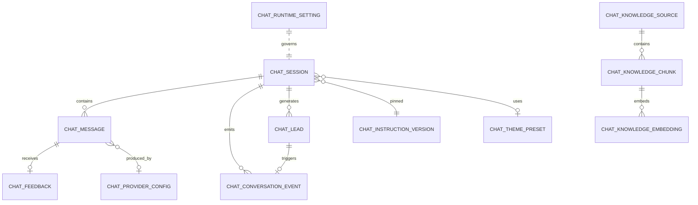

# Chat FemiGlow — spécification de reverse-engineering reproductible

> **Document** : [docs/audit/chat-reverse-engineering-2026-05.md](docs/audit/chat-reverse-engineering-2026-05.md)
> **Date** : 2026-05-13
> **Périmètre** : décortication exhaustive du module *chat* (back, front, data, UI/UX, admin, observabilité) à un niveau permettant la réimplémentation intégrale à partir de cette seule spec.
> **Auteurs** : audit interne (lecture seule, aucune modification de code).
> **Convention** : chaque affirmation est sourcée `chemin/fichier.ts:ligne`. Les chemins partent de `apps/web/` sauf indication contraire.

---

## § 0 — Vue d'ensemble

### 0.1 Mission du module chat

Assistante conversationnelle plurilingue (FR par défaut, AR standard, AR‑MA darija) intégrée à toutes les pages publiques de l'e‑commerce FemiGlow. Trois rôles :

1. **Renseigner** — répond aux questions produit, ingrédients, rituels, livraison, paiement à partir d'une *knowledge base* (RAG pgvector) gouvernée par un *prompt système* versionné.
2. **Capter des leads** — détecte 11 raisons d'offrir un formulaire prénom + téléphone (`explicit-request`, `purchase-intent`, `inline-contact`, `out-of-knowledge`, `objection-repeat`, `long-no-progress`, `frustration`, `after-hours`, `b2b`, `manual`, `lead-capture` automatique sur numéro inline). Pousse les leads vers un webhook CRM/n8n signé HMAC.
3. **Mesurer** — émet un journal d'événements append-only (≈ 27 types) consommé par le tableau de bord admin, exports CSV, attribution conversion vers commandes.

### 0.2 Schéma global

```
┌─────────────────────────────────────────────────────────────────────────────────────────────┐
│  CLIENT (React 18 + Zustand)                                                                │
│                                                                                             │
│  ChatWidgetMount (RSC, feature flag) → ChatWidget (client)                                  │
│     ├── ChatLauncher (FAB 56×56)                                                            │
│     └── ChatPanel (sheet mobile / drawer desktop 380×560)                                   │
│           ├── ChatHeader (titre + statut + fermer)                                          │
│           ├── MessageList (role=log aria-live=polite)                                       │
│           │     ├── MessageBubble user / assistant / sources <details>                      │
│           │     ├── SuggestionPill (quick-reply)                                            │
│           │     └── LeadFormBubble (offered / open / submitting / success / error)          │
│           └── ChatComposer (textarea autorow + send/stop)                                   │
│                                                                                             │
│  chat-store (Zustand + persist localStorage 'femiglow-chat')                                │
│  hooks: use-chat-session, use-chat-send, use-visual-viewport                                │
│  utilitaires: sse-reader, humanize.client                                                   │
└──────────────┬──────────────────────────────────────────────────────────────────────────────┘
               │ HTTPS + cookies (CHAT_VISITOR_COOKIE_NAME, CHAT_SESSION_COOKIE_NAME)
               │ SSE text/event-stream sur /api/chat/message
               ▼
┌─────────────────────────────────────────────────────────────────────────────────────────────┐
│  SERVEUR (Next.js 14 App Router, Drizzle ORM dual-driver)                                   │
│                                                                                             │
│  Routes publiques :                                                                         │
│    /api/chat/session     (GET/POST)  — hydratation + visitor cookie                         │
│    /api/chat/message     (POST SSE)  — pipeline complet (orchestrator)                      │
│    /api/chat/feedback    (POST)      — thumbs ±1                                            │
│    /api/chat/event       (POST)      — KPI append-only                                      │
│    /api/chat/theme       (GET)       — preset CSS / motion / salutations                    │
│    /api/chat/lead/email  (POST)      — capture email simple                                 │
│    /api/chat/lead/contact (POST)     — capture prénom + tél + webhook CRM                   │
│                                                                                             │
│  Routes admin (iron-session) :                                                              │
│    /api/admin/chat/{instructions,sources,providers,settings/toggle,seed-defaults,           │
│                    visualisation/{stream,replay,export}, export/{conversations,kpis}}       │
│                                                                                             │
│  Routes cron (Bearer CRON_SECRET) :                                                         │
│    /api/cron/chat/purge          (hebdo — archive/anonymise)                                │
│    /api/cron/chat/billing-reset  (1er du mois — reset compteurs €)                          │
│                                                                                             │
│  Orchestrator (lib/chat/services/orchestrator.ts)                                           │
│  Providers (factory + 5 adapters : openai|gemini|anthropic|mistral|ollama,                  │
│             azure/qwen/deepseek/zhipu = openai-compatible)                                  │
│  Services : provider-router, billing, rate-limit, sanitize, humanize, charter-filter,       │
│             lead-decision, phone-detect, intent, lang-detect, session-service               │
│  RAG : rag/service.ts, rag/splitter.ts, repos/knowledge.ts (pgvector cosine HNSW)           │
└──────────────┬──────────────────────────────────────────────────────────────────────────────┘
               │
               ▼
┌─────────────────────────────────────────────────────────────────────────────────────────────┐
│  POSTGRES (13 tables chat + 1 extension vector + 1 extension pgcrypto)                      │
│  chat_session, chat_message, chat_conversation_event, chat_feedback,                        │
│  chat_instruction_version, chat_theme_preset, chat_provider_config,                         │
│  chat_knowledge_source, chat_knowledge_chunk, chat_knowledge_embedding,                     │
│  chat_lead, chat_rate_limit_bucket, chat_runtime_setting                                    │
│                                                                                             │
│  Fallback : memoryStore (Map/Set in-process) si DATABASE_URL absent                         │
└──────────────┬──────────────────────────────────────────────────────────────────────────────┘
               │
               ▼
┌─────────────────────────────────────────────────────────────────────────────────────────────┐
│  EXTÉRIEUR                                                                                  │
│   - LLM providers (OpenAI, Anthropic, Gemini, Mistral, Ollama, …)                           │
│   - Embeddings (même pool providers, rôle 'embedding')                                      │
│   - Webhook CRM/n8n (CHAT_LEAD_WEBHOOK_URL, HMAC SHA‑256, timeout 8 s)                      │
│   - Tracking analytics (dataLayer GTM, Plausible)                                           │
└─────────────────────────────────────────────────────────────────────────────────────────────┘
```

### 0.3 Glossaire CHA‑*

| Code | Sujet |
|------|-------|
| CHA‑042/043 | Routes session |
| CHA‑044 | Route message SSE |
| CHA‑045/046/047/048 | Feedback / lead email / event / theme |
| CHA‑050 | Crons (purge + billing reset) |
| CHA‑055 | Widget non‑modal (pas de focus trap dur) |
| CHA‑062 | SuggestionPill interactives |
| CHA‑078 | Humanize côté client (jitter + pauses) |
| CHA‑104…121 | Pages admin (KPI, conversations, instructions, sources, providers, themes, lang, audit) |
| CHA‑131…135 | Tableau de bord système (pipeline live) |
| CHA‑200 | Lead capture in‑chat (table `chat_lead`) |
| CHA‑203 | Toggle runtime `lead_form_enabled` |
| CHA‑205 | Route `/api/chat/lead/contact` |
| CHA‑206 | Webhook lead capture (`CHAT_LEAD_WEBHOOK_URL`) |
| CHA‑225 | Wall des reviews + bug fix SSE events après `end` |
| CHA‑229 | Blocage offres soft après dismiss |
| CHA‑230 | Funnel wizard checkout (extension `chat_lead`) |
| CHA‑243 | Embed YouTube + retry SSE (TODO) |
| CHA‑244 | Mobile UX runbook (100 dvh, body scroll lock) |
| CHA‑260 | Webhook sortant unifié `OUTBOUND_WEBHOOK_URL` |

### 0.4 Variables d'environnement (exhaustif)

Source : [apps/web/src/lib/env.ts:29-64](apps/web/src/lib/env.ts:29).

| Var | Type | Défaut | Rôle |
|-----|------|--------|------|
| `CHAT_ENABLED` | enum `true\|false` | `false` | Kill‑switch ultime côté serveur |
| `CHAT_PROVIDER_KEY` | string ≥ 32 | — | Master key AES‑256‑GCM (chiffre API keys en DB) |
| `CHAT_TOTAL_BUDGET_EUR_MONTHLY` | number ≥ 0 | `0` | Budget mensuel global (0 = illimité) |
| `CHAT_DEFAULT_LANGUAGE` | enum `fr\|ar\|ar-MA` | `fr` | Langue par défaut session |
| `CHAT_DEFAULT_PROVIDER` | enum 9 valeurs | `openai` | Provider de bootstrap si table vide |
| `CHAT_OPENAI_API_KEY`, `CHAT_GEMINI_API_KEY`, `CHAT_ANTHROPIC_API_KEY`, `CHAT_MISTRAL_API_KEY`, `CHAT_AZURE_API_KEY`, `CHAT_AZURE_API_BASE`, `CHAT_OLLAMA_BASE_URL` | strings | — | Clés d'amorçage seeders ([seeders/items/chat-providers.ts]) |
| `CHAT_RATE_LIMIT_PER_MIN` | number ≥ 1 | `20` | Plafond /min (IP par défaut) |
| `CHAT_SESSION_COOKIE_NAME` | string ≥ 3 | `femiglow_chat_session` | Cookie session iron |
| `CHAT_VISITOR_COOKIE_NAME` | string ≥ 2 | `fg_v` | Cookie visiteur persistant |
| `CHAT_LEAD_WEBHOOK_URL` | URL | — | Webhook capture lead (legacy CHA‑206) |
| `CHAT_LEAD_WEBHOOK_SECRET` | string ≥ 16 | — | HMAC secret webhook |
| `CHAT_LEAD_CONSENT_VERSION` | string ≥ 4 | `2026-05-06` | Version RGPD figée sur chaque lead |
| `OUTBOUND_WEBHOOK_URL` | URL | — | Webhook unifié CHA‑260 (priorité sur `CHAT_LEAD_*`) |
| `OUTBOUND_WEBHOOK_SECRET` | string ≥ 16 | — | HMAC secret unifié |
| `CRON_SECRET` | string ≥ 32 | — | Bearer pour `/api/cron/chat/*` |

---

## § 1 — Architecture & frontières

### 1.1 Stack

- **Framework** : Next.js 14.2.15 App Router, RSC + client components stricts.
- **TypeScript** strict, Zod 3.23 aux frontières.
- **Drizzle ORM 0.45** dual‑driver Neon HTTP / postgres‑js (cf. [lib/db/client.ts:175-190](apps/web/src/lib/db/client.ts:175)).
- **State client** : Zustand 5 + middleware `persist` (localStorage).
- **Animations** : Tailwind `motion-safe:*` + CSS animations natives (pas de Framer Motion dans le chat).
- **A11y** : WCAG 2.1 AA visé, hit‑areas 44 × 44, `motion-safe`, RTL natif.

### 1.2 Frontière client/serveur

- Tout secret (clés provider, `CHAT_PROVIDER_KEY`, `CHAT_LEAD_WEBHOOK_SECRET`) reste serveur. Le frontal ne reçoit jamais d'API key.
- Le client n'écrit jamais directement en DB ; toute mutation passe par `/api/chat/*` ou `/api/admin/chat/*`.
- La frontière du *streaming* est SSE (`text/event-stream`) — pas de WebSocket.

### 1.3 Middleware

[apps/web/src/middleware.ts:23-30](apps/web/src/middleware.ts:23) ajoute `chatExtensions.connectSrc` au CSP `connect-src` pour autoriser les fetch SSE vers les providers. Le widget se charge sur toutes les pages publiques (matcher : tout sauf statiques et favicon).

### 1.4 Feature flag à deux niveaux

1. **Env** (`CHAT_ENABLED=true`) — vérifié sync côté serveur par [`isChatEnabled()`](apps/web/src/lib/chat/feature-flag.ts:15). Si `false`, `ChatWidgetMount` retourne `null` et toutes les routes `/api/chat/*` répondent 404.
2. **DB runtime** (`chat_runtime_setting.key='enabled'`, lecture cachée [lib/chat/runtime-setting.ts]) — toggle depuis `/admin/chat` via `POST /api/admin/chat/settings/toggle`. Permet la coupure sans redéploiement.
3. **Sous‑toggle** `lead_form_enabled` — désactive uniquement le formulaire lead (la conversation continue).

---

## § 2 — Modèle de données

### 2.1 Diagramme entités



### 2.2 Tables (récapitulatif)

Schéma source : [lib/chat/db/schema.ts](apps/web/src/lib/chat/db/schema.ts) (≈ 590 lignes).

| Table | Lignes | Rôle |
|-------|--------|------|
| `chat_instruction_version` | 30‑50 | Prompts système versionnés (FR/AR/AR‑MA), un seul `enabled=true` par scope |
| `chat_theme_preset` | 56‑88 | Tokens CSS + layout + motion + salutations par page |
| `chat_provider_config` | 94‑142 | Providers LLM, clés chiffrées AES‑256‑GCM, quotas EUR, fallback priority |
| `chat_session` | 148‑187 | Sessions visiteur (cookie persistant, langue, page, instruction pinned) |
| `chat_message` | 193‑236 | Messages user/assistant/system/tool, tokens, latence, coût, RAG hits |
| `chat_knowledge_source` | 242‑272 | Sources KB (URL / Markdown / PDF / DOCX / FAQ / snippet) |
| `chat_knowledge_chunk` | 278‑302 | Chunks ~500 tokens avec métadonnées (heading, anchor, page) |
| `chat_knowledge_embedding` | 308‑328 | Vecteurs pgvector(1536), index HNSW cosine |
| `chat_conversation_event` | 334‑380 | KPI append‑only (≈ 27 types) |
| `chat_feedback` | 386‑401 | Thumbs ±1, unique par `message_id` |
| `chat_rate_limit_bucket` | 407‑425 | Fenêtres fixes 60 s, scope `ip\|session\|visitor` |
| `chat_runtime_setting` | 433‑439 | Toggles (`enabled`, `lead_form_enabled`) |
| `chat_lead` | 450‑587 | Capture lead + extensions wizard checkout CHA‑230 (38 colonnes au total) |

### 2.3 Détail des colonnes critiques

#### 2.3.1 `chat_session` ([schema.ts:148-187](apps/web/src/lib/chat/db/schema.ts:148))

| Colonne | Type | Contrainte | Note |
|---------|------|------------|------|
| `id` | `text` PK | `cs_xxxxxxxx` | Préfixe imposé par helper `id()` |
| `visitor_id` | `text` NOT NULL, idx | Cookie persistant `fg_v` |  |
| `fingerprint_hash` | `text` | NULL après anonymisation | Hash UA + plugins, anti‑abus |
| `language` | `text` | DEFAULT `'fr'` | Set par `detectLanguage()` au 1er message |
| `page`, `referrer`, `utm` | text/jsonb | NULL | Snapshot d'origine |
| `instruction_version_id` | `text` FK | NOT NULL | Instruction *épinglée* — la session continue avec son prompt même si on en active un nouveau côté admin |
| `theme_preset_id` | `text` FK | NULL | Preset visuel (NULL = défaut) |
| `experiment_variant_id` | `text` | NULL | Slot A/B (futur) |
| `status` | enum | DEFAULT `'open'` | `open\|idle\|archived\|purged` |
| `opened_at`, `last_seen_at`, `archived_at`, `purged_at` | tz | DEFAULT NOW() | Cycle de vie |
| `consent` | jsonb | NULL | `{essential, analytics, marketing}` |
| `converted_order_id`, `converted_at` | text/tz | idx | Attribution conversion |
| `meta_summary` | text | NULL | Résumé LLM (futur) |

Index : `(visitor_id)`, `(status, last_seen_at)`, `(converted_at)`, `(page)`.

#### 2.3.2 `chat_message` ([schema.ts:193-236](apps/web/src/lib/chat/db/schema.ts:193))

Trois colonnes texte :
- `content` : version finale affichée (post‑charter).
- `content_raw` : avant redaction PII (utilisé pour `phone-detect` inline). Soft‑deleted à NULL sur droit à l'oubli.
- `content_safe` : post `sanitize()` (téléphones, e‑mails, IBAN, CB, CNI masqués).

Tokens : `tokens_in`, `tokens_out` (NULL chez Ollama). Latence : `latency_ms` + `first_token_ms` (TTFB pour KPI). Coût : `numeric(10,6)` EUR. RAG : `rag_hits jsonb` (array `{chunkId, score, sourceLabel}`). Moderation : `moderation jsonb` (`{input:{flagged,categories}, output:{flagged,rewritten}}`).

Status : `pending\|streaming\|sent\|error\|deleted`. Index : `(session_id, created_at)` (chargement transcript), `(status)` (retry), GIN `to_tsvector('simple', content)` (recherche admin).

#### 2.3.3 `chat_provider_config` ([schema.ts:94-142](apps/web/src/lib/chat/db/schema.ts:94))

- `kind` enum 9 valeurs (`openai`, `gemini`, `anthropic`, `mistral`, `qwen`, `deepseek`, `zhipu`, `ollama`, `azure-openai`).
- `role` : `chat\|embedding\|moderation\|rerank`.
- `priority` (int) — plus bas = essayé en premier (cf. [provider-router.ts:79-101](apps/web/src/lib/chat/services/provider-router.ts:79)).
- `api_key_encrypted` + `api_key_iv` — AES‑256‑GCM via `secrets.ts`.
- `api_base` — override Azure / Ollama self‑hosted.
- `quota_monthly_eur`, `consumed_month_eur`, `consumed_reset_at` — compteur reset par cron.
- `egress_allowed` — opt‑in pour autoriser l'envoi de PII bruts (par défaut `false`).
- `parameters jsonb` — `{temperature?, topP?, maxTokens?, timeoutMs?}`.

Index : `(role, priority, enabled)` — pivot du routeur.

#### 2.3.4 `chat_knowledge_source` + `chat_knowledge_chunk` + `chat_knowledge_embedding`

Pipeline : `source` (raw_hash unique par language) → `chunk` (ordinal 0..N, unique par `(source_id, ordinal)`) → `embedding` (un par (`chunk_id`, `embedder_model`), `vector(1536)` HNSW).

Métadonnées chunk : `{heading?, url?, anchor?, page?, lastUpdatedAt?}`.

#### 2.3.5 `chat_lead` ([schema.ts:450-587](apps/web/src/lib/chat/db/schema.ts:450))

**Cœur CHA‑200** : `id`, `session_id` FK cascade, `triggering_message_id`, `trigger_reason` (11 valeurs), `first_name`, `phone_e164`, `phone_raw`, `consent_version`, `consent_at`, `language`, `intent_at_capture`, `snapshot_messages jsonb`.

**Webhook** : `webhook_status` (`pending\|sent\|failed\|disabled`), `webhook_attempts`, `webhook_last_error`, `webhook_sent_at`.

**Suivi** : `handled_by`, `handled_at`, `outcome` (`pending\|reached\|no-answer\|converted\|discarded`), `converted_order_id`.

**Extensions CHA‑230** (wizard checkout) — toutes nullable : `last_name`, `email` (idx partiel WHERE NOT NULL), `email_verified_at`, `email_consent`, `shipping_*` (5 colonnes), `preferred_payment_method`, `source`, `form_id`, `form_mode`, `variant_key`, `gclid`, `fbp`, `fbc`, `cart_snapshot jsonb`, `cart_total_cents`, `last_touched_step`, `lead_captured_at`, `address_completed_at`, `payment_selected_at`, `purchased_at`, `abandon_webhook_at`.

Index : 9 au total — sur session, visitor, outcome, webhook_status, phone, email partiel, source, form, step.

#### 2.3.6 `chat_conversation_event` ([schema.ts:334-380](apps/web/src/lib/chat/db/schema.ts:334))

Append‑only. Types (27) :
- Session : `session_open`, `widget_open`, `widget_close`.
- Messages : `message_sent_user`, `message_sent_agent`, `message_received_first_token`, `message_complete`.
- Feedback : `feedback_positive`, `feedback_negative`, `suggestion_clicked`, `language_switch`.
- Erreurs : `error`, `rate_limit_hit`.
- Conversion : `conversion_attributed`.
- Lead (CHA‑203/225) : `chat_lead_form_offered`, `chat_lead_form_view`, `chat_lead_form_focus`, `chat_lead_form_dismiss`, `chat_lead_form_submit`, `chat_lead_webhook_sent`, `chat_lead_webhook_failed`, `chat_lead_auto_created`, `chat_lead_form_upgrade`.

Index : `(session_id, occurred_at)`, `(type, occurred_at)`.

#### 2.3.7 `chat_rate_limit_bucket`

Algorithme **fenêtre fixe 60 s** persistée en DB. INSERT … ON CONFLICT `(scope, key, window_start)` DO UPDATE `count = count + 1` (atomique). `expires_at = window_start + 120 s` ; purge cron.

### 2.4 Repos (matrice opérations)

| Repo | Fichier | Opérations exposées |
|------|---------|---------------------|
| `sessionRepo` | `repos/session.ts:12-78` | `getById`, `getActiveByVisitor`, `create`, `update`, `touch`, `archive`, `forget` |
| `messageRepo` | `repos/message.ts:13-93` | `listBySession(limit=50)`, `getById`, `create`, `update`, `searchFullText`, `recentForMemory(k)` |
| `instructionRepo` | `repos/instruction.ts:14-137` | `listByScope`, `active(scope)`, `getById`, `create`, `update`, `activate` (txn : désactive l'ancien puis active le nouveau) |
| `sourceRepo` | `repos/knowledge.ts:22-72` | `getById`, `create`, `update`, `listEnabled`, `findByHash` |
| `chunkRepo` | `repos/knowledge.ts:74-99` | `deleteBySource` (cascade), `insertMany`, `getById` |
| `embeddingRepo` | `repos/knowledge.ts:101-135` | `insertMany`, `searchSimilar(vector, topK, minScore)` — SQL brut `<=>` pgvector |
| `providerRepo` | `repos/provider.ts:22-123` | `listByRole(role, enabled=true)`, `getById`, `create`, `update`, `decode(row)` (déchiffre la clé) |
| `eventRepo` | `repos/event.ts:14-50` | `append(sessionId, type, payload?)`, `listBySession`, `countByTypeSince` |
| `leadRepo` | `repos/lead.ts:36-210` | `create`, `getById`, `findBySession`, `hasLeadForSession`, `upgrade`, `markWebhookSent\|Failed`, `listForAdmin`, `setOutcome` |

Tous les repos exposent une variante mémoire (`memoryStore()`) via `requireChatDb()` qui retourne `null` si `DATABASE_URL` absent — fallback in‑process pour dev/tests Vitest. Les opérations vectorielles et FT lèvent `ChatDbUnavailableError` en mode mémoire.

### 2.5 Migrations (chronologie)

| Fichier | N° | Rôle |
|---------|----|------|
| `0012_chat_init.sql` | 0012 | 11 tables + extensions `pgcrypto`, `vector` + 13 index (GIN, HNSW) |
| `0013_chat_runtime_setting.sql` | 0013 | `chat_runtime_setting` + seed `'enabled'=true` |
| `0014_chat_lead.sql` | 0014 | `chat_lead` (CHA‑200) + 5 index + seed `'lead_form_enabled'=true` |
| `0016_chat_lead_funnel_extensions.sql` | 0016 | CHA‑230 : 17 colonnes ALTER + 5 index partiels + 5 CHECK |

### 2.6 Seeders

| Seeder | Comportement |
|--------|--------------|
| [`chat-instructions.ts`](apps/web/src/lib/seeders/items/chat-instructions.ts) | Crée v1 si scope vide, idempotent |
| [`chat-instructions-v2.ts`](apps/web/src/lib/seeders/items/chat-instructions-v2.ts) | Importe `DEFAULT_INSTRUCTION_FR_V2` / `_AR_V2` / `_AR_MA_V2` depuis [`lib/chat/instruction-defaults.ts`] — voix FemiGlow, kit, COD, pas de redirection externe |
| [`chat-theme.ts`](apps/web/src/lib/seeders/items/chat-theme.ts) | Crée preset `is_default=true` si absent, tokens FemiGlow (creme/encre/petale) |
| [`chat-providers.ts`](apps/web/src/lib/seeders/items/chat-providers.ts) | Lit `.env` (`CHAT_*_API_KEY`), chiffre via `CHAT_PROVIDER_KEY`, crée si vide |

Bouton admin "Seed par défaut" : POST [`/api/admin/chat/seed-defaults`](apps/web/src/app/api/admin/chat/seed-defaults/route.ts).

### 2.7 Cycle de vie & PII

| Entité | TTL | Politique |
|--------|-----|-----------|
| `chat_session` | ∞ | `open` → `archived` après 30 j idle (cron hebdo) → `purged` après 365 j (anonymisation `visitor_id` random, `fingerprint_hash=NULL`, `referrer=NULL`, `utm=NULL`) |
| `chat_message.content_raw` | 30 j conseillé | NULL après droit à l'oubli ou archivage |
| `chat_rate_limit_bucket` | 120 s | Purge cron quotidien (DELETE WHERE expires_at < NOW()) |
| `chat_lead` | ∞ | Aucune suppression auto ; phone E.164 indexée |
| `chat_conversation_event` | ∞ | Append‑only, compactage analytique optionnel |

PII stockée : `phone_e164`, `phone_raw`, `email` (opt‑in step 4), `first_name`, `last_name`, `shipping_*`. Consent enregistré par version (`CHAT_LEAD_CONSENT_VERSION`).

---

## § 3 — Pipeline backend

### 3.1 Vue d'ensemble du pipeline message

Source : [lib/chat/services/orchestrator.ts:52-417](apps/web/src/lib/chat/services/orchestrator.ts:52).

```
POST /api/chat/message  (sessionId, text)
  ↓
1. sanitize + redact PII        → contentRaw / contentSafe / redactions[]
2. detectLanguage(contentSafe)  → fr | ar | ar-MA
3. detectIntent(contentSafe)    → 15 intents (scoring pondéré)
4. charterFilter.inbound        → bloque jailbreaks ; warn médical
5. rateLimit.consume (session)  → fenêtre 60s
6. rateLimit.consume (ip)       → fenêtre 60s
7. messageRepo.create(user)     → INSERT chat_message status='sent'
8. eventRepo.append('message_sent_user', {redactions, intent})
9. instructionRepo.active('default') + messageRepo.recentForMemory(12)
10. ragService.retrieve(question, language, topK=4)
11. providerRouter.choose('chat')  → 1er provider ok (priority, breaker, quota)
12. assert billing.monthlyTotalEur() < CHAT_TOTAL_BUDGET_EUR_MONTHLY
13. messageRepo.create(assistant, status='streaming')
14. SSE start { messageId, language }
15. provider.streamChat(req)   → AsyncIterable<chunk>
    pour chaque chunk:
        SSE chunk { messageId, delta }
        accumule full text
16. provider.final()           → { text, tokensIn, tokensOut, modelName, costEur }
17. charterFilter.outbound(fullText) → si bloqué : rewrite hint ou error
18. messageRepo.update(assistant, content, tokens, latency, cost, status='sent')
19. providerRepo.incrementConsumed(providerId, costEur)
20. eventRepo.append('message_sent_agent', {tokens, latency, modelName})
21. SSE source { messageId, sources[] }  (si RAG hits)
22. SSE end { messageId, latencyMs }
23. shouldOfferLeadForm(history, intent, reply, alreadyOffered, enabled)
    + détection inline phone (auto-lead fallback)
24. si offer:
        SSE lead-form-offer { messageId, reason, copyKey }
        eventRepo.append('chat_lead_form_offered')
25. Sur erreur (étapes 14-18):
        providerRouter.recordFailure(providerId)
        messageRepo.update(status='error', errorCode)
        SSE error { code, message? }
```

### 3.2 Sanitize / Humanize / Charter (pipeline texte)

#### 3.2.1 Sanitize ([services/sanitize.ts](apps/web/src/lib/chat/services/sanitize.ts))

Trim, normalise espaces, tronque à 2 000 caractères. Détecte et masque par regex :
- E‑mails → `[email]`
- Téléphones (formats FR + MA, avec/sans séparateurs) → `[téléphone]`
- IBAN → `[iban]`
- Cartes bancaires (Luhn) → `[carte]`
- CNI marocaine → `[cni]`
- Codes postaux → `[code]`

Retourne `{contentRaw, contentSafe, truncated, redactions[]}`. **Le `contentRaw` reste non‑masqué** pour permettre à `phone-detect` (étape 23) de capturer un numéro inline et créer un lead fallback ([orchestrator.ts:266](apps/web/src/lib/chat/services/orchestrator.ts:266)).

#### 3.2.2 Humanize serveur / client

[services/humanize.ts:26-46](apps/web/src/lib/chat/services/humanize.ts:26) expose les paramètres par défaut renvoyés au client via `/api/chat/theme.motion` :
- `jitterMinMs: 30`, `jitterMaxMs: 60` — délai aléatoire entre tokens.
- `punctPauseMs: 120` — pause après `.!?…؟`.
- Pause virgule/point‑virgule : 60 ms.
- `minTypingMs: 600` — délai minimum avant le premier token (« réflexion »).

[components/chat/humanize.client.ts:46](apps/web/src/components/chat/humanize.client.ts:46) applique côté client via `humanizeStream(source, onTick, opts, ctx)`. Désactivé si `prefers-reduced-motion: reduce` ([humanize.client.ts:108-115](apps/web/src/components/chat/humanize.client.ts:108)).

#### 3.2.3 Charter‑filter ([services/charter-filter.ts:102-193](apps/web/src/lib/chat/services/charter-filter.ts:102))

**Inbound** : autorise le médical avec *warn*, bloque jailbreaks (`"ignore previous"`, `"reveal prompt"`, `"developer mode"`, `"dan mode"`).

**Outbound** : bloque la réponse si elle contient :
- Termes médicaux (mycose, eczéma, psoriasis, cancer, diabète, enceinte, allaitement, médicament, ordonnance, infection, douleur, piqûre + équivalents AR/Darija) **sans disclaimer** (regex `/(consult|professionnel|médecin|dermatologue|tabib)`).
- Marques tierces (`opi`, `essie`, `sephora`, `amazon`, `shein`).
- Prix promotionnels non vérifiés (`% réduction`, `gratuit`, `remboursement`, `cashback`).
- Profanité (FR : putain, merde, connard, salope).

Retourne `{allowed, reason?, rewriteHint?, detected[]}`. Si bloqué outbound, l'orchestrator soit réécrit via prompt suivant, soit émet `SSE error` selon la criticité.

### 3.3 Détection de langue ([lang/detect.ts:22-60](apps/web/src/lib/chat/lang/detect.ts:22))

Heuristique en 3 étages :
1. Si ≥ 3 caractères Unicode arabes (U+0600–U+06FF) :
   - Match darija arabe ≥ 1 token OU MSA < 2 tokens → `'ar-MA'`.
   - Sinon → `'ar'`.
2. Sinon scan tokens darija en script latin (dictionnaire lowercase) : ≥ 2 matches → `'ar-MA'`.
3. Défaut → `'fr'`.

Dictionnaires : [lang/dictionary.ts](apps/web/src/lib/chat/lang/dictionary.ts) — `DARIJA_FR_TOKENS` (bzzaf, wakha, chno, bghit, …), `DARIJA_AR_TOKENS`, `MSA_AR_TOKENS`.

### 3.4 Intent ([services/intent.ts])

Scoring pondéré sur ≈ 15 intents : `greeting`, `pricing`, `routine`, `support`, `purchase-intent`, `callback-request`, `order-status`, `delivery`, `comparison`, `objection-doubt`, `social-proof`, `frustration`, `b2b`, `medical`, `misc`. Patterns forts (mot‑clé exact dans `[buying-now]` set) vs faibles, règles `negate` (ex. `"pas envie d'acheter"` → pas `purchase-intent`).

### 3.5 Providers (factory + adapters)

#### 3.5.1 Contrat unifié ([providers/types.ts:90-110](apps/web/src/lib/chat/providers/types.ts:90))

```ts
interface ChatProvider {
  streamChat(req: ChatStreamRequest): Promise<{
    stream: AsyncIterable<ChatStreamChunk>;
    final: () => Promise<ChatStreamResult>;
  }>;
  embed?(req): Promise<EmbeddingResult>;
  moderate?(req): Promise<ModerationResult>;
  ping(): Promise<{ ok: boolean; latencyMs: number; modelName?: string }>;
}

interface ChatStreamRequest {
  messages: Array<{role, content}>;
  language: ChatLanguage;
  model?: string;             // override
  temperature?, topP?, maxTokens?;
  signal: AbortSignal;
}

interface ChatStreamChunk {
  delta: string;
  finishReason?: 'stop' | 'length' | 'content_filter' | 'tool_calls' | 'error';
}

interface ChatStreamResult {
  text: string;
  tokensIn: number | null;
  tokensOut: number | null;
  costEur: number | null;   // null pour Ollama
  modelName: string;
}
```

`ProviderError.code` : `auth | rate-limit | quota-exceeded | timeout | context-too-large | content-filter | network | invalid-response | unknown`. Champ `retryable: boolean`.

#### 3.5.2 Factory ([providers/factory.ts:23-51](apps/web/src/lib/chat/providers/factory.ts:23))

`instantiateProvider(config)` dispatch par `kind`. Les kinds OpenAI‑compatibles (`qwen`, `deepseek`, `zhipu`, `azure-openai`) partagent l'adapter OpenAI avec un `apiBase` override.

#### 3.5.3 Adapter OpenAI ([providers/openai.ts:39-150](apps/web/src/lib/chat/providers/openai.ts:39))

- POST `/v1/chat/completions` avec `stream: true`, `stream_options: { include_usage: true }`.
- Parsing SSE ligne par ligne, agrégation des `delta` jusqu'à `[DONE]`.
- `usage` dans le dernier chunk → `tokensIn` / `tokensOut`.
- `withTimeout()` merge `req.signal` + timeout serveur (défaut 30 s).
- Cleanup explicite (`clearTimeout`).
- `costEur` calculé par `estimateCostEur(model, tokensIn, tokensOut)` à partir d'une table interne ([providers/pricing.ts](apps/web/src/lib/chat/providers/pricing.ts)).

Adapters analogues : Anthropic (`/v1/messages`, claude‑3.5‑sonnet par défaut), Gemini (SDK `@google/generative-ai`), Mistral (`/v1/chat/completions` compatible OpenAI), Ollama (local, `costEur = null`, pas d'API key).

#### 3.5.4 Provider router ([services/provider-router.ts:79-101](apps/web/src/lib/chat/services/provider-router.ts:79))

1. `providerRepo.listByRole(role, enabled=true)` triés par `priority ASC`.
2. Filtre : skip si breaker ouvert OU `consumedMonthEur >= quotaMonthlyEur`.
3. Premier candidat gagne. Sinon → `ProviderError('unknown', 'no provider available')`.

**Circuit breaker in‑memory** ([provider-router.ts:21-69](apps/web/src/lib/chat/services/provider-router.ts:21)) :
- État `{failures, openedAt, cooldownMs}` par `providerId`.
- Seuil 3 échecs OU 1 échec non‑retryable → ouvert.
- Cooldown 30 s → demi‑ouvert (retente).
- `recordSuccess()` → reset.

⚠️ Dette V1 : compteurs locaux à l'instance Vercel. Scale‑out → chaque instance gère ses propres compteurs (acceptable, à migrer vers Redis V2).

### 3.6 Billing & budget ([services/billing.ts](apps/web/src/lib/chat/services/billing.ts))

API :
```ts
billing.estimateCostEur(model, tokensIn, tokensOut): number | null;
billing.monthlyTotalEur(): Promise<number>;          // SUM(provider.consumed_month_eur)
billing.assertBudget(): Promise<void>;               // throw si limit atteinte
billing.resetMonthlyCounters(): Promise<void>;       // appelé par cron 1er du mois
```

Si `CHAT_TOTAL_BUDGET_EUR_MONTHLY = 0` → illimité. Sinon throw `ChatBudgetExceededError { code: 'budget-exceeded', totalEur, limitEur }` avant d'appeler le provider.

### 3.7 Rate‑limit ([services/rate-limit.ts](apps/web/src/lib/chat/services/rate-limit.ts))

Fenêtre fixe 60 s persistée en DB (cf. § 2.3.7). API :

```ts
rateLimit.consume(scope: 'ip'|'session'|'visitor', key: string): Promise<{
  allowed: boolean;
  remaining: number;
  resetAt: Date;
}>;
rateLimit.purgeExpired(): Promise<number>;
```

Plafonds par défaut :
- IP : 60 req/min (override `CHAT_RATE_LIMIT_PER_MIN`).
- Session : 30 req/min.
- Visitor : 90 req/min.

Si dépassé → 429 avec header `Retry-After: <secondes>`.

### 3.8 RAG (knowledge base)

#### 3.8.1 Pipeline ingestion ([rag/service.ts:115-150](apps/web/src/lib/chat/rag/service.ts:115))

1. `loadSource(input)` selon `kind` (URL via fetch + cheerio, PDF via pdfjs, DOCX via docx‑parser, FAQ Q/R en markdown).
2. SHA‑256 du contenu brut → dédup (`raw_hash` unique par `language`).
3. Si hash existe : retourne `sourceId` existant.
4. Sinon : INSERT `chat_knowledge_source` → `splitMarkdown()` ~ 500 tokens avec recouvrement → INSERT chunks → `embedTexts()` via provider rôle `embedding` → INSERT embeddings (`vector pgvector`).

#### 3.8.2 Retrieve ([rag/service.ts:164+](apps/web/src/lib/chat/rag/service.ts:164))

```ts
ragService.retrieve({
  question: string;
  language: ChatLanguage;
  topK?: number;    // défaut 4
  minScore?: number;
}): Promise<RetrievedChunk[]>;
```

1. Embed la question avec le même provider/modèle d'embedding.
2. Requête SQL `vector <=> question_vector` (cosine distance, HNSW index).
3. Re‑rank heuristique (langue matching, tag filtering).
4. Top‑K (4 par défaut), filtre `minScore` optionnel.

Les chunks retournés sont injectés dans le system prompt sous forme de Markdown contextuel (`## Sources` …).

### 3.9 Lead capture (decision + write)

#### 3.9.1 Décision ([services/lead-decision.ts:162-281](apps/web/src/lib/chat/services/lead-decision.ts:162))

```ts
shouldOfferLeadForm(input: LeadDecisionInput): LeadDecisionResult;

type LeadFormReason =
  | 'explicit-request' | 'out-of-knowledge' | 'objection-repeat'
  | 'long-no-progress' | 'frustration' | 'after-hours'
  | 'b2b' | 'purchase-intent' | 'inline-contact' | 'manual';
```

Première raison qui matche gagne (priorité descendante) :
1. **inline-contact** : `looksLikePhone(lastUserMsg)` (regex ≥ 3 chiffres OU préfixe `+`/`00` OU `0[5-7] + 8 chiffres`).
2. **explicit-request** : `intent='callback-request'`, dès le 1er message.
3. **purchase-intent** : `intent='purchase-intent'`, dès le 1er message.
4. *(≥ 2 messages user requis pour les suivants)*
5. **b2b** : `intent='b2b'`.
6. **frustration** : `intent='frustration'`.
7. **out-of-knowledge** : regex `"je ne sais pas"`, `"je n'ai pas info"`, `"pas d'informations"` dans la réponse assistant.
8. **objection-repeat** : 2 derniers messages user contiennent `"trop cher"`, `"pas convaincu"`, etc.
9. **long-no-progress** : ≥ 5 messages user ET intent ∈ {misc, greeting, social-proof, comparison, objection-doubt}.
10. **after-hours** : ≥ 3 messages user ET `isAfterHoursMA(now)` (hors lun–sam 9h–17h UTC+1).

Retour : `{shouldOffer: boolean, reason?: LeadFormReason, copyKey?: string, debug?: object}`.

#### 3.9.2 Phone detect ([services/phone-detect.ts])

Parse robuste E.164 avec :
- Préfixes MA : `+212`, `00212`, `0[5-7]` + 8 chiffres.
- Préfixes FR : `+33`, `0[1-9]` + 8 chiffres.
- Heuristique `countryHint` injectée depuis le select pays UI.

Confiance `high | medium | low` selon nombre de signaux concordants. Si `high|medium` et pas de lead existant, l'orchestrator crée un **lead fallback** automatique (`triggerReason='inline-contact'`, `consent_version='2026-05-06+inline-fallback'`, note explicative).

#### 3.9.3 Route `/api/chat/lead/contact` ([route.ts:49-214](apps/web/src/app/api/chat/lead/contact/route.ts:49))

Pipeline :
1. Feature flag runtime `lead_form_enabled` → 503 si off.
2. Validation Zod `chatLeadContactInput` (sessionId, firstName, phoneRaw, countryHint, triggerReason, consent=true, consentVersion, language, honeypot).
3. **Honeypot** (`_phone_alt`) : si rempli → log warn + 200 fake (ne pas signaler au bot).
4. Rate‑limit IP : `consume('ip', 'lead:'+ip)` max 5/min.
5. `sessionRepo.getById(sessionId)` → 404 sinon.
6. **Idempotence** : `leadRepo.findBySession()`. Si lead existe SAUF triggerReason `'inline-contact'` → 409. Sinon upgrade fallback.
7. `parsePhone(phoneRaw, countryHint)` → `{e164, type, country}`. Si parse fail → 422.
8. Snapshot 6 derniers messages.
9. `intentAtCapture` via `detectIntent` sur dernier message user.
10. INSERT ou UPDATE `chat_lead` avec snapshot, UTM, intent, language.
11. `eventRepo.append('chat_lead_form_submit')`.
12. Webhook dispatch ([lib/webhooks/outbound/sources/from-chat-lead.ts](apps/web/src/lib/webhooks/outbound/sources/from-chat-lead.ts)) non‑bloquant, timeout 8 s, signature HMAC SHA‑256.
13. Réponse `{ok: true, leadId, outcomeMessage, webhookStatus}` (outcomeMessage localisé FR/AR/AR‑MA).

### 3.10 Cron jobs

#### 3.10.1 `/api/cron/chat/billing-reset` (CHA‑050)

- Cron Vercel : `0 0 1 * *` (1er du mois, minuit).
- Auth : `isAuthorizedCron(req)` ([services/auth-cron.ts](apps/web/src/lib/chat/services/auth-cron.ts)) — header `Authorization: Bearer $CRON_SECRET`.
- Action : `UPDATE chat_provider_config SET consumed_month_eur = 0, consumed_reset_at = NOW()`.

#### 3.10.2 `/api/cron/chat/purge`

- Cron hebdo (dimanche 1h).
- Actions séquentielles :
  1. Sessions `open` idle > 90 j → `status='archived'`, `archived_at=NOW()`.
  2. Sessions `archived` > 365 j → `status='purged'`, anonymisation (`visitor_id` random, `fingerprint_hash=NULL`, `referrer=NULL`, `utm=NULL`).
  3. `chat_rate_limit_bucket WHERE expires_at < NOW()` → DELETE.
- Retour JSON `{archived, purged, rateLimitBucketsCleaned}`.

---

## § 4 — Routes API (récapitulatif)

### 4.1 Routes publiques

| Route | Méthode | Auth | Body Zod | Réponse | Statuts |
|-------|---------|------|----------|---------|---------|
| `/api/chat/session` | GET | cookie visiteur | `?page=` | `ChatSessionSnapshot` | 200/404 |
| `/api/chat/session` | POST | cookie | `chatSessionRefreshInput` | snapshot | 200/404 |
| `/api/chat/message` | POST | cookie session | `chatMessageInput` (sessionId, text 1‑2000) | SSE stream | 200/429/503 |
| `/api/chat/feedback` | POST | cookie | `chatFeedbackInput` (messageId, value ±1, note?) | `{ok}` | 200/404 |
| `/api/chat/event` | POST | cookie | `chatEventInput` (sessionId, type, payload?) | `{ok}` | 200 |
| `/api/chat/theme` | GET | — | — | `ChatThemePresetRow` (cache 5 min) | 200 |
| `/api/chat/lead/email` | POST | cookie | `chatLeadEmailInput` | `{ok}` | 200/422 |
| `/api/chat/lead/contact` | POST | cookie | `chatLeadContactInput` | `{ok, leadId, outcomeMessage, webhookStatus}` | 200/409/422/503 |

Cookies posés : `CHAT_VISITOR_COOKIE_NAME` (1 an, persistent), `CHAT_SESSION_COOKIE_NAME` (session iron).

### 4.2 Routes admin (`iron-session`)

Toutes derrière `requireAdminApi()` ([lib/chat/admin/auth.ts:11-23](apps/web/src/lib/chat/admin/auth.ts:11)).

| Route | Méthode | Effet |
|-------|---------|-------|
| `/api/admin/chat/instructions` | GET/POST | List / create version |
| `/api/admin/chat/instructions/[id]` | GET/POST | Get / `_action=update\|activate\|duplicate` |
| `/api/admin/chat/instructions/[id]/activate` | POST | Active (txn désactive l'ancien) |
| `/api/admin/chat/sources` | GET/POST | List / ingest sync (split + embed + insert) |
| `/api/admin/chat/providers` | GET/POST | List / create (clé chiffrée AES‑256‑GCM) |
| `/api/admin/chat/providers/models` | POST | `{kind, apiKey?, apiBase?}` → `{models, source:'fetch\|fallback'}` |
| `/api/admin/chat/providers/[id]` | DELETE | Suppression |
| `/api/admin/chat/settings/toggle` | POST | `setChatActive()` runtime |
| `/api/admin/chat/seed-defaults` | POST | Idempotent : instructions + theme |
| `/api/admin/chat/visualisation/stream` | GET | SSE pipeline live |
| `/api/admin/chat/visualisation/replay` | GET | SSE replay `?sessionId=` |
| `/api/admin/chat/visualisation/export` | GET | Export JSON timeline |
| `/api/admin/chat/export/conversations` | GET | CSV `?w=7d\|30d\|...` |
| `/api/admin/chat/export/kpis` | GET | CSV |

### 4.3 Routes cron

| Route | Méthode | Auth | Effet |
|-------|---------|------|-------|
| `/api/cron/chat/purge` | GET | `Bearer CRON_SECRET` | Archive + anonymise + purge rate‑limit |
| `/api/cron/chat/billing-reset` | GET | idem | Reset compteurs mensuels |

---

## § 5 — Frontend client

### 5.1 Arborescence composants

```
RootLayout (apps/web/src/app/layout.tsx:107)
  └── ChatWidgetMount (server) — feature-flag gate
        └── ChatWidget (client, components/chat/ChatWidget.tsx:17)
              ├── ChatLauncher (ChatLauncher.tsx:20)
              │     └── ChatIcon (SVG toggle)
              └── ChatPanel (ChatPanel.tsx:31)
                    ├── ChatHeader (ChatHeader.tsx:13)
                    ├── MessageList (MessageList.tsx:15)
                    │     ├── MessageBubble (MessageBubble.tsx:16)
                    │     ├── SourcesPopover (<details> dans MessageBubble:58)
                    │     ├── SuggestionPill (inline dans MessageList:95)
                    │     └── LeadFormBubble (LeadFormBubble.tsx:54)
                    └── ChatComposer (ChatComposer.tsx:19)
```

### 5.2 Store Zustand ([components/chat/chat-store.ts:140](apps/web/src/components/chat/chat-store.ts:140))

#### 5.2.1 État persisté (localStorage `femiglow-chat`)

```ts
interface ChatPersistedState {
  sessionId: string | null;
  language: ChatLanguage;
  hasInteracted: boolean;
  leadOfferDismissedSessionId: string | null;
  leadCapturedSessionId: string | null;
}
```

#### 5.2.2 État volatil

```ts
interface ChatVolatileState {
  isOpen: boolean;
  isStreaming: boolean;
  messages: ChatMessageDto[];
  pendingAssistantId: string | null;
  error: string | null;
  greeting: string;
  suggestions: string[];           // max 3
  leadOffer: LeadOfferState;
}

interface LeadOfferState {
  status: 'idle' | 'offered' | 'open' | 'submitting' | 'success' | 'error';
  triggeringMessageId: string | null;
  reason: ChatLeadTriggerReason | null;
  copyKey: string | null;
  errorMessage: string | null;
  successMessage: string | null;
}
```

#### 5.2.3 Actions principales

- `open()`, `close()`, `toggle()`.
- `setLanguage(lang)`.
- `setSession(snapshot)` — hydrate depuis GET `/api/chat/session`.
- `pushUserMessage(message)`.
- `beginStreaming(messageId)` — crée message assistant vide `status='streaming'`.
- `appendDelta(messageId, delta)`.
- `setSources(messageId, sources)`.
- `endStreaming(messageId)` — `status='sent'`.
- `setError(message)`.
- Lead : `receiveLeadOffer({messageId, reason, copyKey})`, `openLeadForm()`, `dismissLeadForm(reason)`, `setLeadFormSubmitting()`, `setLeadFormSuccess(msg)`, `setLeadFormError(msg)`.
- `reset()` — restaure défaut.

#### 5.2.4 Logique de blocage offre soft (CHA‑229)

[chat-store.ts:117-122](apps/web/src/components/chat/chat-store.ts:117) :
```ts
const STRONG_LEAD_REASONS = new Set([
  'explicit-request', 'purchase-intent', 'inline-contact', 'manual'
]);

// Dans receiveLeadOffer:
if (s.leadOfferDismissedSessionId === s.sessionId && !STRONG_LEAD_REASONS.has(reason)) {
  return {}; // ignore l'offre "soft"
}
```

### 5.3 Hooks

#### 5.3.1 `useChatSession(page?)` ([hooks/use-chat-session.ts:14](apps/web/src/components/chat/hooks/use-chat-session.ts:14))

- Idempotent : si `sessionId` déjà peuplé, no‑op.
- Premier mount → `GET /api/chat/session?page=…` → `setSession(snapshot)`.
- Fallback silencieux si 404 (feature flag off).
- AbortController syntétique pour cancellation au unmount.

#### 5.3.2 `useChatSend()` ([hooks/use-chat-send.ts:19](apps/web/src/components/chat/hooks/use-chat-send.ts:19))

Retourne `{send: (text: string) => Promise<void>, cancel: () => void}`.

Pipeline `send` :
1. Trim + validation (non‑vide, pas en streaming).
2. `pushUserMessage(message)`.
3. POST `/api/chat/message` avec `Accept: text/event-stream`.
4. `readSseStream(response.body)` → AsyncIterable de `ChatStreamEvent`.
5. Pour chaque event :
   - `start` → `beginStreaming(messageId)`, détecte changement de langue.
   - `chunk` → enqueue dans une file FIFO → `humanizeStream(queue, appendDelta, opts, ctx)`.
   - `source` → `setSources(messageId, sources)`.
   - `end` → attend que la file soit drainée → `endStreaming(messageId)`.
   - `lead-form-offer` → `receiveLeadOffer({…})` + dataLayer push.
   - `error` → `setError(message)` + éventuel `endStreaming`.

⚠️ Bug fix CHA‑225 : la boucle de lecture **ne s'arrête pas** au premier `end` — un `lead-form-offer` peut arriver après ([sse-reader.ts:16+](apps/web/src/components/chat/sse-reader.ts:16)).

Tracking dataLayer :
- `chat_message_sent` : `message_index`, `chars`.
- `chat_message_received` : `first_token_ms` (TTFB).
- `chat_message_complete` : `latency_ms`.
- `chat_lead_form_offered` : `reason`, `copy_key`.

#### 5.3.3 `useVisualViewportHeight()` ([hooks/use-visual-viewport.ts:24])

Retourne la hauteur visible (moins clavier iOS). Branché optionnellement à `ChatPanel` (v2).

### 5.4 SSE reader ([components/chat/sse-reader.ts:16](apps/web/src/components/chat/sse-reader.ts:16))

Parser robuste :
- Buffer UTF‑8, split par `"\n\n"`.
- Parse `event: X\ndata: <json>\n\n`.
- Tolère blocs fragmentés multi‑chunks réseau.
- Tolère JSON invalide (`data = null`, pas d'exception).
- Tolère événements après `end` (continuer la lecture jusqu'au close).
- Émet `ChatStreamEvent`.

### 5.5 Format SSE serveur → client

```ts
type ChatStreamEvent =
  | { event: 'start'; data: { messageId: string; language: ChatLanguage } }
  | { event: 'chunk'; data: { messageId: string; delta: string } }
  | { event: 'typing'; data: { active: boolean; pauseMs?: number } }
  | { event: 'source'; data: { messageId: string; sources: Array<{chunkId, title, url?, score?}> } }
  | { event: 'end'; data: { messageId: string; latencyMs: number } }
  | { event: 'error'; data: { messageId?: string; code: string; message?: string } }
  | { event: 'lead-form-offer'; data: { messageId: string; reason: ChatLeadTriggerReason; copyKey: string } };
```

---

## § 6 — UI/UX & design

### 6.1 Anatomie visuelle

#### 6.1.1 Bouton flottant (ChatLauncher)

- **Dimension** : 56 × 56 px (`h-14 w-14`).
- **Position** : `fixed bottom-5 right-5` (mobile) ; `sm:bottom-7 sm:right-7` (desktop). RTL : `left-5` au lieu de `right-5`. Sur `/kit` (sticky CTA) : `sm:right-[372px]` (≈ 24 + 340 + 8 px) pour ne pas couvrir le bouton Commander.
- **Repos** : `bg-stone-900 text-white shadow-lg shadow-stone-900/15`.
- **Hover** : `hover:bg-stone-800`.
- **Focus** : `focus-visible:ring-2 focus-visible:ring-stone-900 focus-visible:ring-offset-2`.
- **Badge unread** : pastille `bg-rose-500` en `-top-1 -right-1` (cap à `9+`).
- **Icône** : SVG « vague » (22 × 22) au repos → croix (20 × 20) lorsque `isOpen`. Transition 200 ms.
- **A11y** : `aria-label="Ouvrir/Fermer le chat"`, `aria-expanded={isOpen}`, hit‑area 56×56 (≥ 44 WCAG 2.5.5 AAA).
- **Z‑index** : `var(--z-chat-overlay) = 250` (au‑dessus header sticky 100, sous modal 300).

#### 6.1.2 Panneau (ChatPanel)

| Aspect | Mobile (< sm) | Desktop (≥ sm 640px) |
|--------|----------------|----------------------|
| Position | `fixed inset-0` | `fixed bottom-28 sm:right-7` |
| Dimension | `h-[100dvh] w-full` | `w-[380px] max-h-[min(560px, calc(100vh-9rem))]` |
| Radius | `rounded-none` | `sm:rounded-2xl` (16 px) |
| Bordure | aucune | `sm:border sm:border-stone-200` |
| Ombre | `shadow-2xl shadow-stone-900/10` | idem |
| Drag‑handle | visible (`h-1 w-10 bg-stone-300`) | masqué |
| Safe area | `pb-[env(safe-area-inset-bottom)]` | n/a |

Verrou scroll body : à l'ouverture `document.body.style.overflow = 'hidden'` + sauvegarde `scrollY` ; restauration via `requestAnimationFrame` à la fermeture ([ChatPanel.tsx:58-73](apps/web/src/components/chat/ChatPanel.tsx:58)).

Animation entrée :
- Desktop : `motion-safe:animate-in motion-safe:fade-in motion-safe:slide-in-from-bottom-4 motion-safe:duration-200`.
- Mobile : durée 280 ms.

`role="dialog" aria-modal="false"` (intentionnel CHA‑055 — pas de focus trap rigide). `data-chat-scope` permet du CSS scopé (taille texte chat = `text-base`, reste du site = `text-sm`).

#### 6.1.3 ChatHeader

- Hauteur ≈ 44 px (`px-3 py-2`), bordure inférieure `border-b border-stone-200`.
- Avatar circulaire 36 × 36 (`h-9 w-9 rounded-full bg-stone-900 text-white`) avec initiales « FG ».
- Titre : « Assistante FemiGlow » (`text-base font-medium`).
- Sous‑titre : « En ligne · répond en quelques secondes » (`text-xs text-stone-500`).
- Bouton fermer : chevron‑down, `h-11 min-w-[44px]`, label visible « Fermer ».

#### 6.1.4 MessageList

- `flex-1 overflow-y-auto overscroll-contain bg-stone-50/40 px-3 py-4`.
- `role="log" aria-live="polite"` (annonces screen‑reader).
- Auto‑scroll lisse vers `scrollHeight` au `useEffect([messages, leadOfferStatus])`.
- Si `messages.length === 0` : affiche `greeting` + 3 `SuggestionPill`.

#### 6.1.5 MessageBubble

**User** : `bg-stone-900 text-white rounded-2xl rounded-br-sm px-4 py-2.5 max-w-[85%] justify-end`. Texte `text-base leading-relaxed whitespace-pre-wrap`.

**Assistant** : `bg-stone-100 text-stone-900 rounded-2xl rounded-bl-sm px-4 py-2.5 max-w-[85%] justify-start`. Status `streaming` → pulse dot `h-2 w-2 animate-pulse rounded-full bg-stone-500 ml-1`.

**Sources** : `<details>` sous la bulle, `<summary>` « Sources · N » (`text-xs text-stone-500`). Liens `underline decoration-dotted hover:text-stone-700`.

**Erreur** : `bg-rose-50 text-rose-800`.

**RTL** : `dir="rtl"` sur les bulles si `language === 'ar' || 'ar-MA'`.

#### 6.1.6 ChatComposer

- `flex row gap-2 border-t border-stone-200 p-3 bg-white`.
- Textarea : `min-h-[2.75rem] max-h-32 flex-1 resize-none rounded-lg border border-stone-300 text-lg` (18 px ≥ seuil iOS anti‑zoom).
- Focus : `focus:border-stone-900 focus:ring-1 focus:ring-stone-900`.
- Bouton envoi : 44 × 44 min, noir en repos. En streaming → bouton « Stop » (rouge).
- Raccourcis : `Enter` envoyer, `Shift+Enter` newline.
- `aria-label="Message"`.

#### 6.1.7 LeadFormBubble (3 états)

**Offered** ([LeadFormBubble.tsx:120-161](apps/web/src/components/chat/LeadFormBubble.tsx:120)) :
- Article `flex flex-col gap-3 rounded-2xl bg-white px-4 py-3 shadow-sm ring-1 ring-stone-200/70`.
- Intro `text-sm text-stone-800 leading-relaxed` (copy par `copyKey`).
- CTA primaire : `rounded-full bg-stone-900 px-4 py-2 text-xs font-medium text-white hover:bg-stone-800`.
- Bouton « Plus tard » : `hover:bg-stone-100`.

**Open** ([LeadFormBubble.tsx:164-387](apps/web/src/components/chat/LeadFormBubble.tsx:164)) :
- Champs : Prénom (autofocus), Sélecteur pays (drapeaux + indicatif), Téléphone (`inputmode="tel" autocomplete="tel" enterkeyhint="next"`), Note (textarea optionnelle).
- Honeypot : `<input name="_phone_alt" tabindex="-1" aria-hidden="true">` masqué.
- Validation locale : `firstName.length >= 2`, `phone digits >= 6`.
- Consent note discrète sous le formulaire (pas de checkbox — consentement implicite version `2026-05-06`).
- Submit POST `/api/chat/lead/contact`. Pendant `submitting` → bouton disabled.

**Success** ([LeadFormBubble.tsx:101-112](apps/web/src/components/chat/LeadFormBubble.tsx:101)) :
- Bandeau `bg-emerald-50 px-4 py-3 rounded-2xl text-sm text-emerald-900 shadow-sm`.
- `role="status" aria-live="polite"`.

**Error** : message `text-rose-600 text-xs` + bouton réessayer.

Tracking : `chat_lead_form_view` (mount offered), `chat_lead_form_focus` (CTA click), `chat_lead_form_dismiss` (`reason: 'offered'`), `chat_lead_form_submit`, et `generate_lead` (datalayer GTM) sur succès.

### 6.2 États visuels — matrice complète

| État | Déclencheur | Visuel |
|------|-------------|--------|
| Idle | Page chargée | Launcher seul, panel fermé |
| Empty | Panel ouvert, 0 message | Greeting + 3 suggestions |
| Streaming | SSE `chunk` | Bulle assistant + pulse dot |
| Lead offered | SSE `lead-form-offer` | Bulle LeadFormBubble inline |
| Lead open | Click CTA | Formulaire complet |
| Lead success | POST 200 | Bandeau émeraude |
| Error | Fetch 5xx / timeout | Bulle rose `role="alert"` (à parfaire) |
| Rate-limit | 429 | Toast (TODO V2) ; pour l'heure `error` générique |
| Modération | Charter outbound bloque | Message système courtois (TODO copy dédiée) |
| Maintenance | `chat_runtime_setting.enabled=false` | Widget jamais monté (RSC) |
| Reduced motion | `prefers-reduced-motion: reduce` | Animations → 0.01 ms, humanize désactivé |

### 6.3 Animations

| Effet | Durée | Easing | Variants | Reduced motion |
|-------|-------|--------|----------|----------------|
| Launcher apparition | 300 ms | ease‑out | fade | 0.01 ms |
| Panel open desktop | 200 ms | cubic‑bezier(.16,1,.3,1) | fade + slide‑in‑from‑bottom‑4 | 0.01 ms |
| Panel open mobile | 280 ms | idem | slide‑up | 0.01 ms |
| Pulse typing | ≈ 1000 ms | ease‑in‑out infinite | `animate-pulse` natif | 0.01 ms |
| Humanize tokens | 30‑60 ms jitter, +120 ms ponctuation, +60 ms virgule, ≥ 600 ms 1er token | linéaire | option `disabled` | bypass complet |

Aucun Framer Motion : tout en Tailwind `motion-safe:*` + CSS natif.

### 6.4 Copywriting & voix

**Ton FemiGlow** ([docs/chat-assistant/05-ui-ux-design.md], [docs/chat-assistant/annexes/prompts-systeme.md], [docs/chat-assistant/annexes/glossaire-editorial.md]) :
- Tutoiement systématique.
- Pas d'exclamation, pas d'emoji, pas d'urgence (« profite », « vite », « limité » bannis).
- Lexique maison : *la maison* (jamais « la marque »), *initiée* (pas « cliente »), *rituel* (pas « produit »), *gestes* (pas « étapes »).
- Charter filter applique automatiquement les termes interdits (cf. § 3.2.3).

**Chaînes UI** :

| Élément | FR | AR | Darija |
|---------|-----|-----|--------|
| Placeholder textarea | « Posez votre question… » | « اكتب رسالتك… » | « kteb ssoual dyalek… » |
| Titre header | « Assistante FemiGlow » | « مساعدة فيمي‌غلو » | idem |
| Sous‑titre header | « En ligne · répond en quelques secondes » | « متصل · يرد في ثوان » | idem |
| Aria‑label launcher | « Ouvrir/Fermer le chat » | « افتح/أغلق الدردشة » | idem |
| Greeting matin `/` | « la maison te souhaite un matin doux. en quoi puis‑je t'éclairer ? » | « أتمنى لك صباحًا جميلًا. فيم يمكنني أن أساعدك ؟ » | idem |
| Suggestion #1 | « parle‑moi du rituel » | « حدّثيني عن الطقس » | « sser li tqas » |
| Suggestion #2 | « comment l'utiliser ? » | « كيف أستخدمه ؟ » | « kifash nstaamel ? » |
| Lead CTA contact | « Je t'appelle » | « اتصلي بي » | idem |
| Lead CTA help | « Je veux l'avis d'une hôtesse » | « أريد رأي مضيفة » | idem |
| Dismiss | « Plus tard » | « لاحقًا » | « b'men » |

Copy lead form dépend du `copyKey` retourné par `lead-decision` (1 entrée par raison × 3 langues — voir [`components/chat/lead-form-copy.ts:35`](apps/web/src/components/chat/lead-form-copy.ts:35)).

### 6.5 Mobile spec (CHA‑244)

- Sheet plein écran : `inset-0 h-[100dvh]` (100 dynamic viewport height — tient compte du clavier iOS).
- Safe‑area : `pb-[env(safe-area-inset-bottom)]`.
- Drag‑handle visuel non interactif (idiome sheet).
- Textarea `text-lg` (18 px ≥ seuil anti‑zoom iOS 16 px).
- Viewport meta : `interactiveWidget: 'resizes-content'` ([app/layout.tsx:71](apps/web/src/app/layout.tsx:71)).
- Scroll body lock à l'ouverture, restauration scrollY à la fermeture.
- Cibles tactiles ≥ 44 × 44 (WCAG 2.5.5 AAA).
- Launcher masqué (`hidden sm:flex`) quand panel ouvert.
- Visual Viewport API : hook préparé ([use-visual-viewport.ts:24]) mais pas branché V1.

### 6.6 Tokens design

**Palette** (CSS vars dans `globals.css` + Tailwind aliases) :
- `--color-creme` `#FBF8F1` → `bg-stone-50/40` dans MessageList.
- `--color-encre` `#2C2A28` → `bg-stone-900` (launcher, bulle user).
- `--color-petale` `#F2CECC` → `bg-rose-500` (badge unread).
- `--color-sauge`, `--color-champagne`, `--color-ciel` : présents mais non utilisés dans le chat v1.

**Typographie** :
- Display : Cormorant Garamond 500 (non utilisé dans le widget v1).
- Body : Inter 400/500.
- Arabic : IBM Plex Sans Arabic 400/500, line‑height 1.7.
- Sizes : `text-base` (16 px) bulles, `text-sm` (14 px) suggestions, `text-xs` (11 px) métadonnées.

**Ombres** :
- `--shadow-sm: 0 1px 2px rgba(44,42,40,0.04)` (LeadFormBubble).
- `--shadow-xl: 0 16px 48px rgba(44,42,40,0.10)` (ChatPanel).

**Focus** : `--focus-outline-width: 2px`, `--focus-outline-offset: 3px`, `--focus-outline-color: var(--color-encre)`. Tailwind override : `focus-visible:ring-2 focus-visible:ring-stone-900 focus-visible:ring-offset-2`.

**Z‑index** :
- `--z-sticky: 100` (header).
- `--z-chat-overlay: 250` (chat).
- `--z-modal: 300`, `--z-toast: 400`, `--z-tooltip: 500`.

### 6.7 Accessibilité

| Composant | Role | aria‑label | aria‑live | Notes |
|-----------|------|------------|-----------|-------|
| ChatLauncher | button | « Ouvrir/Fermer le chat » | — | `aria-expanded` |
| ChatPanel | dialog | « Assistant FemiGlow » | — | `aria-modal="false"` (intentionnel) |
| MessageList | log | « Conversation » | polite | annonce stream |
| MessageBubble | listitem | — | — | |
| ChatComposer | form | — | — | textarea `aria-label="Message"` |
| LeadFormBubble (offered) | article | — | — | autofocus prénom |
| LeadFormBubble (form) | form | copy.intro | — | `aria-invalid` dynamique |
| LeadFormBubble (success) | status | — | polite | bandeau émeraude |
| ChatHeader close | button | « Fermer le chat » | — | hit‑area 44×44 |
| ErrorAlert | alert | — | assertive | (à renforcer) |

Reduced motion :
- `motion-safe:` Tailwind sur ChatPanel/Launcher.
- `humanizeStream` détecte `prefers-reduced-motion` et bypass.

Contraste vérifié : stone‑900 sur blanc ≈ 19:1 (AAA), rose‑700 sur rose‑50 ≈ 8:1, stone‑500 sur stone‑50 ≈ 4.6:1 (AA borderline pour les sources).

### 6.8 Parcours utilisateur complet

1. **Arrivée** — `ChatLauncher` apparaît fade‑in 300 ms en bas à droite (ou bas‑gauche RTL). Pas de pulsation criarde.
2. **Première interaction** — Click → tracking `chat_widget_open` → panel slide‑in 200 ms. Greeting + 3 pills suggestions.
3. **Saisie** — User clique pill (pré‑remplit textarea) ou tape librement. Textarea grow auto jusqu'à `max-h-32`.
4. **Envoi** — `useChatSend.send(text)` → POST `/api/chat/message` SSE. Bulle user noire alignée droite. Pulse dot apparaît côté assistant.
5. **Stream** — Tokens arrivent → `humanizeStream` cadence (30‑60 ms jitter + pauses) → `appendDelta`. Annonce `aria-live` polite.
6. **Fin** — `endStreaming`, pulse dot retiré. Sources collapsible si présentes.
7. **Lead offer** — Selon décision : `SSE lead-form-offer` → `LeadFormBubble` inline après le message déclencheur (ou en fin de liste si pas trouvé).
8. **Dismiss** — Click « Plus tard » → `dismissLeadForm()` → `leadOfferDismissedSessionId = sessionId`. Les offres *soft* sont bloquées (CHA‑229), mais une raison *strong* (`explicit-request`, `purchase-intent`, `inline-contact`, `manual`) ré‑offre.
9. **Submit** — Form open → POST `/api/chat/lead/contact` → success bandeau vert. Webhook CRM en arrière‑plan.
10. **Fermeture** — Escape ou chevron‑down → fade‑out 200 ms. Scroll body restauré.
11. **Reload** — localStorage hydrate `sessionId` ; GET `/api/chat/session` réconcilie côté serveur ; conversation persistée.
12. **Navigation** — `sessionId` conservé entre pages (même cookie + même store). Pas de nouveau greeting si `messages.length > 0`.

---

## § 7 — Console admin

### 7.1 Sitemap

```
/admin/chat
├── /                       Dashboard 7j (CHA-104)
├── /conversations          Liste 100 + filtres (CHA-105/106/225)
│   └── /[id]              Détail session (CHA-107)
├── /kpis                  KPIs fenêtrés (CHA-108)
├── /instructions          Versions + seed (CHA-109/110)
│   ├── /new               Création FR/AR/Darija
│   └── /[id]              Édition + activate + duplicate
├── /sources               KB sources (CHA-112)
│   └── /new               Création + ingestion sync
├── /providers             Liste + politique fallback (CHA-115)
│   └── /new               Form + auto-complétion modèles
├── /themes                Presets CSS (CHA-118)
├── /lang                  Dictionnaires darija (CHA-120, lecture)
├── /audit                 Journal événements (CHA-121)
├── /system                Pipeline live + health (CHA-131…135)
└── /leads                 Vue rapide leads (CHA-225)
```

Navigation : [ChatAdminNav.tsx:22-35](apps/web/src/components/admin/chat/ChatAdminNav.tsx:22) — 11 liens avec `aria-current="page"`.

### 7.2 Pages clés

#### 7.2.1 Dashboard ([admin/chat/page.tsx:13-144](apps/web/src/app/admin/chat/page.tsx:13))

Server component. Données via `adminQueries.overviewKpis('7d')` :
- Sessions ouvertes, messages user/agent, conversions, leads capturés/convertis, feedback ±, coût EUR, latence P50/P95.
- Voyant vert/gris selon `isChatActive()`.
- Form POST `/api/admin/chat/settings/toggle` avec `enabled=true|false`.

#### 7.2.2 Conversations ([conversations/page.tsx:21-200](apps/web/src/app/admin/chat/conversations/page.tsx:21))

Filtres : `q` (FT search `tsvector`), `lang`, `status`, `converted`. Limite 100 fixe (pas de pagination cursor V1). Pastille verte si session convertie.

Détail ([conversations/[id]/page.tsx:16-91](apps/web/src/app/admin/chat/conversations/[id]/page.tsx:16)) : transcript style chat (user dark / assistant light, max‑height 600 px) + journal événements en bas.

#### 7.2.3 Instructions

- Liste ([instructions/page.tsx:12-143](apps/web/src/app/admin/chat/instructions/page.tsx:12)) : 1 ligne / version, body preview, bouton activer.
- Édition ([instructions/[id]/page.tsx]) : monte `<InstructionEditor>` client.
- `InstructionEditor` ([InstructionEditor.tsx:38-325](apps/web/src/components/admin/chat/InstructionEditor.tsx:38)) :
  - 3 textareas (body 50‑20k FR + bodyAr + bodyArMa optionnels).
  - Dirty tracking + Cmd/Ctrl+S → submit.
  - `beforeunload` guard si dirty.
  - Boutons : `_action=update`, `_action=activate`, `_action=duplicate`.
- `ImportFromFileButton` ([ImportFromFileButton.tsx:44-183](apps/web/src/components/admin/chat/ImportFromFileButton.tsx:44)) : charge `.md`/`.txt`/`.markdown` localement (FileReader), injecte dans textarea via DOM setter + event synthétique React.

#### 7.2.4 Providers

- `ProviderForm` ([ProviderForm.tsx:62-240](apps/web/src/components/admin/chat/ProviderForm.tsx:62)) :
  - Champs : kind, role, label, priority, apiKey, apiBase, chatModel, embeddingModel.
  - Debounce 350 ms sur `/api/admin/chat/providers/models` (POST `{kind, apiKey?, apiBase?}`) → datalist auto‑complétion.
  - Fallback statique `FALLBACK_MODELS` par kind si fetch échoue.

#### 7.2.5 Sources RAG ([sources/new/page.tsx:14-135](apps/web/src/app/admin/chat/sources/new/page.tsx:14))

Form : label, kind (`url\|markdown\|pdf\|docx\|faq\|snippet`), language, audience (`all\|public\|b2b`), locator, body (200k chars max). POST `/api/admin/chat/sources` → ingestion sync (split + embed + INSERT pgvector).

#### 7.2.6 Système ([system/page.tsx:18-73](apps/web/src/app/admin/chat/system/page.tsx:18))

Monte `<SystemDashboard>` ([SystemDashboard.tsx:41-90](apps/web/src/components/admin/chat/SystemDashboard.tsx:41)) :
- SSE `GET /api/admin/chat/visualisation/stream` ou `/replay?sessionId=…`.
- Events `data: {edge, latencyMs}\n\n` → push dans `pulseQueue`, accumule counters.
- `<PipelineGraph>` ([PipelineGraph.tsx]) : nœuds (router, LLM, RAG, moderation, output) + edges qui pulsent.
- Cards providers (état, consommé/quota €), stats KB (sources, chunks, stale).

#### 7.2.7 Leads ([leads/page.tsx:45-273](apps/web/src/app/admin/chat/leads/page.tsx:45))

Filtres outcome + triggerReason. Compteurs totaux par outcome. `<ConversationQuickView>` modal pour ouvrir le transcript sans quitter la liste.

### 7.3 Auth admin

[lib/chat/admin/auth.ts:11-23](apps/web/src/lib/chat/admin/auth.ts:11) — `requireAdminApi()` :
1. `getAdminSession()` — iron‑session cookie.
2. Vérifie présence + (optionnel) rôle `'chat-admin'`.
3. Log structuré JSON via `logger.info('chat.admin.<action>', {…, by: auth.email})`.

⚠️ Audit global a noté : pas de middleware RBAC dur sur `/api/admin/chat/*` — la vérification est en début de handler. Risque si nouveau handler oublie l'appel (à standardiser via wrapper).

### 7.4 Observabilité

| Métrique | Source | Consommateur |
|----------|--------|--------------|
| `sessions` | `COUNT(chat_session)` window | Dashboard, KPIs |
| `messagesUser/Agent` | `COUNT(chat_message WHERE role)` | Dashboard |
| `conversions` | `COUNT(DISTINCT session WHERE convertedAt OR lead.outcome='converted')` | Dashboard, taux conv. |
| `leadsCaptured/Converted` | `COUNT(chat_lead)` | Dashboard |
| `feedback±` | `COUNT(chat_feedback WHERE value=±1)` | CSAT % |
| `totalCostEur` | `SUM(chat_message.cost WHERE role='assistant')` | Dashboard |
| `latencyP50/P95` | `PERCENTILE_DISC ORDER BY latency_ms` | Dashboard |

Logs structurés JSON (cf. AsyncLocalStorage context du logger global) avec champs : `chat.admin.instruction.created`, `chat.admin.source.ingested`, `chat.admin.toggle`, `chat.admin.instruction.activated`, `chat.error.provider`, `chat.error.charter`, etc.

Sentry : `NEXT_PUBLIC_SENTRY_DSN` capture exceptions provider et erreurs critiques.

### 7.5 Exports

- `/api/admin/chat/export/conversations?w=7d|30d|all` → CSV `id, page, language, status, openedAt, messages_count, converted, cost_eur`.
- `/api/admin/chat/export/kpis?w=…` → CSV ligne‑par‑métrique.

---

## § 8 — Sécurité, RGPD, fiabilité

### 8.1 Secrets

- Clés API providers : chiffrées AES‑256‑GCM avec `CHAT_PROVIDER_KEY` (master). IV stocké séparément. Helpers `encryptSecret`/`decryptSecret` dans [lib/chat/secrets.ts](apps/web/src/lib/chat/secrets.ts).
- Webhook secret (`CHAT_LEAD_WEBHOOK_SECRET` / `OUTBOUND_WEBHOOK_SECRET`) jamais transmis côté client.
- Cookies : `httpOnly`, `secure`, `sameSite='lax'` (iron‑session).

### 8.2 CSP

[lib/chat/csp.ts](apps/web/src/lib/chat/csp.ts) expose `buildChatCspExtensions()` qui retourne les `connectSrc` (URLs providers) à fusionner dans la directive globale ([middleware.ts:26](apps/web/src/middleware.ts:26)). Permet le streaming SSE sans assouplir tout le CSP.

### 8.3 PII

- Sanitize masque dans `content_safe` avant persistance ; `content_raw` conservé temporairement pour `phone-detect`.
- Cron purge anonymise les sessions > 365 j (visitor_id random, fingerprint NULL, referrer NULL, utm NULL).
- Logs structurés appliquent une redaction maison (cf. audit global § Logs) sur tokens, emails, téléphones, IBAN.
- Provider `egress_allowed=false` par défaut → le serveur n'envoie au LLM que `content_safe` (PII masquée).

### 8.4 Consent

- Capture lead : `consent: true` est obligatoire dans le body (Zod refuse `false`).
- `consent_version` figé sur chaque lead (`CHAT_LEAD_CONSENT_VERSION = '2026-05-06'`).
- Mention RGPD discrète dans `LeadFormBubble` (pas de case à cocher — consent implicite à la soumission, conforme si la mention est claire).

### 8.5 Anti‑abus

- Honeypot `_phone_alt` (champ aria‑hidden tabindex=-1).
- Rate‑limit triple (IP/session/visitor) en DB.
- Fingerprint hash (anonymisé) pour détection multi‑comptes.
- Idempotence lead par session : un seul lead par session (sauf upgrade depuis `inline-contact`).

### 8.6 Fiabilité

- Circuit breaker provider (in‑memory, 3 failures / 30 s cooldown).
- Quota mensuel par provider + budget global.
- Fallback `memoryStore()` si Postgres down (dégradation gracieuse en dev, à éviter en prod).
- Webhook timeout 8 s, retry via cron (TODO V2 — actuellement best‑effort).

---

## § 9 — Tests (oracle des comportements)

| Fichier | Sujet | Spec exécutable |
|---------|-------|-----------------|
| [`services/orchestrator.test.ts`](apps/web/src/lib/chat/services/orchestrator.test.ts) | Pipeline message | Ordre SSE `start/chunk/source/end`, types corrects, mocks repos |
| [`services/lead-decision.test.ts`](apps/web/src/lib/chat/services/lead-decision.test.ts) | Règles offre lead | Tous les triggers + edge cases (long-no-progress, objection-repeat) |
| [`services/orchestrator-lead-capture.test.ts`](apps/web/src/lib/chat/services/orchestrator-lead-capture.test.ts) | Auto‑lead inline | Phone détecté → INSERT lead fallback |
| [`services/phone-detect.test.ts`](apps/web/src/lib/chat/services/phone-detect.test.ts) | Parsing E.164 | Patterns mobile MA, préfixes +/00, raw 10+ chiffres |
| [`services/charter-filter.test.ts`](apps/web/src/lib/chat/services/charter-filter.test.ts) | Termes interdits | Inbound jailbreak, outbound médical sans disclaimer |
| [`services/humanize.test.ts`](apps/web/src/lib/chat/services/humanize.test.ts) | Cadence serveur | Defaults, override theme.motion |
| [`services/sanitize.test.ts`](apps/web/src/lib/chat/services/sanitize.test.ts) | Redaction PII | Emails, téléphones MA/FR, IBAN, CB Luhn |
| [`lang/detect.test.ts`](apps/web/src/lib/chat/lang/detect.test.ts) | Détection langue | FR/AR/AR‑MA, edge cases emoji |
| [`providers/openai.test.ts`](apps/web/src/lib/chat/providers/openai.test.ts) | Adapter OpenAI | MSW mocks SSE, token counts, error codes |
| [`feature-flag.test.ts`](apps/web/src/lib/chat/feature-flag.test.ts) | Flag | true/false / unset |
| [`api/chat/lead/contact/route.test.ts`](apps/web/src/app/api/chat/lead/contact/route.test.ts) | Capture lead | Honeypot, idempotence, upgrade, webhook |
| [`test/integration/chat-lead-webhook.test.ts`](apps/web/src/test/integration/chat-lead-webhook.test.ts) | Webhook CRM | HMAC, timeout, retry |
| [`components/chat/hooks/use-chat-send.test.tsx`](apps/web/src/components/chat/hooks/use-chat-send.test.tsx) | SSE client | `lead-form-offer` après `end`, multi‑offers strong override |
| `ChatPanel.test.tsx`, `ChatLauncher.test.tsx`, `ChatComposer.test.tsx`, `ChatHeader.test.tsx` | UI | Sheet responsive, body scroll lock, Escape, RTL, hit‑areas |
| [`components/chat/humanize.client.test.ts`](apps/web/src/components/chat/humanize.client.test.ts) | Cadence client | Jitter, pauses ponctuation, reduced motion |
| [`components/chat/sse-reader.test.ts`](apps/web/src/components/chat/sse-reader.test.ts) | Parser | Fragmentation, événements après `end`, JSON invalide |
| `lead-form-flow.test.tsx` | E2E intégration | offer → CTA → submit → success |
| [`components/layout/Header.chat-aware.test.tsx`](apps/web/src/components/layout/Header.chat-aware.test.tsx) | Header | Comportement lors de l'ouverture du chat |

---

## § 10 — Recette de reproduction

### 10.1 Ordre canonique d'implémentation

#### Phase A — Fondations (jour 1‑2)

1. **DB** : créer extensions `pgcrypto`, `vector`. Appliquer migrations 0012 → 0016 dans l'ordre.
2. **Env** : définir au minimum `CHAT_ENABLED`, `CHAT_PROVIDER_KEY`, `CHAT_DEFAULT_LANGUAGE`, `CHAT_DEFAULT_PROVIDER`, `CRON_SECRET`, `CHAT_LEAD_CONSENT_VERSION`.
3. **Schema Drizzle** : porter [schema.ts](apps/web/src/lib/chat/db/schema.ts) (13 tables, enums, index).
4. **Client DB** : `chatDb()` / `requireChatDb()` ([db/client.ts](apps/web/src/lib/chat/db/client.ts)) avec dual‑driver Neon HTTP / postgres‑js.
5. **Contracts** : porter [contracts.ts](apps/web/src/lib/chat/contracts.ts) (Zod schemas + types DTO).

#### Phase B — Backend orchestrator (jour 3‑5)

6. **Repos** : session, message, instruction, event, provider, knowledge (source/chunk/embedding), lead.
7. **Services utilitaires** : sanitize, humanize, charter‑filter, lang/detect, intent, phone‑detect, lead‑decision.
8. **Secrets** : encryptSecret / decryptSecret (AES‑256‑GCM).
9. **Providers** : interface `ChatProvider`, factory, adapters OpenAI/Anthropic/Gemini/Mistral/Ollama, pricing table.
10. **Routing & breaker** : provider‑router avec circuit breaker in‑memory.
11. **Billing** : estimateCostEur, monthlyTotalEur, assertBudget, resetMonthlyCounters.
12. **Rate‑limit** : consume (fenêtre fixe 60 s, INSERT ON CONFLICT), purgeExpired.
13. **RAG** : loaders (url/md/pdf/docx/faq/snippet), splitter, embedTexts, retrieve (cosine HNSW).
14. **Orchestrator** : streamReply async generator (cf. § 3.1).

#### Phase C — Routes publiques (jour 5‑6)

15. Implémenter dans cet ordre :
    - `/api/chat/session` (GET/POST) — visitor + session cookies.
    - `/api/chat/theme` (GET) — preset cache 5 min.
    - `/api/chat/message` (POST SSE) — streamReply → ReadableStream.
    - `/api/chat/feedback`, `/api/chat/event`, `/api/chat/lead/email`.
    - `/api/chat/lead/contact` — honeypot + idempotence + webhook.

#### Phase D — Frontend (jour 6‑8)

16. **Store Zustand** : ChatPersistedState + ChatVolatileState + LeadOfferState + actions (cf. § 5.2).
17. **Hooks** : `useChatSession`, `useChatSend`, `useVisualViewportHeight` (optionnel).
18. **Utilitaires** : `sse-reader`, `humanize.client`, `lead-form-copy`.
19. **Composants UI** : ChatHeader → MessageBubble → ChatComposer → MessageList → LeadFormBubble → ChatLauncher → ChatPanel → ChatWidget → ChatWidgetMount.
20. **Intégration** : monter `<ChatWidgetMount />` dans `RootLayout` ; viewport meta `interactiveWidget: 'resizes-content'`.

#### Phase E — Admin (jour 9‑11)

21. `requireAdminApi()` + `ChatAdminNav`.
22. Pages : dashboard → instructions (avec InstructionEditor + ImportFromFileButton) → providers (avec ProviderForm) → sources → conversations → KPIs → themes → lang → audit → system → leads.
23. Routes admin (CRUD + seed-defaults + visualisation SSE + exports).

#### Phase F — Cron, sécurité, observabilité (jour 12)

24. Crons : `/api/cron/chat/purge` + `/api/cron/chat/billing-reset` avec `isAuthorizedCron`.
25. Webhook outbound : `from-chat-lead.ts` (HMAC SHA‑256, timeout 8 s).
26. CSP : `buildChatCspExtensions()` dans le middleware global.
27. Logger structuré + Sentry.

#### Phase G — Seeders & tests (jour 13‑14)

28. Seeders : instructions v1+v2 (FR/AR/AR‑MA), theme par défaut, providers bootstrap.
29. Tests Vitest : reproduire la matrice § 9.
30. Tests E2E Playwright : `lead-form-flow`, `ChatPanel mobile`.

### 10.2 Décisions de design à reproduire (tl;dr)

- **SSE non‑terminant à `end`** : continuer la lecture pour capter `lead-form-offer` postérieur (CHA‑225).
- **Phone‑detect sur `content_raw`** : sanitize masque, mais la décision lead a besoin du brut.
- **Une seule instruction active par scope** : index unique partiel WHERE `enabled=true`.
- **Instruction épinglée par session** : la conversation conserve son prompt même si l'admin en active un nouveau.
- **CSP `connect-src` dynamique** : injecté depuis `buildChatCspExtensions()`, pas hard‑codé.
- **Pas de focus trap dur** : `aria-modal="false"` (CHA‑055) — design non‑modal pour cohabiter avec la page.
- **Auto‑lead fallback** : si numéro détecté inline avec confiance haute, créer un lead automatiquement (`triggerReason='inline-contact'`, consent suffixé `+inline-fallback`).
- **Charter outbound** : médical OK ssi disclaimer présent, sinon bloque.
- **Humanize bypass** sur `prefers-reduced-motion`.
- **Body scroll lock** + sauvegarde scrollY pour Safari iOS.
- **Z‑index 250** pour passer devant header sticky 100 sans bloquer modal 300.

---

## § Z — Annexes

### Z.1 Récapitulatif des variables d'environnement par couche

| Couche | Variables consommées |
|--------|---------------------|
| Feature flag | `CHAT_ENABLED` |
| Cookies | `CHAT_SESSION_COOKIE_NAME`, `CHAT_VISITOR_COOKIE_NAME` |
| Langue | `CHAT_DEFAULT_LANGUAGE` |
| Providers seeders | `CHAT_DEFAULT_PROVIDER`, `CHAT_OPENAI_API_KEY`, `CHAT_GEMINI_API_KEY`, `CHAT_ANTHROPIC_API_KEY`, `CHAT_MISTRAL_API_KEY`, `CHAT_AZURE_API_KEY`, `CHAT_AZURE_API_BASE`, `CHAT_OLLAMA_BASE_URL` |
| Chiffrement | `CHAT_PROVIDER_KEY` |
| Budget | `CHAT_TOTAL_BUDGET_EUR_MONTHLY` |
| Rate‑limit | `CHAT_RATE_LIMIT_PER_MIN` |
| Lead webhook | `CHAT_LEAD_WEBHOOK_URL`, `CHAT_LEAD_WEBHOOK_SECRET`, `CHAT_LEAD_CONSENT_VERSION`, `OUTBOUND_WEBHOOK_URL`, `OUTBOUND_WEBHOOK_SECRET` |
| Crons | `CRON_SECRET` |

### Z.2 Dette identifiée

| # | Sujet | Fichier | Sévérité | Note |
|---|-------|---------|----------|------|
| 1 | Circuit breaker in‑memory non partagé | [provider-router.ts:27](apps/web/src/lib/chat/services/provider-router.ts:27) | M | Scale‑out → compteurs locaux. Migrer Redis V2. |
| 2 | RAG top‑K cosine naïf (pas de re‑rank ML) | [rag/service.ts:164+](apps/web/src/lib/chat/rag/service.ts:164) | M | Domain‑specific limité. |
| 3 | Charter‑filter hardcodé FR | [charter-filter.ts:26-101](apps/web/src/lib/chat/services/charter-filter.ts:26) | M | Pas d'admin UI pour étendre. |
| 4 | Intent scoring linéaire | [services/intent.ts:255-290] | M | Marges fines purchase‑intent / order‑status. |
| 5 | Webhook lead pas de retry persisté | [lead/contact/route.ts:199](apps/web/src/app/api/chat/lead/contact/route.ts:199) | H | Best‑effort 8 s timeout, perte possible. |
| 6 | Session status taxonomie incohérente | [schema.ts:163](apps/web/src/lib/chat/db/schema.ts:163) | L | `open/idle/archived/purged` vs convention `active/paused/deleted`. |
| 7 | Embeddings non comptabilisés dans budget | [billing.ts](apps/web/src/lib/chat/services/billing.ts) | M | Seul `role='chat'` agrège son `consumed_month_eur`. |
| 8 | Pas d'UI rollback rapide d'instruction | [instructions/[id]/page.tsx] | L | Activation manuelle uniquement. |
| 9 | Edge cases langue (emoji, cursive) | [lang/detect.ts:22-60](apps/web/src/lib/chat/lang/detect.ts:22) | L | Fallback FR systématique. |
| 10 | PII redaction redondante | [sanitize.ts](apps/web/src/lib/chat/services/sanitize.ts) | L | Calcul refait dans orchestrator pour `content_raw`. |
| 11 | FT search `simple` sans stemming | [message.ts:57-74](apps/web/src/lib/chat/repos/message.ts:57) | L | Exact phrase match seulement. |
| 12 | Pas de tracing distribué | global | M | Logs OK mais pas Datadog/OTel. |
| 13 | Lead upgrade logic complexe | [lead/contact/route.ts:140-163](apps/web/src/app/api/chat/lead/contact/route.ts:140) | M | Risque doublons si webhook échoue. |
| 14 | Pagination admin conversations limitée à 100 | [conversations/page.tsx] | L | Pas de cursor. |
| 15 | A/B testing experiments slot annoncé non utilisé | `chat_session.experiment_variant_id` | L | Réservé. |
| 16 | Visualisation pipeline live encore léger | [SystemDashboard.tsx] | L | Edges + counters sans graphes timeline. |
| 17 | Toast rate‑limit absent côté client | hook `useChatSend` | M | 429 mappé en erreur générique. |
| 18 | Markdown sanitize côté client (CHA‑064) | non implémenté | M | Bulles affichent texte brut, pas de markdown sécurisé. |
| 19 | Retry SSE / backoff (CHA‑243) | non implémenté | M | Coupure réseau perd la réponse. |
| 20 | Theme API client non branché | `/api/chat/theme` | L | Tailwind hardcodé V1. |

### Z.3 Drift documentation ↔ code

| Doc | Constat |
|-----|---------|
| `docs/chat-assistant/02-data.md` | Liste 14 types `chat_conversation_event`, code en a 27 |
| `docs/chat-assistant/04-frontend.md` | Décrit `ChatProvider`/`ChatRoot` + `next/dynamic ssr:false`, code utilise `ChatWidgetMount` (RSC) + montage direct |
| `docs/chat-assistant/05-ui-ux-design.md` | Décrit 3 points typing animés (1200 ms), code implémente 1 pulse dot (1000 ms natif) |
| `docs/chat-assistant/08-admin-console.md` | Annonce A/B testing, sandbox preview, drag‑drop sources, graphes KPI courbes — non implémentés V1 |
| `docs/chat-assistant/09-knowledge-base-rag.md` | Mentionne vue SQL `chat_kpi_window` — absente |
| `docs/chat-assistant/15-plan-action.md` | CHA‑240+ partiellement implémentés (cf. dette ci‑dessus) |
| `docs/chat-assistant/19-lead-capture-form.md` | OK, cohérent avec CHA‑200/205/206/225 |
| `docs/chat-assistant/22-mobile-ux-runbook.md` | OK, cohérent avec CHA‑244 (100 dvh, body lock, viewport hint) |

### Z.4 Index des fichiers cités

**Backend orchestration**
- [lib/chat/services/orchestrator.ts](apps/web/src/lib/chat/services/orchestrator.ts)
- [lib/chat/services/sanitize.ts](apps/web/src/lib/chat/services/sanitize.ts)
- [lib/chat/services/humanize.ts](apps/web/src/lib/chat/services/humanize.ts)
- [lib/chat/services/charter-filter.ts](apps/web/src/lib/chat/services/charter-filter.ts)
- [lib/chat/services/provider-router.ts](apps/web/src/lib/chat/services/provider-router.ts)
- [lib/chat/services/billing.ts](apps/web/src/lib/chat/services/billing.ts)
- [lib/chat/services/rate-limit.ts](apps/web/src/lib/chat/services/rate-limit.ts)
- [lib/chat/services/lead-decision.ts](apps/web/src/lib/chat/services/lead-decision.ts)
- [lib/chat/services/phone-detect.ts](apps/web/src/lib/chat/services/phone-detect.ts)
- [lib/chat/services/session-service.ts](apps/web/src/lib/chat/services/session-service.ts)
- [lib/chat/services/auth-cron.ts](apps/web/src/lib/chat/services/auth-cron.ts)

**Providers**
- [lib/chat/providers/types.ts](apps/web/src/lib/chat/providers/types.ts)
- [lib/chat/providers/factory.ts](apps/web/src/lib/chat/providers/factory.ts)
- [lib/chat/providers/openai.ts](apps/web/src/lib/chat/providers/openai.ts)
- [lib/chat/providers/anthropic.ts](apps/web/src/lib/chat/providers/anthropic.ts)
- [lib/chat/providers/gemini.ts](apps/web/src/lib/chat/providers/gemini.ts)
- [lib/chat/providers/mistral.ts](apps/web/src/lib/chat/providers/mistral.ts)
- [lib/chat/providers/ollama.ts](apps/web/src/lib/chat/providers/ollama.ts)
- [lib/chat/providers/pricing.ts](apps/web/src/lib/chat/providers/pricing.ts)

**RAG**
- [lib/chat/rag/service.ts](apps/web/src/lib/chat/rag/service.ts)
- [lib/chat/rag/splitter.ts](apps/web/src/lib/chat/rag/splitter.ts)

**Data**
- [lib/chat/db/client.ts](apps/web/src/lib/chat/db/client.ts)
- [lib/chat/db/schema.ts](apps/web/src/lib/chat/db/schema.ts)
- [lib/chat/repos/session.ts](apps/web/src/lib/chat/repos/session.ts)
- [lib/chat/repos/message.ts](apps/web/src/lib/chat/repos/message.ts)
- [lib/chat/repos/instruction.ts](apps/web/src/lib/chat/repos/instruction.ts)
- [lib/chat/repos/knowledge.ts](apps/web/src/lib/chat/repos/knowledge.ts)
- [lib/chat/repos/provider.ts](apps/web/src/lib/chat/repos/provider.ts)
- [lib/chat/repos/event.ts](apps/web/src/lib/chat/repos/event.ts)
- [lib/chat/repos/lead.ts](apps/web/src/lib/chat/repos/lead.ts)

**Routes**
- [app/api/chat/session/route.ts](apps/web/src/app/api/chat/session/route.ts)
- [app/api/chat/message/route.ts](apps/web/src/app/api/chat/message/route.ts)
- [app/api/chat/feedback/route.ts](apps/web/src/app/api/chat/feedback/route.ts)
- [app/api/chat/event/route.ts](apps/web/src/app/api/chat/event/route.ts)
- [app/api/chat/theme/route.ts](apps/web/src/app/api/chat/theme/route.ts)
- [app/api/chat/lead/email/route.ts](apps/web/src/app/api/chat/lead/email/route.ts)
- [app/api/chat/lead/contact/route.ts](apps/web/src/app/api/chat/lead/contact/route.ts)
- [app/api/cron/chat/purge/route.ts](apps/web/src/app/api/cron/chat/purge/route.ts)
- [app/api/cron/chat/billing-reset/route.ts](apps/web/src/app/api/cron/chat/billing-reset/route.ts)

**Frontend**
- [components/chat/ChatWidget.tsx](apps/web/src/components/chat/ChatWidget.tsx)
- [components/chat/ChatWidgetMount.tsx](apps/web/src/components/chat/ChatWidgetMount.tsx)
- [components/chat/ChatLauncher.tsx](apps/web/src/components/chat/ChatLauncher.tsx)
- [components/chat/ChatPanel.tsx](apps/web/src/components/chat/ChatPanel.tsx)
- [components/chat/ChatHeader.tsx](apps/web/src/components/chat/ChatHeader.tsx)
- [components/chat/MessageList.tsx](apps/web/src/components/chat/MessageList.tsx)
- [components/chat/MessageBubble.tsx](apps/web/src/components/chat/MessageBubble.tsx)
- [components/chat/ChatComposer.tsx](apps/web/src/components/chat/ChatComposer.tsx)
- [components/chat/LeadFormBubble.tsx](apps/web/src/components/chat/LeadFormBubble.tsx)
- [components/chat/chat-store.ts](apps/web/src/components/chat/chat-store.ts)
- [components/chat/sse-reader.ts](apps/web/src/components/chat/sse-reader.ts)
- [components/chat/humanize.client.ts](apps/web/src/components/chat/humanize.client.ts)
- [components/chat/hooks/use-chat-session.ts](apps/web/src/components/chat/hooks/use-chat-session.ts)
- [components/chat/hooks/use-chat-send.ts](apps/web/src/components/chat/hooks/use-chat-send.ts)

**Admin**
- [components/admin/chat/ChatAdminNav.tsx](apps/web/src/components/admin/chat/ChatAdminNav.tsx)
- [components/admin/chat/InstructionEditor.tsx](apps/web/src/components/admin/chat/InstructionEditor.tsx)
- [components/admin/chat/ProviderForm.tsx](apps/web/src/components/admin/chat/ProviderForm.tsx)
- [components/admin/chat/ImportFromFileButton.tsx](apps/web/src/components/admin/chat/ImportFromFileButton.tsx)
- [components/admin/chat/PipelineGraph.tsx](apps/web/src/components/admin/chat/PipelineGraph.tsx)
- [components/admin/chat/SystemDashboard.tsx](apps/web/src/components/admin/chat/SystemDashboard.tsx)
- [lib/chat/admin/auth.ts](apps/web/src/lib/chat/admin/auth.ts)
- [lib/chat/admin/queries.ts](apps/web/src/lib/chat/admin/queries.ts)

**Webhook & docs**
- [lib/webhooks/outbound/sources/from-chat-lead.ts](apps/web/src/lib/webhooks/outbound/sources/from-chat-lead.ts)
- [docs/chat-assistant/](docs/chat-assistant/)

---

**Fin du document.** Cette spec est suffisante pour reproduire le module chat FemiGlow intégralement (back, front, data, UI/UX, admin) — chaque décision est sourcée. Pour aller plus loin (extensions multilingues, ML re‑ranking, A/B testing live), repartir de la dette § Z.2.
