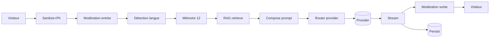

# 11 — Visualisation du système

> *Interface graphique des flux, des étapes RAG, des providers actifs, des guard-rails*

---

## 1. Pourquoi cette interface

Le pipeline du chat est riche : modération, RAG, routage,
streaming, cost accounting, persistance. Pour que la maison
puisse **diagnostiquer**, **expliquer**, **rassurer** et plus
tard **vendre la transparence** comme valeur, il faut un écran
qui rend ce pipeline lisible **en temps réel** (admin) et
**en exemple** (mode coulisses public).

Deux contextes :

| Contexte                    | Usage                                                                 |
| --------------------------- | --------------------------------------------------------------------- |
| `/admin/chat/system`        | Console interne. Voir le pipeline en live, configurer, débugger.      |
| Widget — mode coulisses     | Optionnel. Montre à l'initiée qui le souhaite ce qui se passe.        |

## 2. Vue admin — `/admin/chat/system`

### 2.1 Schéma général

```
┌────────────────────────────────────────────────────────────────────────────┐
│                                                                            │
│   ┌──────────┐    ┌────────────┐    ┌─────────┐    ┌──────────────┐        │
│   │ Visiteur │───►│ Sanitize   │───►│ Modér.  │───►│ Détect lang. │───►    │
│   │ message  │    │ + PII      │    │ entrée  │    │ + sanity     │        │
│   └──────────┘    └────────────┘    └─────────┘    └──────────────┘        │
│                                                                            │
│      │                  │                  │              │                │
│      ▼                  ▼                  ▼              ▼                │
│    1.4ms              0.8ms              140ms          1.2ms              │
│                                                                            │
│     ┌─────────────┐    ┌────────────┐    ┌────────────────────────────┐    │
│  ──►│ Mémoire     │───►│ RAG        │───►│ Compose prompt             │    │
│     │ (12 derniers)│    │ retrieve   │    │ (system + sources + hist.)│    │
│     └─────────────┘    └────────────┘    └────────────────────────────┘    │
│                                                                            │
│       │                    │                       │                       │
│       ▼                    ▼                       ▼                       │
│      8ms                  120ms                   2ms                      │
│                                                                            │
│     ┌──────────┐    ┌───────────────┐    ┌────────────┐    ┌─────────┐     │
│  ──►│ Router   │───►│ Provider P1   │───►│ Stream out │───►│ Modér.  │──► visiteur │
│     │ provider │    │ OpenAI 4o-mini│    │ (SSE)      │    │ sortie  │             │
│     └──────────┘    └───────────────┘    └────────────┘    └─────────┘             │
│                                                                            │
│       │                    │                       │              │        │
│       ▼                    ▼                       ▼              ▼        │
│      2ms              latency 720ms            tokens 254      0.6ms       │
│                                                                            │
│                                                                            │
│   ┌──────────────────────────────────────────────────────────────────┐     │
│   │  Persistance Postgres + tracking dataLayer                       │     │
│   │  + cost accounting + audit                                       │     │
│   └──────────────────────────────────────────────────────────────────┘     │
└────────────────────────────────────────────────────────────────────────────┘
```

Implémentation : composant React `<PipelineGraph>` (D3 + framer-motion)
qui dessine les nœuds et anime les flux de données. La structure
est portée par un descripteur déclaratif :

```ts
type PipelineNode = {
  id: string;
  label: string;
  kind: 'input' | 'sanitize' | 'moderate' | 'lang' | 'memory' | 'rag' | 'compose' | 'router' | 'provider' | 'stream' | 'persist';
  metrics?: { latencyMs?: number; tokensIn?: number; tokensOut?: number; costEur?: number };
  status: 'ok' | 'warn' | 'error' | 'idle';
  meta?: Record<string, unknown>;
};

type PipelineEdge = {
  from: string;
  to: string;
  pulse?: boolean;
};
```

### 2.2 Mode `live`

L'admin clique sur **Live**. Le composant ouvre une SSE
`GET /api/admin/chat/visualisation/stream` qui pousse pour
chaque message :

```
event: pipeline.start
data: { messageId, sessionId, ts }

event: pipeline.node.update
data: { id: 'moderate-in', status: 'ok', metrics: { latencyMs: 142 } }

event: pipeline.edge.pulse
data: { from: 'moderate-in', to: 'lang' }

...

event: pipeline.done
data: { messageId, totalLatencyMs: 1820, costEur: 0.0021, providerKind: 'openai', model: 'gpt-4o-mini' }
```

L'animation déclenche un **pulse de la flèche** entre les nœuds,
puis met à jour les métriques de chaque nœud. Les pulses sont
rate-limités à 60 fps.

### 2.3 Mode `replay`

L'admin clique sur **Replay** d'une conversation existante.
Le serveur recompose les `pipeline.*` events depuis les
traces OTel + logs structurés (cf. doc 14) et les rejoue
au rythme réel ou accéléré.

### 2.4 Inspecteur de nœud

Au clic sur un nœud :

| Nœud           | Inspecteur                                                                |
| -------------- | ------------------------------------------------------------------------- |
| Sanitize       | Diff avant / après, PII détectée                                           |
| Modération     | Catégories flaggées, score                                                 |
| Langue         | Heuristique vs CLD3 vs LLM, dictionnaire darija touché                     |
| Mémoire        | 12 derniers messages tronqués                                              |
| RAG            | Top-k chunks, scores, source label, distance cosine, re-rank score         |
| Compose        | Prompt système final reconstruit (tronqué pour PII)                        |
| Router         | Candidat 1, 2, 3 ; choix retenu ; raison (priorité, breaker, quota)        |
| Provider       | Modèle, paramètres, latence, tokens in/out, finishReason                   |
| Stream         | Nombre de tokens, durée perçue, humanisation activée                       |
| Modération out | Filtre charte, mots détectés, action (ok / réécrit / régen / bloqué)        |
| Persist        | IDs DB, durée transaction                                                  |

### 2.5 Carte des providers

Encart en haut-droite : carte miniature des providers actifs avec
état (✓ vert, ⚠ orange si breaker à 1/3, ✕ rouge si ouvert), quota
(barre de progression), latence p95 24h.

```
┌─────────────────────────────────────┐
│ Providers                           │
│                                     │
│ chat                                │
│  ✓ OpenAI 4o-mini   ████░ 73 %  610 ms │
│  ⚠ Gemini 1.5-flash █░░░░ 12 %  920 ms │
│  ✓ Qwen 7b          ██░░░ 28 %  1340 ms │
│  ✓ Ollama llama3.1  ░░░░░  0 %  340 ms (local) │
│                                     │
│ embedding                           │
│  ✓ OpenAI 3-small   ███░░ 41 %  170 ms │
│                                     │
│ moderation                          │
│  ✓ OpenAI mod.      ░░░░░  4 %  85 ms  │
└─────────────────────────────────────┘
```

### 2.6 Carte du RAG

Représentation de la base de connaissance :

```
┌─────────────────────────────────────────────────┐
│ Base de connaissance                            │
│  18 sources actives · 412 chunks · FR/AR        │
│                                                 │
│  Top sources citées (24 h) :                    │
│   1. Page Kit                  142 hits         │
│   2. FAQ COD                    87 hits         │
│   3. Page Rituel                72 hits         │
│   4. Composition (PDF)          51 hits         │
│   ...                                           │
│                                                 │
│  Sources jamais citées (alertes) :              │
│   - Conditions B2B (FR)                         │
│   - Charte engagement (AR)                      │
└─────────────────────────────────────────────────┘
```

## 3. Mode coulisses (visiteur, opt-in)

### 3.1 Pourquoi exposer ce mode

Pas de manipulation : transparence radicale. Une initiée curieuse
peut voir « comment la maison réfléchit ». Cela renforce la
confiance.

Opt-in via un lien discret dans le footer du panel chat :
« voir les coulisses ». Sur clic, un panneau auxiliaire s'ouvre
à droite (en cas de desktop) ou en remplacement (mobile) avec
une **version simplifiée** du pipeline.

### 3.2 Vue simplifiée

```
┌───────────────────────────────────────────────┐
│ La maison fait, à chaque message, six pas :    │
│                                                │
│   1. lit ton message                           │
│   2. regarde dans quelle langue tu écris       │
│   3. consulte ses notes (le rituel, le journal)│
│   4. réfléchit (un modèle de langue)           │
│   5. relit pour ne rien dire d'inexact         │
│   6. te réponds                                │
│                                                │
│   La maison ne garde rien d'identifiant sans   │
│   ton accord. Tu peux tout effacer.            │
│                                                │
│   [Voir la trace de mon dernier message]       │
└───────────────────────────────────────────────┘
```

Au clic sur **Voir la trace**, un schéma simplifié anime les six
pas pour le dernier échange. Aucune métrique technique (tokens,
latences précises). Aucune donnée serveur sensible (modèles
spécifiques, providers).

### 3.3 Ce qui n'apparaît jamais en mode visiteur

- Nom exact du modèle (« un modèle de langue partenaire »)
- Nom exact du provider (« un partenaire chiffré »)
- Coûts
- Prompt système
- IDs internes

Cela protège les choix techniques, les contrats avec les providers,
et évite la curiosité malveillante (prompt injection).

## 4. Schémas d'architecture exportables

L'écran admin permet l'export de chaque schéma :

| Format     | Usage                                       |
| ---------- | ------------------------------------------- |
| PNG        | Pour insertion dans un document             |
| SVG        | Pour archivage, fidèle vectoriel            |
| Mermaid    | Pour intégration dans Markdown / docs       |

Le bouton **Exporter Mermaid** produit le code source réinjectable :



## 5. Données alimentant le visualizer

### 5.1 Côté admin (live)

Source : `OpenTelemetry traces` + logs JSON émis par chaque service.
Un service `lib/chat/visualisation/stream.ts` aggrège ces traces
et les ré-émet en SSE via `/api/admin/chat/visualisation/stream`.

### 5.2 Côté visiteur (mode coulisses)

Source : la réponse `meta` du message le plus récent (event SSE
`meta` côté client). Aucun appel supplémentaire. Pour des raisons
de surface d'attaque, on n'expose **jamais** les métadonnées
détaillées des autres conversations.

## 6. Composants implémentation

```
components/chat/visualizer/
├── PipelineGraph.tsx              // SVG / D3 layout
├── PipelineNode.tsx               // forme + label + métrique
├── PipelineEdge.tsx               // ligne + pulse animé
├── ProviderHealthCard.tsx         // carte providers temps réel
├── KnowledgeMapCard.tsx           // top sources, sources froides
├── NodeInspectorPanel.tsx         // ouverture latérale au clic
├── ReplayControls.tsx             // play / pause / vitesse
└── public/
    ├── BackstagePanel.tsx         // mode coulisses simplifié
    └── BackstageSteps.tsx         // 6 étapes animées
```

## 7. Performance

- Le `<PipelineGraph>` ne ré-render que les nœuds dont les props
  ont changé (memoization stricte).
- Les pulses utilisent `requestAnimationFrame` capé à 60 fps.
- En mode `live`, la SSE pousse en moyenne 8-12 events / message ;
  pas un goulot.
- Le replay charge les traces en lots paginés (200 events / page).

## 8. Accessibilité

- Le graphe est doublé par une **vue tableau** consultable au
  clavier (`Tab` entre nœuds, `Entrée` pour ouvrir l'inspecteur).
- Pulses désactivés en `prefers-reduced-motion`.
- Couleurs des états (vert / orange / rouge) doublées par icônes
  (✓ ⚠ ✕) pour daltonisme.

## 9. Tests

| Test                                                   | Outil       |
| ------------------------------------------------------ | ----------- |
| Render `<PipelineGraph>` avec descripteur fixture      | Vitest      |
| Pulse animation déclenchée à event `pipeline.edge.pulse` | Vitest      |
| Inspecteur ouvre au clic, ferme à `Esc`                | Vitest + RTL |
| SSE replay reconstitue 100 events sans drop            | Vitest      |
| Mode coulisses public n'expose pas de PII              | Test contrat (assert: `JSON.stringify(payload).indexOf('chat_provider_config')` < 0) |
| Export Mermaid produit chaîne valide                   | Vitest      |

## 10. Lecture suivante

- [08 — Console admin](08-admin-console.md) pour les autres vues.
- [14 — Observabilité](14-observabilite-perf.md) pour les traces
  qui alimentent ce visualizer.
- [13 — Sécurité](13-securite-rgpd-moderation.md) pour les filtres
  qui empêchent les fuites en mode coulisses.
